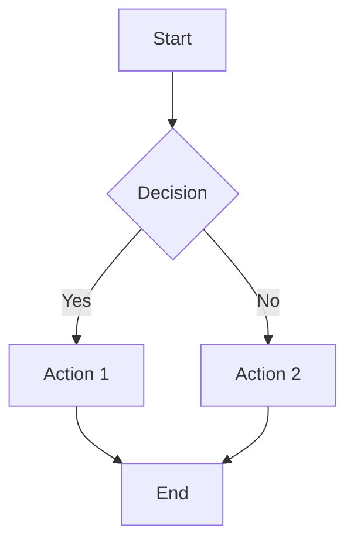

# Contributing to Warcraft II Notifications Plugin

Thank you for your interest in contributing to the Warcraft II Notifications Plugin for OpenCode! This document provides guidelines and instructions for contributing to the project.

## Table of Contents

- [Code of Conduct](#code-of-conduct)
- [Getting Started](#getting-started)
- [How to Contribute](#how-to-contribute)
- [Development Workflow](#development-workflow)
- [Coding Standards](#coding-standards)
- [Testing Guidelines](#testing-guidelines)
- [Documentation](#documentation)
- [Pull Request Process](#pull-request-process)
- [Release Process](#release-process)

---

## Code of Conduct

### Our Pledge

We are committed to providing a welcoming and inspiring community for all. We pledge to make participation in our project a harassment-free experience for everyone, regardless of age, body size, disability, ethnicity, gender identity and expression, level of experience, nationality, personal appearance, race, religion, or sexual identity and orientation.

### Our Standards

**Positive behavior includes**:

- Using welcoming and inclusive language
- Being respectful of differing viewpoints and experiences
- Gracefully accepting constructive criticism
- Focusing on what is best for the community
- Showing empathy towards other community members

**Unacceptable behavior includes**:

- Trolling, insulting/derogatory comments, and personal or political attacks
- Public or private harassment
- Publishing others' private information without explicit permission
- Other conduct which could reasonably be considered inappropriate

### Enforcement

Instances of abusive, harassing, or otherwise unacceptable behavior may be reported by contacting the project team. All complaints will be reviewed and investigated promptly and fairly.

---

## Getting Started

### Prerequisites

Before you begin, ensure you have:

- **Bun**: v1.0.0 or higher
- **Node.js**: v18.0.0 or higher
- **Git**: For version control
- **OpenCode**: For testing the plugin
- **GitHub Account**: For submitting contributions

### Initial Setup

1. **Fork the repository** on GitHub

2. **Clone your fork**:

```bash
git clone https://github.com/YOUR_USERNAME/opencode-warcraft-notifications.git
cd opencode-warcraft-notifications
```

3. **Add upstream remote**:

```bash
git remote add upstream https://github.com/pantheon-org/opencode-warcraft-notifications.git
```

4. **Install dependencies**:

```bash
bun install
```

5. **Verify setup**:

```bash
bun test
bun run type-check
bun run lint
```

### Development Environment

See the [Development Guide](docs/DEVELOPMENT.md) for detailed environment setup instructions.

---

## How to Contribute

### Types of Contributions

We welcome many types of contributions:

#### 🐛 Bug Reports

Found a bug? Please create an issue with:

- Clear description of the bug
- Steps to reproduce
- Expected vs actual behavior
- Environment details (OS, OpenCode version, plugin version)
- Screenshots or logs (if applicable)

**Use the bug report template** when creating issues.

#### ✨ Feature Requests

Have an idea? Create an issue describing:

- The problem you're trying to solve
- Your proposed solution
- Alternative solutions you've considered
- Any additional context

**Use the feature request template** when creating issues.

#### 📝 Documentation Improvements

Documentation is crucial! You can help by:

- Fixing typos or unclear explanations
- Adding examples and use cases
- Improving diagrams and visualizations
- Translating documentation
- Creating tutorials or guides

#### 🔧 Code Contributions

Ready to code? Great! Follow the [Development Workflow](#development-workflow) below.

#### 💬 Community Support

Help others by:

- Answering questions in discussions
- Reviewing pull requests
- Sharing your experience
- Creating tutorials or blog posts

---

## Development Workflow

### 1. Create a Branch

Always create a new branch for your work:

```bash
# Update your fork
git checkout main
git pull upstream main

# Create a feature branch
git checkout -b feature/your-feature-name

# Or for bug fixes
git checkout -b fix/bug-description
```

**Branch naming conventions**:

- `feature/` - New features
- `fix/` - Bug fixes
- `docs/` - Documentation changes
- `refactor/` - Code refactoring
- `test/` - Test improvements
- `chore/` - Maintenance tasks

### 2. Make Your Changes

#### Code Changes

- Follow the [Coding Standards](#coding-standards)
- Write tests for new functionality
- Update documentation as needed
- Keep commits focused and atomic

#### Commit Messages

Follow the [Conventional Commits](https://www.conventionalcommits.org/) specification:

```
<type>(<scope>): <subject>

<body>

<footer>
```

**Types**:

- `feat`: New feature
- `fix`: Bug fix
- `docs`: Documentation changes
- `style`: Code style changes (formatting, etc.)
- `refactor`: Code refactoring
- `test`: Test changes
- `chore`: Maintenance tasks
- `perf`: Performance improvements

**Examples**:

```bash
# Feature
git commit -m "feat(sounds): Add rare sound category with optional inclusion"

# Bug fix
git commit -m "fix(config): Handle missing plugin.json gracefully"

# Documentation
git commit -m "docs(api): Add examples for sound selection functions"

# Breaking change
git commit -m "feat(config)!: Change default faction to 'both'

BREAKING CHANGE: Default faction changed from 'alliance' to 'both'"
```

### 3. Test Your Changes

Run the full test suite:

```bash
# Run all tests
bun test

# Run tests with coverage
bun test --coverage

# Run type checking
bun run type-check

# Run linting
bun run lint

# Format code
bun run format
```

### 4. Update Documentation

If your changes affect:

- **User-facing features**: Update `docs/USER_GUIDE.md`
- **API**: Update `docs/API.md`
- **Architecture**: Update `docs/ARCHITECTURE.md`
- **Configuration**: Update `docs/schemas/README.md`
- **Development**: Update `docs/DEVELOPMENT.md`

### 5. Push Your Changes

```bash
# Push to your fork
git push origin feature/your-feature-name
```

### 6. Create a Pull Request

1. Go to the [repository on GitHub](https://github.com/pantheon-org/opencode-warcraft-notifications)
2. Click "New Pull Request"
3. Select your fork and branch
4. Fill out the PR template
5. Submit the PR

---

## Coding Standards

### TypeScript Style Guide

#### General Principles

- **Clarity over cleverness**: Write code that's easy to understand
- **Type safety**: Leverage TypeScript's type system
- **Consistency**: Follow existing patterns in the codebase
- **Documentation**: Add JSDoc comments for public APIs

#### Code Style

We use **ESLint** and **Prettier** for code formatting:

```bash
# Format code
bun run format

# Check formatting
bun run format:check

# Lint code
bun run lint
```

#### Naming Conventions

```typescript
// Constants: UPPER_SNAKE_CASE
const DEFAULT_DATA_DIR = '/path/to/data';

// Functions: camelCase
function getRandomSound(): string {}

// Classes: PascalCase
class SoundManager {}

// Interfaces: PascalCase with 'I' prefix (optional)
interface WarcraftNotificationConfig {}

// Types: PascalCase
type Faction = 'alliance' | 'horde' | 'both';

// Private members: prefix with underscore
class Example {
  private _internalState: string;
}
```

#### Function Guidelines

````typescript
/**
 * Get a random sound from the specified faction
 *
 * @param faction - The faction to select from ('alliance', 'horde', or 'both')
 * @param dataDir - Optional custom data directory path
 * @returns Absolute path to a random sound file
 *
 * @example
 * ```typescript
 * const soundPath = getRandomSoundPathFromFaction('alliance');
 * // Returns: '/path/to/data/alliance/human_selected1.wav'
 * ```
 */
export const getRandomSoundPathFromFaction = (faction: Faction, dataDir?: string): string => {
  // Implementation
};
````

#### Error Handling

```typescript
// Use try-catch for async operations
try {
  await someAsyncOperation();
} catch (error) {
  if (process.env.DEBUG_OPENCODE) {
    console.error('Operation failed:', error);
  }
  // Handle error gracefully
}

// Validate inputs
if (!isValidFaction(faction)) {
  throw new Error(`Invalid faction: ${faction}`);
}

// Return early for error conditions
if (!soundExists) {
  return fallbackSound;
}
```

#### Async/Await

```typescript
// Prefer async/await over promises
async function loadConfig(): Promise<Config> {
  const data = await readFile('config.json');
  return JSON.parse(data);
}

// Handle errors properly
async function safeOperation(): Promise<Result> {
  try {
    return await riskyOperation();
  } catch (error) {
    console.error('Operation failed:', error);
    return defaultResult;
  }
}
```

### File Organization

```typescript
// 1. Imports (grouped and sorted)
import { join } from 'path';
import { exists } from 'fs/promises';

import { DEFAULT_DATA_DIR, type Faction } from './plugin-config.js';

// 2. Type definitions
export type SoundCategory = 'selected' | 'acknowledge' | 'special';

// 3. Constants
const SOUND_EXTENSIONS = ['.wav', '.mp3'];

// 4. Helper functions (private)
const isValidExtension = (filename: string): boolean => {
  // Implementation
};

// 5. Exported functions (public API)
export const getRandomSound = (): string => {
  // Implementation
};

// 6. Main exports
export { sounds, allianceSounds, hordeSounds };
```

---

## Testing Guidelines

### Test Structure

```typescript
import { describe, it, expect, beforeEach, afterEach } from 'bun:test';

describe('ModuleName', () => {
  describe('functionName', () => {
    it('should handle normal case', () => {
      // Arrange
      const input = 'test';

      // Act
      const result = functionName(input);

      // Assert
      expect(result).toBe('expected');
    });

    it('should handle edge case', () => {
      // Test edge cases
    });

    it('should throw error for invalid input', () => {
      expect(() => functionName(null)).toThrow();
    });
  });
});
```

### Test Coverage

Aim for:

- **Unit tests**: 80%+ coverage
- **Integration tests**: Key workflows
- **Edge cases**: Error conditions, boundary values
- **Platform-specific**: macOS and Linux paths

### Test Categories

#### Unit Tests

Test individual functions in isolation:

```typescript
// src/sounds.unit.test.ts
describe('getRandomSoundFromFaction', () => {
  it('should return alliance sound when faction is alliance', () => {
    const sound = getRandomSoundFromFaction('alliance');
    expect(determineSoundFaction(sound)).toBe('alliance');
  });
});
```

#### Integration Tests

Test module interactions:

```typescript
// src/notification.test.ts
describe('NotificationPlugin', () => {
  it('should install bundled sounds and play on idle', async () => {
    // Test full workflow
  });
});
```

#### Edge Case Tests

Test error conditions:

```typescript
// src/bundled-sounds.edge.test.ts
describe('installBundledSoundsIfMissing', () => {
  it('should handle missing data directory gracefully', async () => {
    // Test error handling
  });
});
```

### Mocking

```typescript
import { mock } from 'bun:test';

// Mock file system operations
const mockExists = mock((path: string) => Promise.resolve(true));

// Mock platform
const originalPlatform = process.platform;
Object.defineProperty(process, 'platform', {
  value: 'darwin',
});

// Restore after test
afterEach(() => {
  Object.defineProperty(process, 'platform', {
    value: originalPlatform,
  });
});
```

---

## Documentation

### Documentation Standards

#### Markdown Style

- Use ATX-style headers (`#` not `===`)
- Include table of contents for long documents
- Use code blocks with language specifiers
- Add examples for complex concepts
- Use Mermaid for diagrams

#### Code Examples

```markdown
### Example: Configure Faction

\`\`\`json
{
"@pantheon-ai/opencode-warcraft-notifications": {
"faction": "alliance"
}
}
\`\`\`

This configuration will play only Alliance unit sounds.
```

#### Diagrams

Use Mermaid syntax for all diagrams:

````markdown

````

#### API Documentation

````typescript
/**
 * Get a random sound from the specified faction
 *
 * This function selects a random sound file from the specified faction's
 * sound collection. It supports Alliance, Horde, or both factions.
 *
 * @param faction - The faction to select from ('alliance', 'horde', or 'both')
 * @param dataDir - Optional custom data directory path. If not provided,
 *                  uses the default platform-specific directory.
 * @returns Absolute path to a random sound file from the specified faction
 *
 * @throws {Error} If the faction parameter is invalid
 *
 * @example
 * ```typescript
 * // Get a random Alliance sound
 * const allianceSound = getRandomSoundPathFromFaction('alliance');
 *
 * // Get a random sound from both factions
 * const anySound = getRandomSoundPathFromFaction('both');
 *
 * // Use custom data directory
 * const customSound = getRandomSoundPathFromFaction('horde', '/custom/path');
 * ```
 *
 * @see {@link determineSoundFaction} for faction detection
 * @see {@link getSoundPath} for path resolution
 */
export const getRandomSoundPathFromFaction = (faction: Faction, dataDir?: string): string => {
  // Implementation
};
````

---

## Pull Request Process

### Before Submitting

Checklist:

- [ ] Tests pass (`bun test`)
- [ ] Type checking passes (`bun run type-check`)
- [ ] Linting passes (`bun run lint`)
- [ ] Code is formatted (`bun run format`)
- [ ] Documentation is updated
- [ ] Commit messages follow conventions
- [ ] Branch is up to date with main

### PR Template

```markdown
## Description

Brief description of the changes in this PR.

## Type of Change

- [ ] Bug fix (non-breaking change which fixes an issue)
- [ ] New feature (non-breaking change which adds functionality)
- [ ] Breaking change (fix or feature that would cause existing functionality to not work as expected)
- [ ] Documentation update
- [ ] Refactoring (no functional changes)
- [ ] Performance improvement
- [ ] Test improvement

## Related Issues

Closes #123
Relates to #456

## Changes Made

- Change 1
- Change 2
- Change 3

## Testing

### Test Coverage

- [ ] Unit tests added/updated
- [ ] Integration tests added/updated
- [ ] Edge case tests added/updated
- [ ] All tests passing

### Manual Testing

Describe manual testing performed:

1. Tested on macOS Sonoma
2. Tested with Alliance faction
3. Verified sound playback
4. Confirmed notification display

## Documentation

- [ ] README updated (if needed)
- [ ] API documentation updated
- [ ] User Guide updated
- [ ] Architecture documentation updated

## Screenshots/Recordings

If applicable, add screenshots or recordings demonstrating the changes.

## Checklist

- [ ] My code follows the project's coding standards
- [ ] I have performed a self-review of my code
- [ ] I have commented my code, particularly in hard-to-understand areas
- [ ] I have made corresponding changes to the documentation
- [ ] My changes generate no new warnings
- [ ] I have added tests that prove my fix is effective or that my feature works
- [ ] New and existing unit tests pass locally with my changes
- [ ] Any dependent changes have been merged and published

## Additional Notes

Any additional information that reviewers should know.
```

### Review Process

1. **Automated Checks**: CI/CD pipeline runs automatically
2. **Code Review**: Maintainers review your code
3. **Feedback**: Address any requested changes
4. **Approval**: Once approved, PR is ready to merge
5. **Auto-Merge**: Bot may automatically merge if configured

### After Merge

- Your changes will be included in the next release
- The version bump workflow will determine the version
- Release notes will be generated automatically

---

## Release Process

### Versioning

We follow [Semantic Versioning](https://semver.org/):

- **MAJOR**: Breaking changes
- **MINOR**: New features (backward compatible)
- **PATCH**: Bug fixes (backward compatible)

### Automated Releases

The project uses AI-powered version management:

1. **Smart Version Bump**: Analyzes commits to determine version
2. **Version PR**: Creates PR with version bump
3. **Auto-Merge**: Merges version bump PR
4. **Release & Publish**: Creates GitHub release and publishes to npm

See [Pipeline Documentation](docs/PIPELINE.md) for details.

### Manual Release (if needed)

```bash
# Update version in package.json
npm version patch  # or minor, or major

# Push changes
git push origin main --tags

# GitHub Actions will handle the rest
```

---

## Questions?

### Getting Help

- **Documentation**: Check [docs/](docs/)
- **Discussions**: [GitHub Discussions](https://github.com/pantheon-org/opencode-warcraft-notifications/discussions)
- **Issues**: [GitHub Issues](https://github.com/pantheon-org/opencode-warcraft-notifications/issues)

### Contact

- **Email**: support@pantheon-ai.com
- **GitHub**: [@pantheon-org](https://github.com/pantheon-org)

---

## Thank You!

Thank you for contributing to the Warcraft II Notifications Plugin! Your contributions help make this project better for everyone.

_"Work complete!"_ - Warcraft II Peasant  
_"Zug zug!"_ - Warcraft II Orc

---

**Document Version**: 1.0  
**Last Updated**: 2025-11-10  
**Maintained By**: Pantheon AI Team
