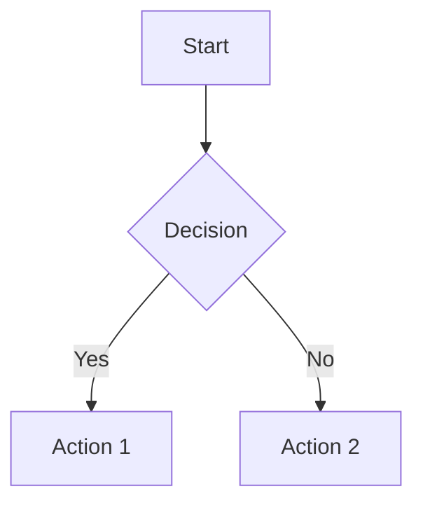

# OpenCode-Inspired Jekyll Theme

A modern, dark-themed Jekyll documentation theme inspired by the [OpenCode](https://opencode.ai/docs) website design. This theme features responsive design, dark/light mode toggle, collapsible navigation, and beautiful syntax highlighting.

## Features

- 🎨 **OpenCode-Inspired Design**: Clean, modern interface matching OpenCode's aesthetic
- 🌓 **Dark/Light Mode**: Automatic theme detection with manual toggle
- 📱 **Fully Responsive**: Works seamlessly on mobile, tablet, and desktop
- 🧭 **Smart Navigation**: Collapsible sidebar with auto-expand for active pages
- 📖 **Table of Contents**: Automatic TOC generation with scroll highlighting
- 🎯 **Syntax Highlighting**: Beautiful code highlighting with Rouge
- ♿ **Accessible**: WCAG 2.1 AA compliant with keyboard navigation
- 🚀 **GitHub Pages Compatible**: Uses only safe Jekyll plugins
- ⚡ **Performance Optimized**: Minimal dependencies, fast load times

## Installation

### Option 1: Use in Existing Jekyll Site

1. Copy the theme files to your Jekyll site:

   ```bash
   # Copy layouts
   cp -r docs/_layouts/* your-site/_layouts/

   # Copy includes
   cp -r docs/_includes/* your-site/_includes/

   # Copy assets
   cp -r docs/assets/* your-site/assets/

   # Copy data files
   cp -r docs/_data/* your-site/_data/

   # Copy config
   cp docs/_config.yml your-site/_config.yml
   ```

2. Update `_config.yml` with your site settings:

   ```yaml
   title: Your Site Title
   description: Your site description
   url: 'https://yourusername.github.io'
   baseurl: '/your-repo-name'
   github_repo: 'yourusername/your-repo-name'
   github_url: 'https://github.com/yourusername/your-repo-name'
   ```

3. Customize `_data/navigation.yml` for your site structure

### Option 2: Start from Scratch

1. Create a new Jekyll site:

   ```bash
   jekyll new my-docs
   cd my-docs
   ```

2. Follow Option 1 to copy theme files

## Configuration

### Basic Configuration

Edit `_config.yml`:

```yaml
# Site settings
title: Your Documentation
description: Documentation for your project
url: 'https://yourusername.github.io'
baseurl: '/repo-name'

# GitHub integration
github_repo: 'username/repo-name'
github_url: 'https://github.com/username/repo-name'
discord_url: 'https://discord.gg/your-invite' # Optional

# Plugins (GitHub Pages compatible)
plugins:
  - jekyll-sitemap
  - jekyll-feed
  - jekyll-seo-tag
```

### Navigation

Edit `_data/navigation.yml`:

```yaml
docs:
  - title: 'Getting Started'
    url: /

  - title: 'User Guide'
    url: /user-guide
    open: true # Optional: keep section expanded
    children:
      - title: 'Installation'
        url: /user-guide#installation
      - title: 'Configuration'
        url: /user-guide#configuration

  - title: 'API Reference'
    url: /api
```

### Page Front Matter

For standard documentation pages:

```yaml
---
layout: page
title: Page Title
description: Optional page description
toc: true # Enable table of contents (default: true)
---
```

For the homepage:

```yaml
---
layout: home
title: Home
---
```

### Customizing Colors

Edit `docs/assets/css/main.css` and modify the CSS variables:

```css
:root {
  /* Customize accent color */
  --color-accent-primary: #8957e5; /* Purple (OpenCode default) */

  /* Or use your brand color */
  --color-accent-primary: #007bff; /* Blue */
  --color-accent-primary: #28a745; /* Green */
}
```

## Features Guide

### Dark/Light Mode

The theme automatically detects system preference and allows manual toggle:

- **Automatic**: Respects system dark/light mode preference
- **Persistent**: Saves user's choice in localStorage
- **Toggle**: Click the sun/moon icon in the header
- **Keyboard**: Theme toggle is keyboard accessible

### Table of Contents

Automatically generated for pages with `toc: true`:

- Includes H2 and H3 headings
- Highlights current section on scroll
- Sticky positioning in right sidebar
- Hidden on mobile/tablet viewports

### Mobile Navigation

- Hamburger menu on mobile devices
- Slide-out sidebar with overlay
- Tap outside or press ESC to close
- Maintains state during navigation

### Syntax Highlighting

Uses Rouge with Monokai-inspired colors:

```ruby
def hello_world
  puts "Hello, World!"
end
```

Supports 100+ languages out of the box.

### Mermaid Diagrams

Automatically renders Mermaid diagrams:

````markdown

````

## Customization

### Adding Custom CSS

Create `assets/css/custom.css`:

```css
/* Your custom styles */
.custom-class {
  color: var(--color-accent-primary);
}
```

Include in `_includes/head.html`:

```html
<link rel="stylesheet" href="{{ '/assets/css/custom.css' | relative_url }}" />
```

### Adding Custom JavaScript

Create `assets/js/custom.js` and include in `_layouts/default.html`:

```html
<script src="{{ '/assets/js/custom.js' | relative_url }}"></script>
```

### Customizing Layouts

All layouts are in `_layouts/`:

- `default.html` - Base layout with header, sidebar, footer
- `page.html` - Documentation page layout
- `home.html` - Homepage layout

Override by creating files with the same names in your `_layouts/` directory.

## Development

### Local Development

1. Install dependencies:

   ```bash
   bundle install
   ```

2. Serve locally:

   ```bash
   bundle exec jekyll serve
   ```

3. View at `http://localhost:4000`

### Testing

Test the theme:

```bash
# Check for broken links
bundle exec htmlproofer ./_site

# Validate HTML
bundle exec jekyll build
```

## GitHub Pages Deployment

### Enable GitHub Pages

1. Go to repository Settings
2. Navigate to Pages
3. Select source branch (usually `main` or `gh-pages`)
4. Set folder to `/docs` if docs are in a subdirectory
5. Save

### Custom Domain (Optional)

Add `CNAME` file to `/docs`:

```
docs.yourdomain.com
```

Update DNS settings:

```
Type: CNAME
Name: docs
Value: yourusername.github.io
```

## Browser Support

- Chrome/Edge (last 2 versions)
- Firefox (last 2 versions)
- Safari (last 2 versions)
- Mobile browsers (iOS Safari, Chrome Android)

## Accessibility

The theme is built with accessibility in mind:

- Semantic HTML5 elements
- ARIA labels and roles
- Keyboard navigation support
- Focus indicators
- Skip to content link
- Sufficient color contrast
- Screen reader friendly

## Performance

- Minimal external dependencies
- Optimized CSS with CSS variables
- Efficient JavaScript with no frameworks
- Lazy loading for non-critical resources
- Fast initial page load

## Troubleshooting

### Theme not loading

1. Check `_config.yml` paths are correct
2. Ensure `baseurl` matches your repository name
3. Clear Jekyll cache: `rm -rf .jekyll-cache`
4. Rebuild: `bundle exec jekyll build --trace`

### Navigation not working

1. Verify `_data/navigation.yml` syntax
2. Check URLs match your page paths
3. Ensure JavaScript files are loading (check browser console)

### Styles not applying

1. Check CSS file path in `_includes/head.html`
2. Verify file exists at `assets/css/main.css`
3. Clear browser cache
4. Check for CSS syntax errors

### Mermaid diagrams not rendering

1. Ensure code blocks use ` ```mermaid ` syntax
2. Check browser console for JavaScript errors
3. Verify Mermaid CDN is accessible

## License

MIT License - feel free to use this theme in your projects.

## Credits

- Design inspired by [OpenCode](https://opencode.ai/docs)
- Built with [Jekyll](https://jekyllrb.com/)
- Syntax highlighting by [Rouge](https://github.com/rouge-ruby/rouge)
- Diagrams by [Mermaid](https://mermaid.js.org/)
- Icons inspired by [Feather Icons](https://feathericons.com/)

## Support

- **Issues**: [GitHub Issues](https://github.com/pantheon-org/opencode-warcraft-notifications/issues)
- **Documentation**: This README and inline code comments
- **Discussions**: [GitHub Discussions](https://github.com/pantheon-org/opencode-warcraft-notifications/discussions)

---

Built with ❤️ for the open source community
