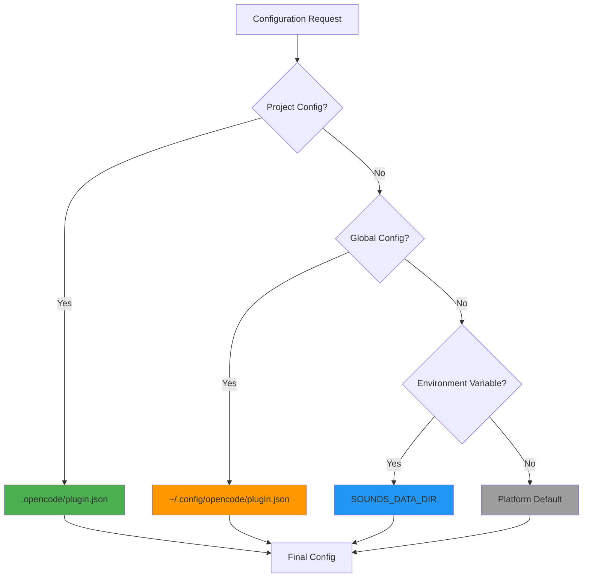
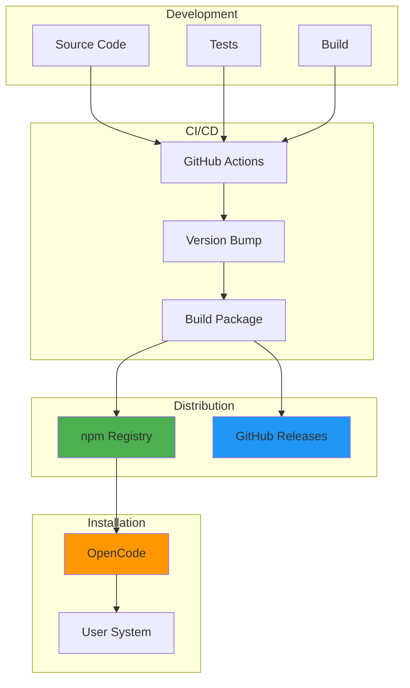
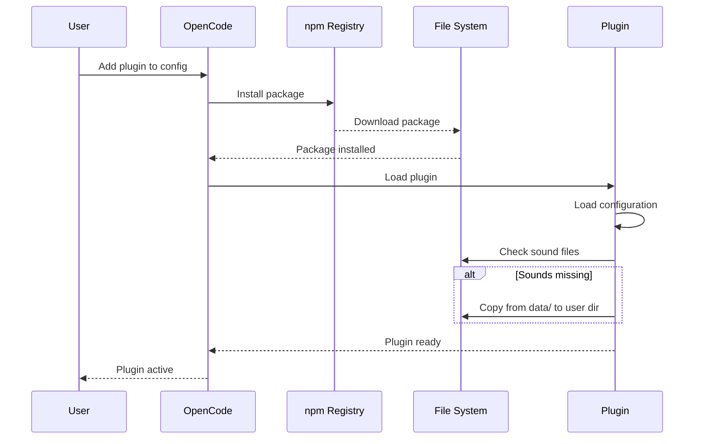
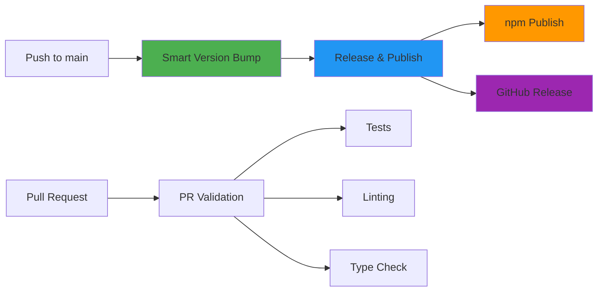
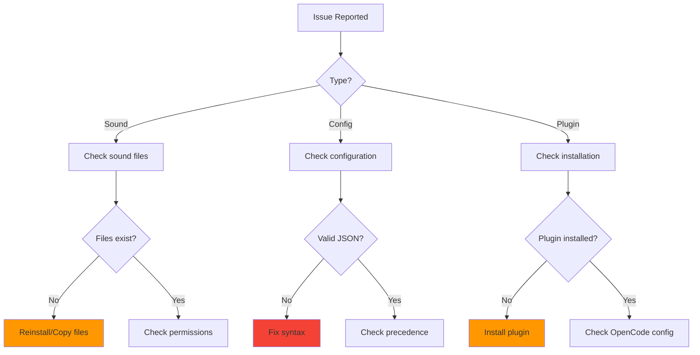
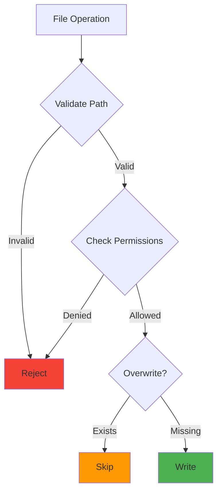

# Deployment Guide

## Overview

This guide covers deployment, installation, configuration, and operational aspects of the Warcraft II Notifications Plugin for OpenCode.

## Table of Contents

- [Installation](#installation)
- [Configuration](#configuration)
- [Platform-Specific Setup](#platform-specific-setup)
- [Deployment Architecture](#deployment-architecture)
- [CI/CD Pipeline](#cicd-pipeline)
- [Monitoring](#monitoring)
- [Troubleshooting](#troubleshooting)
- [Maintenance](#maintenance)
- [Security](#security)

---

## Installation

### End User Installation

#### 1. Add Plugin to OpenCode Configuration

Create or edit your OpenCode configuration file:

**Location**: `~/.config/opencode/opencode.json` or project-specific `.opencode/opencode.json`

```json
{
  "$schema": "https://opencode.ai/config.json",
  "plugin": ["@pantheon-ai/opencode-warcraft-notifications"]
}
```

#### 2. Restart OpenCode

```bash
opencode
```

The plugin will automatically:

- Install from npm registry
- Copy bundled sounds to user data directory
- Activate on session idle events

### Manual Installation (Development)

```bash
# Clone repository
git clone https://github.com/pantheon-org/opencode-warcraft-notifications.git
cd opencode-warcraft-notifications

# Install dependencies
bun install

# Build (if needed)
bun run build

# Link for local testing
bun link

# In your project
bun link @pantheon-ai/opencode-warcraft-notifications
```

---

## Configuration

### Configuration Hierarchy



### Project-Specific Configuration

**Location**: `<project>/.opencode/plugin.json`

```json
{
  "@pantheon-ai/opencode-warcraft-notifications": {
    "soundsDir": "/path/to/project/sounds",
    "faction": "alliance"
  }
}
```

**Use Case**: Different sound preferences per project

### Global Configuration

**Location**: `~/.config/opencode/plugin.json`

```json
{
  "@pantheon-ai/opencode-warcraft-notifications": {
    "soundsDir": "/home/user/.cache/warcraft-sounds",
    "faction": "horde"
  }
}
```

**Use Case**: User-wide default preferences

### Environment Variables

```bash
# Override data directory
export SOUNDS_DATA_DIR=/custom/sounds/path

# Enable debug logging
export DEBUG_OPENCODE=1

# Override base URL (legacy)
export SOUNDS_BASE_URL=https://custom-cdn.com/sounds
```

### Configuration Options

#### `soundsDir`

**Type**: `string` (optional)  
**Description**: Custom directory for sound file storage  
**Default**: Platform-specific (see [Platform-Specific Setup](#platform-specific-setup))

**Example**:

```json
{
  "soundsDir": "/custom/sounds/path"
}
```

#### `faction`

**Type**: `'alliance' | 'horde' | 'both'` (optional)  
**Description**: Which faction sounds to play  
**Default**: `'both'`

**Options**:

- `'alliance'`: Play only Alliance unit sounds
- `'horde'`: Play only Horde unit sounds
- `'both'`: Play random sounds from both factions

**Example**:

```json
{
  "faction": "horde"
}
```

---

## Platform-Specific Setup

### macOS

#### Default Locations

```bash
# Configuration
~/.config/opencode/plugin.json

# Sound storage
~/Library/Application Support/opencode/storage/plugin/opencode-warcraft-notifications/
```

#### Required Commands

```bash
# Audio playback (built-in)
afplay

# Notifications (built-in)
osascript
```

#### Verification

```bash
# Test audio playback
afplay /System/Library/Sounds/Glass.aiff

# Test notification
osascript -e 'display notification "Test" with title "OpenCode"'
```

### Linux

#### Default Locations

```bash
# Configuration
~/.config/opencode/plugin.json

# Sound storage (XDG compliant)
~/.local/share/opencode/storage/plugin/opencode-warcraft-notifications/
```

#### Required Commands

```bash
# Audio playback
sudo apt-get install libcanberra-gtk-module  # Ubuntu/Debian
sudo dnf install libcanberra-gtk3            # Fedora
sudo pacman -S libcanberra                   # Arch

# Notifications
sudo apt-get install libnotify-bin           # Ubuntu/Debian
sudo dnf install libnotify                   # Fedora
sudo pacman -S libnotify                     # Arch
```

#### Verification

```bash
# Test audio playback
canberra-gtk-play --id=message

# Test notification
notify-send 'OpenCode' 'Test notification'
```

### Windows

#### Default Locations

```powershell
# Configuration
%APPDATA%\opencode\plugin.json

# Sound storage
%APPDATA%\opencode\storage\plugin\opencode-warcraft-notifications\
```

#### Status

**Note**: Windows support is planned but not yet implemented. The plugin currently supports macOS and Linux only.

---

## Deployment Architecture

### Package Distribution



### Package Structure

```
@pantheon-ai/opencode-warcraft-notifications/
├── index.ts                 # Entry point
├── src/                     # Source code
│   ├── notification.ts
│   ├── plugin-config.ts
│   ├── sounds.ts
│   ├── bundled-sounds.ts
│   └── sound-data/
├── data/                    # Bundled sounds (50+ MB)
│   ├── alliance/
│   └── horde/
├── docs/                    # Documentation
│   └── schemas/
├── package.json
└── README.md
```

### Installation Flow



---

## CI/CD Pipeline

### Workflow Overview



### Workflows

#### 1. Smart Version Bump

**Trigger**: Push to `main` branch  
**Purpose**: Automatically determine and apply semantic version bump

**Steps**:

1. Analyze commits since last tag
2. Use AI (Gemini) + conventional commits to determine version type
3. Cross-validate decisions
4. Update `package.json`
5. Create git tag
6. Push tag (triggers release)

**Version Types**:

- **MAJOR**: Breaking changes, API changes
- **MINOR**: New features, backwards-compatible additions
- **PATCH**: Bug fixes, documentation, improvements

#### 2. Release & Publish

**Trigger**: New git tag (`v*`)  
**Purpose**: Build and publish package to npm

**Steps**:

1. Checkout code at tag
2. Install dependencies
3. Run tests
4. Build package
5. Publish to npm
6. Create GitHub release with changelog

#### 3. PR Validation

**Trigger**: Pull request creation/update  
**Purpose**: Validate code quality before merge

**Steps**:

1. Run all tests
2. Check linting
3. Verify type checking
4. Check formatting
5. Validate schemas

#### 4. Auto-Merge Bot

**Trigger**: Version sync PRs  
**Purpose**: Automatically merge version synchronization PRs

**Conditions**:

- PR created by GitHub Actions
- Title contains "sync package.json version"
- All checks pass

#### 5. Cleanup Workflows

**Cleanup Old Releases**:

- Runs weekly
- Keeps last 10 releases
- Deletes older releases

**Cleanup Merged Branches**:

- Runs on PR merge
- Deletes merged feature branches

### Deployment Checklist

- [ ] All tests pass
- [ ] Linting passes
- [ ] Type checking passes
- [ ] Documentation updated
- [ ] Version bump appropriate
- [ ] No breaking changes (unless MAJOR)
- [ ] Changelog generated

---

## Monitoring

### Health Checks

#### Plugin Installation

```bash
# Check if plugin is installed
ls -la ~/.cache/opencode/node_modules/@pantheon-ai/opencode-warcraft-notifications/

# Check plugin version
cat ~/.cache/opencode/node_modules/@pantheon-ai/opencode-warcraft-notifications/package.json | grep version
```

#### Sound Files

```bash
# Check sound directory
ls -la ~/.local/share/opencode/storage/plugin/opencode-warcraft-notifications/

# Count alliance sounds
ls -1 ~/.local/share/opencode/storage/plugin/opencode-warcraft-notifications/alliance/ | wc -l

# Count horde sounds
ls -1 ~/.local/share/opencode/storage/plugin/opencode-warcraft-notifications/horde/ | wc -l
```

#### Configuration

```bash
# Check project config
cat .opencode/plugin.json

# Check global config
cat ~/.config/opencode/plugin.json

# Check environment variables
echo $SOUNDS_DATA_DIR
echo $DEBUG_OPENCODE
```

### Debug Logging

Enable debug mode:

```bash
DEBUG_OPENCODE=1 opencode
```

**Debug Output**:

- Configuration loading attempts
- Sound installation progress
- File operation results
- Event handling
- Error details

### Performance Metrics

**Plugin Load Time**: < 100ms  
**Sound Installation Time**: < 5s (first run)  
**Event Response Time**: < 50ms  
**Memory Footprint**: < 10MB

---

## Troubleshooting

### Common Issues

#### 1. Sound Not Playing

**Symptoms**: No sound when session goes idle

**Diagnosis**:

```bash
# Check if sound files exist
ls -la ~/.local/share/opencode/storage/plugin/opencode-warcraft-notifications/alliance/

# Check platform commands
which afplay        # macOS
which canberra-gtk-play  # Linux

# Test sound playback manually
afplay ~/.local/share/opencode/storage/plugin/opencode-warcraft-notifications/alliance/human_selected1.wav
```

**Solutions**:

1. **Files missing**: Reinstall plugin or manually copy from `data/`
2. **Permission issues**: `chmod 644 *.wav`
3. **Command missing**: Install required packages (see [Platform-Specific Setup](#platform-specific-setup))

#### 2. Wrong Faction Playing

**Symptoms**: Horde sounds play when Alliance is configured

**Diagnosis**:

```bash
# Check configuration
cat .opencode/plugin.json
cat ~/.config/opencode/plugin.json
```

**Solutions**:

1. Verify `faction` setting in configuration
2. Check configuration precedence (project > global > default)
3. Restart OpenCode after configuration changes

#### 3. Configuration Not Loading

**Symptoms**: Custom configuration ignored

**Diagnosis**:

```bash
# Validate JSON syntax
cat .opencode/plugin.json | jq .

# Check file permissions
ls -la .opencode/plugin.json
```

**Solutions**:

1. Fix JSON syntax errors
2. Ensure file is readable: `chmod 644 .opencode/plugin.json`
3. Verify plugin name matches exactly: `@pantheon-ai/opencode-warcraft-notifications`

#### 4. Plugin Not Loading

**Symptoms**: Plugin doesn't activate

**Diagnosis**:

```bash
# Check if plugin is installed
ls -la ~/.cache/opencode/node_modules/@pantheon-ai/opencode-warcraft-notifications/

# Check OpenCode config
cat ~/.config/opencode/opencode.json
```

**Solutions**:

1. Verify plugin is in `opencode.json` configuration
2. Reinstall plugin: Remove from cache and restart OpenCode
3. Check OpenCode logs for errors

#### 5. Notification Not Showing

**Symptoms**: Sound plays but no notification appears

**Diagnosis**:

```bash
# Test notification manually
osascript -e 'display notification "Test" with title "OpenCode"'  # macOS
notify-send 'OpenCode' 'Test'  # Linux
```

**Solutions**:

1. **macOS**: Check System Preferences > Notifications > Script Editor
2. **Linux**: Install `libnotify-bin` package
3. Check notification permissions

### Debug Workflow



---

## Maintenance

### Updates

#### Automatic Updates

**Note**: OpenCode does NOT auto-update plugins

#### Manual Update

```bash
# Remove plugin from cache
cd ~
sed -i.bak '/"@pantheon-ai\/opencode-warcraft-notifications"/d' .cache/opencode/package.json
rm -rf .cache/opencode/node_modules/@pantheon-ai/opencode-warcraft-notifications

# Restart OpenCode (reinstalls latest)
opencode
```

#### Check for Updates

```bash
# Check current version
cat ~/.cache/opencode/node_modules/@pantheon-ai/opencode-warcraft-notifications/package.json | grep version

# Check latest version
npm view @pantheon-ai/opencode-warcraft-notifications version
```

### Backup

#### Configuration Backup

```bash
# Backup project config
cp .opencode/plugin.json .opencode/plugin.json.backup

# Backup global config
cp ~/.config/opencode/plugin.json ~/.config/opencode/plugin.json.backup
```

#### Sound Files Backup

```bash
# Backup sound directory
tar -czf warcraft-sounds-backup.tar.gz ~/.local/share/opencode/storage/plugin/opencode-warcraft-notifications/
```

### Cleanup

#### Remove Plugin

```bash
# Remove from OpenCode config
# Edit ~/.config/opencode/opencode.json and remove plugin entry

# Remove cached plugin
rm -rf ~/.cache/opencode/node_modules/@pantheon-ai/opencode-warcraft-notifications

# Remove sound files (optional)
rm -rf ~/.local/share/opencode/storage/plugin/opencode-warcraft-notifications/
```

#### Clear Cache

```bash
# Clear Bun cache
bun pm cache rm

# Clear npm cache
npm cache clean --force
```

---

## Security

### Security Considerations

#### 1. File System Security



**Measures**:

- No file overwrites (existing files preserved)
- Path validation before operations
- Respect system permissions
- No arbitrary code execution

#### 2. Configuration Security

**Measures**:

- Configuration is pure JSON (no code execution)
- Path sanitization
- Environment variable scoping
- No sensitive data in configuration

#### 3. Network Security

**Measures**:

- No runtime network operations
- All sounds bundled with package
- No external API calls
- No telemetry or tracking

#### 4. Dependency Security

**Measures**:

- Minimal dependencies
- Regular dependency updates
- Automated security scanning (GitHub Dependabot)
- No known vulnerabilities

### Security Best Practices

1. **Keep plugin updated**: Install security patches promptly
2. **Verify configuration**: Review `plugin.json` for unexpected changes
3. **Monitor file permissions**: Ensure sound files have appropriate permissions
4. **Use official sources**: Install only from npm registry or official GitHub repository

### Reporting Security Issues

**Do NOT** open public issues for security vulnerabilities.

**Contact**: security@pantheon-ai.com

**Include**:

- Description of vulnerability
- Steps to reproduce
- Potential impact
- Suggested fix (if any)

---

## Operational Procedures

### Deployment Checklist

- [ ] Version bump appropriate
- [ ] All tests pass
- [ ] Documentation updated
- [ ] Changelog generated
- [ ] No breaking changes (unless MAJOR)
- [ ] Security scan clean
- [ ] Performance acceptable

### Rollback Procedure

If a release has critical issues:

1. **Identify last good version**:

   ```bash
   npm view @pantheon-ai/opencode-warcraft-notifications versions
   ```

2. **Install specific version**:

   ```bash
   # In opencode.json
   {
     "plugin": ["@pantheon-ai/opencode-warcraft-notifications@1.0.150"]
   }
   ```

3. **Report issue**: Create GitHub issue with details

4. **Fix and release**: Follow normal release process

### Monitoring Checklist

- [ ] Plugin installation successful
- [ ] Sound files present
- [ ] Configuration loaded correctly
- [ ] Events triggering properly
- [ ] No errors in logs
- [ ] Performance acceptable

---

## Support

### Documentation

- [README](../README.md) - Quick start guide
- [API Documentation](./API.md) - API reference
- [Architecture](./ARCHITECTURE.md) - System design
- [Development Guide](./DEVELOPMENT.md) - Development workflows

### Community

- [GitHub Issues](https://github.com/pantheon-org/opencode-warcraft-notifications/issues) - Bug reports and feature requests
- [GitHub Discussions](https://github.com/pantheon-org/opencode-warcraft-notifications/discussions) - Questions and discussions

### Contact

- **Email**: support@pantheon-ai.com
- **GitHub**: [@pantheon-org](https://github.com/pantheon-org)

---

**Document Version**: 1.0  
**Last Updated**: November 10, 2025  
**Maintained By**: Pantheon AI Team
