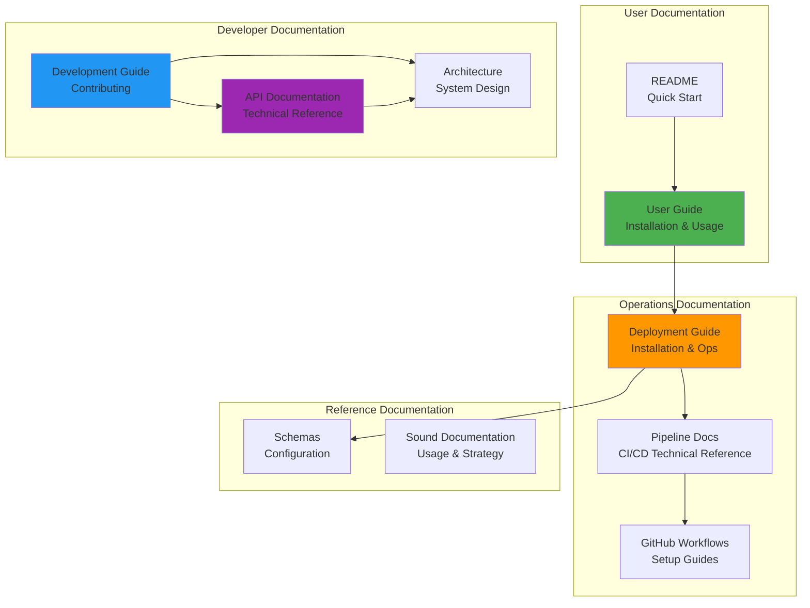

# Documentation Index

Welcome to the comprehensive documentation for the Warcraft II Notifications Plugin for OpenCode!

**Live Documentation**: This documentation is also available online at [https://pantheon-org.github.io/opencode-warcraft-notifications/](https://pantheon-org.github.io/opencode-warcraft-notifications/)

## Documentation Structure

### For Users

#### [User Guide](USER_GUIDE.md)

**Start here if you're using the plugin**

Complete guide for end users covering:

- Quick start and installation
- Configuration options
- Using the plugin
- Sound factions (Alliance & Horde)
- Customization
- Troubleshooting
- FAQ

**Best for**: Plugin users, configuration, troubleshooting

---

#### [README](../README.md)

**Quick overview and setup**

Main project documentation with:

- Feature overview
- Quick setup instructions
- Basic configuration
- Platform support
- Update instructions

**Best for**: First-time users, quick reference

---

### For Developers

#### [Onboarding Guide](ONBOARDING.md)

**Start here if you're new to the project**

Complete onboarding guide for new contributors:

- First day setup and exercises
- First week deep dive
- First month contribution goals
- Key resources and tools
- Team structure and communication
- Getting help

**Best for**: New contributors, team members, onboarding

---

#### [Contributing Guide](../CONTRIBUTING.md)

**Guidelines for contributing**

Comprehensive contribution guidelines:

- Code of conduct
- How to contribute
- Development workflow
- Coding standards
- Testing guidelines
- Pull request process
- Release process

**Best for**: Contributors, code reviewers, maintainers

---

#### [Development Guide](DEVELOPMENT.md)

**Technical development documentation**

Comprehensive development documentation:

- Development environment setup
- Project structure
- Development workflow
- Testing strategies
- Code quality standards
- Debugging techniques
- Release process

**Best for**: Active developers, maintainers

---

#### [API Documentation](API.md)

**Technical API reference**

Complete API documentation covering:

- Plugin entry point
- Notification module
- Schema validator module
- Plugin configuration module
- Sound manager module
- Bundled sounds module
- Sound data module
- Type definitions
- Usage examples

**Best for**: Developers, API integration, technical reference

---

#### [Architecture Documentation](ARCHITECTURE.md)

**System design and components**

Detailed architecture documentation:

- System architecture overview
- Component architecture
- Data flow diagrams
- Platform integration
- Configuration precedence
- Testing architecture
- Security considerations
- Performance optimization
- Extension points

**Best for**: Understanding system design, architectural decisions

---

### For Operations

#### [Deployment Guide](DEPLOYMENT.md)

**Installation and operations**

Complete deployment documentation:

- Installation procedures
- Configuration management
- Platform-specific setup
- Deployment architecture
- CI/CD pipeline overview
- Monitoring and health checks
- Troubleshooting
- Maintenance procedures
- Security considerations

**Best for**: DevOps, system administrators, deployment

---

#### [CI/CD Pipeline Documentation](PIPELINE.md)

**Complete pipeline technical reference**

Comprehensive CI/CD pipeline documentation:

- Pipeline architecture and flow
- Detailed workflow documentation (8 workflows)
- AI-powered version management
- Environment configuration
- Secrets management
- Monitoring and observability
- Troubleshooting guide
- Best practices
- Maintenance procedures

**Best for**: Understanding CI/CD details, pipeline configuration, workflow troubleshooting

---

### Specialized Documentation

#### [GitHub Workflows](github-workflows/README.md)

**CI/CD automation guides**

Documentation for GitHub Actions workflows:

- Workflow overview
- Smart version bump
- Release & publish
- PR validation
- Auto-merge bot
- Cleanup workflows
- Setup guide
- Architecture summary

**Best for**: Quick workflow reference, setup guides

---

#### [Schemas](schemas/README.md)

**JSON schema definitions**

Schema documentation and examples:

- Plugin configuration schema
- Configuration examples
- Schema validation

**Best for**: Configuration validation, IDE autocomplete

---

## Documentation Map

## Quick Navigation

### I want to...

#### Use the Plugin

1. Start with [README](../README.md) for quick setup
2. Read [User Guide](USER_GUIDE.md) for detailed usage
3. Check [Troubleshooting](USER_GUIDE.md#troubleshooting) if you have issues

#### Contribute to the Project

1. Start with [Onboarding Guide](ONBOARDING.md) for getting started
2. Read [Contributing Guide](../CONTRIBUTING.md) for guidelines
3. Read [Development Guide](DEVELOPMENT.md) for setup
4. Review [Architecture](ARCHITECTURE.md) to understand the system
5. Check [API Documentation](API.md) for technical details

#### Deploy or Maintain

1. Follow [Deployment Guide](DEPLOYMENT.md) for installation
2. Review [CI/CD Pipeline](PIPELINE.md) for complete technical reference
3. Review [GitHub Workflows](github-workflows/README.md) for setup guides
4. Check [Monitoring](DEPLOYMENT.md#monitoring) for health checks

#### Understand the System

1. Start with [Architecture](ARCHITECTURE.md) for system design
2. Review [API Documentation](API.md) for component details
3. Check [Development Guide](DEVELOPMENT.md) for code organization

## Documentation by Topic

### Installation & Setup

- [Quick Start](../README.md#setup)
- [Installation Guide](USER_GUIDE.md#installation)
- [Platform-Specific Setup](DEPLOYMENT.md#platform-specific-setup)

### Configuration

- [Basic Configuration](USER_GUIDE.md#configuration)
- [Configuration Options](API.md#plugin-configuration-module)
- [Configuration Precedence](ARCHITECTURE.md#configuration-precedence)

### Usage

- [Using the Plugin](USER_GUIDE.md#using-the-plugin)
- [Sound Factions](USER_GUIDE.md#sound-factions)
- [Customization](USER_GUIDE.md#customization)

### Development

- [Development Workflow](DEVELOPMENT.md#development-workflow)
- [Testing](DEVELOPMENT.md#testing)
- [Code Quality](DEVELOPMENT.md#code-quality)

### Architecture

- [System Architecture](ARCHITECTURE.md#system-architecture)
- [Component Architecture](ARCHITECTURE.md#component-architecture)
- [Data Flow](ARCHITECTURE.md#data-flow)

### API Reference

- [Plugin Entry Point](API.md#plugin-entry-point)
- [Notification Module](API.md#notification-module)
- [Sound Manager](API.md#sound-manager-module)

### Operations

- [Deployment](DEPLOYMENT.md#deployment-architecture)
- [CI/CD Pipeline Overview](DEPLOYMENT.md#cicd-pipeline)
- [CI/CD Pipeline Details](PIPELINE.md)
- [Workflow Setup](github-workflows/README.md)
- [Monitoring](DEPLOYMENT.md#monitoring)

### Troubleshooting

- [User Troubleshooting](USER_GUIDE.md#troubleshooting)
- [Deployment Troubleshooting](DEPLOYMENT.md#troubleshooting)
- [Debug Mode](DEVELOPMENT.md#debugging)

## Search by Role

### End User

**Goal**: Use the plugin effectively

**Recommended Reading**:

1. [README](../README.md) - Quick start
2. [User Guide](USER_GUIDE.md) - Complete usage guide
3. [FAQ](USER_GUIDE.md#faq) - Common questions

**Key Topics**:

- Installation
- Configuration
- Faction selection
- Troubleshooting

---

### Developer

**Goal**: Contribute to the project

**Recommended Reading**:

1. [Onboarding Guide](ONBOARDING.md) - Getting started
2. [Contributing Guide](../CONTRIBUTING.md) - Contribution guidelines
3. [Development Guide](DEVELOPMENT.md) - Development setup
4. [Architecture](ARCHITECTURE.md) - System design
5. [API Documentation](API.md) - Technical reference

**Key Topics**:

- Onboarding process
- Development workflow
- Testing
- Code quality
- Contributing guidelines

---

### DevOps/SRE

**Goal**: Deploy and maintain the plugin

**Recommended Reading**:

1. [Deployment Guide](DEPLOYMENT.md) - Installation & operations
2. [CI/CD Pipeline](PIPELINE.md) - Complete technical reference
3. [GitHub Workflows](github-workflows/README.md) - Setup guides
4. [Monitoring](DEPLOYMENT.md#monitoring) - Health checks

**Key Topics**:

- Deployment
- Configuration management
- Pipeline architecture
- Workflow troubleshooting
- Monitoring

---

### Architect

**Goal**: Understand system design

**Recommended Reading**:

1. [Architecture](ARCHITECTURE.md) - System architecture
2. [API Documentation](API.md) - Component details
3. [Development Guide](DEVELOPMENT.md) - Code organization

**Key Topics**:

- System architecture
- Component design
- Data flow
- Extension points

---

## Additional Resources

### Project Resources

- [Contributing Guide](../CONTRIBUTING.md) - How to contribute
- [License](../LICENSE) - MIT License

### External Documentation

- [Live Documentation Site](https://pantheon-org.github.io/opencode-warcraft-notifications/) - GitHub Pages hosted documentation
- [OpenCode Plugin Documentation](https://opencode.ai/docs/plugins/)
- [Bun Documentation](https://bun.sh/docs)
- [TypeScript Documentation](https://www.typescriptlang.org/docs/)

### Community

- [GitHub Issues](https://github.com/pantheon-org/opencode-warcraft-notifications/issues)
- [GitHub Discussions](https://github.com/pantheon-org/opencode-warcraft-notifications/discussions)

### Support

- **Email**: support@pantheon-ai.com
- **GitHub**: [@pantheon-org](https://github.com/pantheon-org)
- **Security**: security@pantheon-ai.com

---

## Recent Updates

### 2025-11-10

- ✅ Complete documentation suite created
- ✅ User Guide added
- ✅ API Documentation added
- ✅ Architecture Documentation added
- ✅ Development Guide added
- ✅ Deployment Guide added
- ✅ Documentation Index created
- ✅ GitHub Pages deployment configured

---

## Documentation Checklist

### For Users

- [x] Installation instructions
- [x] Configuration guide
- [x] Usage examples
- [x] Troubleshooting guide
- [x] FAQ section

### For Developers

- [x] Onboarding guide
- [x] Contributing guidelines
- [x] Development setup
- [x] API reference
- [x] Architecture documentation
- [x] Testing guide

### For Operations

- [x] Deployment procedures
- [x] CI/CD pipeline documentation
- [x] Configuration management
- [x] Monitoring guide
- [x] Troubleshooting procedures
- [x] Security considerations

### Project Documentation

- [x] Changelog
- [x] Security policy
- [x] License
- [x] Code of conduct (in Contributing)

---

## Contributing to Documentation

Found an issue or want to improve the documentation?

1. **Report issues**: [GitHub Issues](https://github.com/pantheon-org/opencode-warcraft-notifications/issues)
2. **Suggest improvements**: [GitHub Discussions](https://github.com/pantheon-org/opencode-warcraft-notifications/discussions)
3. **Submit changes**: Follow the [Contributing Guidelines](DEVELOPMENT.md#contributing)

---

**Document Version**: 1.0  
**Last Updated**: 2025-11-10  
**Maintained By**: Pantheon AI Team

---

_"Work complete!"_ - Warcraft II Peasant  
_"Zug zug!"_ - Warcraft II Orc
