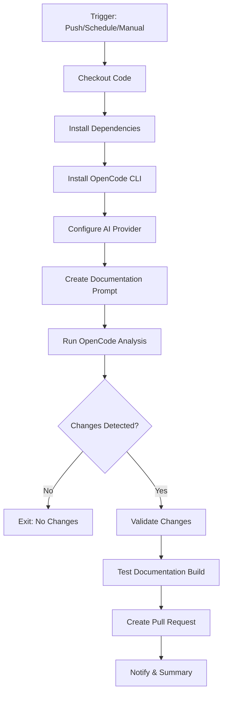
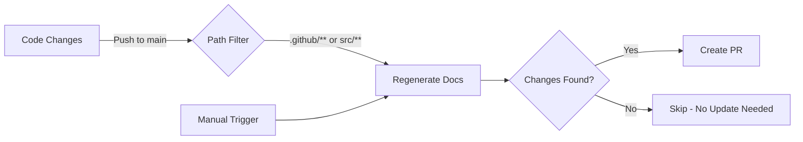

## Overview

The **Documentation Regeneration Workflow** (`chores-docs-regenerate.yml`) automatically regenerates documentation by analyzing the current codebase using AI (OpenCode). This ensures documentation stays in sync with code changes.

## Features

- 🤖 **AI-Powered**: Uses OpenCode with Claude, ChatGPT, Gemini, or GitHub Copilot
- 🚀 **Auto-Triggered**: Runs automatically when code or workflows change
- 🎯 **Selective**: Only creates PRs when changes are detected
- ✅ **Validated**: Tests documentation builds before creating PR
- 🔄 **Automated**: Fully automated with minimal human intervention
- ⚠️ **Non-Blocking**: Never blocks other workflows - fails gracefully with warnings

## Workflow Triggers

### Automatic on Code Changes

The workflow automatically triggers when changes are pushed to `main` branch in:

```yaml
push:
  branches:
    - main
  paths:
    - '.github/**' # Workflow or CI/CD changes
    - 'src/**' # Source code changes
```

**Why these paths?**

- **`.github/**`\*\*: Workflow changes should be reflected in pipeline documentation
- **`src/**`\*\*: Code changes may require API/architecture doc updates

### Manual Execution

Run manually from GitHub Actions:

1. Go to **Actions** → **Chores — Regenerate Documentation**
2. Click **Run workflow**
3. Select options:
   - **AI Provider**: Choose from:
     - `anthropic` - Anthropic Claude (recommended)
     - `openai` - OpenAI ChatGPT
     - `google` - Google Gemini
     - `github` - GitHub Copilot
   - **Create PR**: Whether to create a pull request with changes

## Configuration

### Required Secrets

Add at least one of these secrets to your GitHub repository:

- `ANTHROPIC_API_KEY` - For Anthropic Claude (recommended)
- `OPENAI_API_KEY` - For OpenAI ChatGPT
- `GOOGLE_API_KEY` - For Google Gemini
- `GITHUB_TOKEN` - For GitHub Copilot (automatically provided)

#### Setting Secrets

1. Navigate to **Settings** → **Secrets and variables** → **Actions**
2. Click **New repository secret**
3. Add your preferred AI provider's API key

**Note**: `GITHUB_TOKEN` is automatically available in GitHub Actions if you want to use GitHub Copilot.

### Permissions

The workflow requires these permissions:

```yaml
permissions:
  contents: write # To create commits
  pull-requests: write # To create PRs
```

## How It Works

### Workflow Steps



### Trigger Flow



### Documentation Analysis

The workflow uses a structured prompt that instructs the AI to:

1. **Analyze** the current codebase
2. **Update** documentation to match implementation
3. **Preserve** existing structure and formatting
4. **Validate** all changes before committing

### Files Regenerated

The workflow focuses on these key documentation files:

| File              | Purpose                        |
| ----------------- | ------------------------------ |
| `index.md`        | Main landing page and overview |
| `user-guide.md`   | User-facing documentation      |
| `api.md`          | Complete API reference         |
| `architecture.md` | System architecture            |
| `development.md`  | Development guide              |
| `deployment.md`   | Deployment guide               |
| `pipeline.md`     | CI/CD pipeline documentation   |

## Usage

### Automatic Triggering on Code Changes

**Zero configuration required!** The workflow automatically runs when:

#### Source Code Changes (`src/**`)

When you merge changes to source code:

1. Workflow analyzes the updated code
2. Regenerates relevant documentation (API, architecture)
3. Creates PR if documentation needs updating

**Example scenarios:**

- New functions/classes added → API docs updated
- Architecture changes → Architecture docs updated
- Configuration changes → User guide/deployment docs updated

#### Workflow Changes (`.github/**`)

When you update CI/CD workflows:

1. Workflow analyzes the workflow changes
2. Regenerates pipeline documentation
3. Creates PR with updated workflow docs

**Example scenarios:**

- New workflow added → Pipeline docs updated
- Workflow steps modified → Setup guides updated
- Secrets changed → Configuration docs updated

**Result**: Your documentation stays in sync automatically after every code change!

### Manual Regeneration

#### Via GitHub Actions

1. Go to **Actions** → **Chores — Regenerate Documentation**
2. Click **Run workflow**
3. Select desired options
4. Click **Run workflow** button

#### Locally

Use the provided script to regenerate documentation on your machine:

```bash
# Ensure you have API key set
export ANTHROPIC_API_KEY="your-key-here"

# Run the regeneration script
.github/scripts/regenerate-docs-local.sh
```

The local script:

- Uses the same prompt as the workflow
- Runs OpenCode analysis
- Shows detected changes
- Allows you to review before committing

### Reviewing Generated PRs

When the workflow detects changes, it creates a PR with:

- **Title**: `docs: Automated Documentation Regeneration`
- **Label**: `documentation`, `automated`
- **Assignee**: The user who triggered the workflow

#### Review Checklist

When reviewing a documentation PR:

- [ ] Verify accuracy of updated content
- [ ] Check that code examples are correct
- [ ] Ensure links are not broken
- [ ] Validate tone and style consistency
- [ ] Confirm technical accuracy
- [ ] Test documentation site locally

#### Testing Locally

```bash
# Checkout the PR branch
gh pr checkout <PR-NUMBER>

# Build and preview docs
cd docs
bun install
bun run build
bun run preview
```

## Customization

### Modifying the Prompt

Edit the prompt in the workflow file to adjust how documentation is regenerated:

```yaml
- name: Create documentation regeneration prompt
  run: |
    cat > .github/scripts/regenerate-docs-prompt.txt << 'EOF'
    # Your custom prompt here
    EOF
```

### Changing Default AI Provider

Edit the workflow to use a different provider by default:

```yaml
ai_provider:
  description: 'AI Provider to use'
  default: 'anthropic' # Options: 'anthropic', 'openai', 'google', 'github'
```

**Provider Details:**

- **anthropic**: Uses Claude 3.5 Sonnet (best for comprehensive analysis)
- **openai**: Uses GPT-4 Turbo (balanced performance)
- **google**: Uses Gemini 2.0 Flash (fast and efficient)
- **github**: Uses GitHub Copilot with GPT-4o (integrated with GitHub)

### Adjusting Trigger Paths

Modify or add paths to trigger the workflow:

```yaml
push:
  branches:
    - main
  paths:
    - '.github/**'
    - 'src/**'
    # Add more paths as needed:
    # - 'package.json'  # Trigger on dependency changes
    # - 'index.ts'      # Trigger on main entry point changes
```

## Troubleshooting

### Workflow Skipped - No AI Provider

**Symptom**: Workflow completes with warning "No AI provider available"

**Cause**: No API keys found in repository secrets

**Solution**:

1. Add at least one API key to repository secrets:
   - `ANTHROPIC_API_KEY` (for Claude)
   - `OPENAI_API_KEY` (for ChatGPT)
   - `GOOGLE_API_KEY` (for Gemini)
   - `GITHUB_TOKEN` (usually auto-available for Copilot)

2. Re-run the workflow or wait for next trigger

**Note**: This is a warning, not an error. The workflow will not block other workflows from running.

### No Changes Detected

**Symptom**: Workflow completes but reports no changes

**Possible Causes**:

- Documentation is already up-to-date
- OpenCode didn't find any discrepancies
- AI provider rate limits

**Solution**:

- Review workflow logs for OpenCode output
- Check if API key is valid and has quota
- Try running locally with verbose output

### Build Failure

**Symptom**: Documentation build fails in validation step

**Possible Causes**:

- Invalid markdown syntax
- Broken frontmatter
- Missing required files

**Solution**:

1. Check workflow logs for specific error
2. Test build locally: `cd docs && bun run build`
3. Fix syntax errors and re-run workflow

### PR Not Created

**Symptom**: Workflow completes but no PR appears

**Possible Causes**:

- No changes detected
- Missing permissions
- `create_pr` input set to false

**Solution**:

- Verify `has_changes` output in workflow logs
- Check workflow has `pull-requests: write` permission
- Ensure `create_pr` is not disabled

### API Rate Limits

**Symptom**: Workflow fails with rate limit errors

**Possible Causes**:

- Too many API requests in short time
- Exceeded daily/monthly quota

**Solution**:

- Wait for rate limit to reset
- Consider upgrading API plan
- Temporarily disable auto-trigger by removing paths from workflow
- Use manual trigger only when needed

## Non-Blocking Behavior

This workflow is designed to **never block other workflows** from running:

### Graceful Failure

- ✅ Uses `continue-on-error: true` at the job level
- ✅ All steps check for provider availability before executing
- ✅ Missing API keys result in warnings, not errors
- ✅ Workflow summary shows clear status and action items

### Fallback Strategy

If the requested provider isn't available, the workflow:

1. Shows a warning about the missing provider
2. Lists available providers
3. Falls back to the first available provider
4. Continues with documentation regeneration

### When Provider is Unavailable

If **no** providers are available:

1. Workflow logs a clear warning message
2. Step summary shows required action items
3. Workflow completes successfully (exit code 0)
4. Other workflows continue unaffected

**Example warning message:**

```
⚠️  WARNING: No AI provider API keys found
   Please add at least one of:
   - ANTHROPIC_API_KEY (for Claude)
   - OPENAI_API_KEY (for ChatGPT)
   - GOOGLE_API_KEY (for Gemini)
   - GITHUB_TOKEN (for Copilot)

   Skipping documentation regeneration...
```

## Best Practices

### 1. Regular Reviews

Even with automated regeneration, periodically review documentation manually to ensure:

- Tone and voice remain consistent
- Examples are relevant and helpful
- No AI hallucinations or inaccuracies

### 2. Incremental Updates

After major code changes:

1. Run workflow manually
2. Review generated PR carefully
3. Make manual adjustments if needed

### 3. Version Documentation

When releasing new versions:

1. Trigger documentation regeneration
2. Review for version-specific changes
3. Ensure migration guides are updated

### 4. Monitor Costs

Track AI API usage:

- Set up billing alerts
- Monitor token consumption
- Adjust frequency if costs are high

## Integration with Other Workflows

The documentation regeneration workflow integrates with:

### Deploy Documentation Workflow

After a regeneration PR is merged:

1. Changes trigger `deploy-docs.yml`
2. Documentation is built
3. Deployed to `docs` branch
4. Published to GitHub Pages

### Version Update Workflow

Documentation regeneration can be triggered after version updates to ensure version numbers are current.

## Monitoring

### Success Metrics

Track these metrics to measure effectiveness:

- **PR Creation Rate**: How often changes are detected
- **Review Time**: How long PRs take to review
- **Merge Rate**: Percentage of PRs merged without changes
- **Build Success**: Documentation build success rate

### Logs and Debugging

View detailed logs:

1. Go to **Actions** → **Chores — Regenerate Documentation**
2. Click on a workflow run
3. Expand steps to see detailed output

## Future Enhancements

Potential improvements:

- [ ] Add support for more AI providers
- [ ] Implement smart diffing to show only significant changes
- [ ] Add automatic review approval for minor changes
- [ ] Integrate with documentation quality checks
- [ ] Add support for multi-language documentation

## Related Documentation

- [CI/CD Pipeline Documentation](../pipeline.md)
- [Documentation Deployment](../deployment.md#documentation-deployment)
- [GitHub Workflows Overview](./overview.md)
- [Development Guide](../development.md)

## Support

For issues with documentation regeneration:

1. Check workflow logs
2. Review this troubleshooting guide
3. Open an issue with `documentation` label
4. Include workflow run link and error messages

## Version History

- **v1.0.0** (2025-01-14): Initial documentation regeneration workflow
