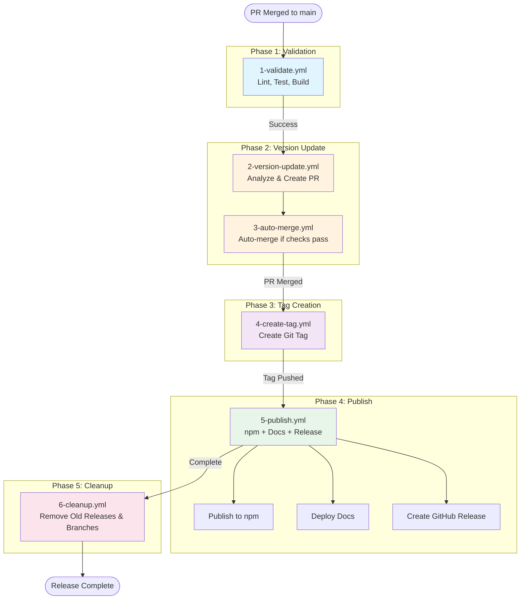

## Overview

This repository uses a **sequential orchestrated workflow** to automate releases following semantic versioning principles.

## Workflow Architecture



## Workflow Details

### 1. Validate PR (1-validate.yml)

**Trigger**: Pull request opened/updated  
**Purpose**: Run quality checks before merging

**Jobs**:

- Lint, test, type-check, build
- Security scanning (Trivy)
- PR size analysis

**Outputs**: Pass/fail status for PR approval

---

### 2. Version Update (2-version-update.yml)

**Trigger**: Push to main (after PR merge)  
**Purpose**: Analyze commits and create version bump PR

**Jobs**:

1. Analyze commits with conventional commit patterns
2. Determine version bump (MAJOR/MINOR/PATCH)
3. Update package.json
4. Create version bump PR

**Outputs**: New PR with version update

**Protection**: Skips if commit is workflow-generated (prevents loops)

---

### 3. Auto-Merge (3-auto-merge.yml)

**Trigger**: PR opened/updated, checks completed  
**Purpose**: Automatically merge version bump PRs

**Conditions**:

- PR title matches: `chore: bump version to v*`
- PR author is `github-actions[bot]`
- PR branch starts with `version-bump/`
- All checks pass

**Jobs**:

1. Verify PR is version bump
2. Check all status checks passed
3. Enable auto-merge with squash

**Outputs**: Merged version bump PR

---

### 4. Create Tag (4-create-tag.yml)

**Trigger**: Push to main with package.json changes  
**Purpose**: Create git tag from package.json version

**Jobs**:

1. Verify commit is version bump
2. Read version from package.json
3. Create annotated git tag (v\*)
4. Push tag to remote

**Outputs**: New git tag

**Protection**: Only runs for version bump commits, checks if tag exists

---

### 5. Publish Release (5-publish.yml)

**Trigger**: Tag pushed (v\*)  
**Purpose**: Publish npm package, deploy docs, create GitHub release

**Jobs**:

1. **publish-npm**
   - Verify package.json matches tag
   - Run full test suite
   - Publish to npm with provenance
   - Verify publication

2. **publish-docs**
   - Build Astro documentation
   - Deploy to `docs` branch

3. **create-release**
   - Generate changelog from commits
   - Create GitHub release with links

**Outputs**:

- npm package published
- Documentation deployed
- GitHub release created

---

### 6. Cleanup (6-cleanup.yml)

**Trigger**: After publish workflow completes, weekly schedule, manual  
**Purpose**: Maintain clean repository

**Jobs**:

1. **cleanup-releases**
   - Keep 5 most recent major versions
   - Keep 10 releases for current major
   - Keep 1 release for older majors
   - Delete old releases and tags

2. **cleanup-branches**
   - Delete branches merged >1 day ago
   - Skip protected branches (main, docs, etc.)
   - Clean up local tracking branches

**Outputs**: Clean repository with relevant history

---

## Complete Flow Example

### Scenario: New Feature Added

```
1. Developer creates PR with "feat: add new feature"
   → 1-validate.yml runs (lint, test, build)

2. PR approved and merged to main
   → 2-version-update.yml analyzes commits
   → Determines MINOR version bump needed
   → Creates PR: "chore: bump version to v1.1.0"

3. Version bump PR created
   → 1-validate.yml runs on version PR
   → 3-auto-merge.yml monitors checks
   → All checks pass → auto-merge enabled
   → PR merged with squash

4. Version bump PR merged
   → 4-create-tag.yml detects version commit
   → Creates tag v1.1.0
   → Pushes tag to remote

5. Tag v1.1.0 pushed
   → 5-publish.yml triggered
   → Publishes @pantheon-ai/opencode-warcraft-notifications@1.1.0 to npm
   → Deploys documentation to docs branch
   → Creates GitHub release v1.1.0

6. Publish complete
   → 6-cleanup.yml triggered
   → Cleans up old releases (if >10 for current major)
   → Deletes merged version-bump branch
```

**Result**: New version published to npm, docs updated, release created

---

## Version Determination Rules

### Conventional Commit Analysis

The workflow uses **conventional commit** patterns to determine version bumps:

| Commit Pattern                       | Version Bump | Example               |
| ------------------------------------ | ------------ | --------------------- |
| `BREAKING CHANGE:` or `!:`           | MAJOR        | `feat!: change API`   |
| `feat:` or `feature:`                | MINOR        | `feat: add new sound` |
| `fix:` or `bugfix:`                  | PATCH        | `fix: correct path`   |
| `docs:`, `chore:`, `refactor:`, etc. | PATCH        | `docs: update README` |

### Manual Override

You can force a specific version bump:

```bash
# Trigger workflow manually with specific version type
gh workflow run 2-version-update.yml -f version_type=major
```

---

## Workflow Configuration

### Required Secrets

| Secret          | Purpose               | Required For              |
| --------------- | --------------------- | ------------------------- |
| `GITHUB_TOKEN`  | Built-in token        | All workflows (auto)      |
| `WORKFLOW_PAT`  | Personal access token | Push commits, create tags |
| `NPM_TOKEN`     | npm authentication    | Publishing packages       |
| `CODECOV_TOKEN` | Coverage reporting    | Test coverage upload      |

### Repository Settings

**Required Settings** (enforced by repo-config-check workflow):

- ✅ Allow squash merging (required)
- ❌ Allow merge commits (disabled)
- ❌ Allow rebase merging (disabled)
- ✅ Automatically delete head branches (enabled)

**Why**: Ensures one commit per PR = one version bump = one release

---

## Preventing Workflow Loops

### Protection Mechanisms

1. **Commit Message Detection**
   - Workflows skip if commit starts with `chore: bump version`
   - Workflows skip if commit contains `[skip ci]`

2. **Branch Name Filtering**
   - Only specific branches trigger workflows
   - `version-bump/*` branches handled specially

3. **Tag Existence Checks**
   - Before creating tag, check if already exists
   - Skip if tag found locally or remotely

4. **PR Existence Checks**
   - Before creating version PR, check if already exists
   - Skip if branch or PR found

---

## Troubleshooting

### Workflow Not Triggering

**Problem**: Version update workflow doesn't run after PR merge

**Solutions**:

1. Check commit message doesn't contain `[skip ci]`
2. Verify commit modified files outside `paths-ignore`
3. Check workflow is enabled in Actions tab

---

### Auto-Merge Not Working

**Problem**: Version bump PR not auto-merging

**Solutions**:

1. Verify `WORKFLOW_PAT` has sufficient permissions
2. Check all status checks passed (not just some)
3. Verify PR title matches pattern exactly
4. Check auto-merge is enabled for repository

---

### Version Mismatch

**Problem**: package.json version doesn't match tag

**Solutions**:

1. This should not happen with new workflow structure
2. If it does, manually update package.json
3. Re-run 4-create-tag workflow

---

### Tag Already Exists

**Problem**: Tag creation fails because tag exists

**Solutions**:

1. Workflow should skip gracefully
2. If tag is wrong, delete it: `git push --delete origin v1.0.0`
3. Re-run workflow

---

## Comparison: Old vs New Workflow

### Old Workflow Issues

1. ❌ **Version bump happened BEFORE PR**: No review process
2. ❌ **AI dependency broken**: Gemini CLI installation failed
3. ❌ **Redundant sync workflow**: Created additional PRs
4. ❌ **Race conditions**: Multiple workflows modifying same files
5. ❌ **Complex orchestration**: Hard to follow flow

### New Workflow Benefits

1. ✅ **Clear sequential flow**: Easy to understand and debug
2. ✅ **Version bump via PR**: Reviewable and auditable
3. ✅ **No AI dependency**: Uses proven conventional commits
4. ✅ **No redundancy**: Single purpose per workflow
5. ✅ **Loop prevention**: Multiple safeguards
6. ✅ **Idempotent**: Safe to re-run workflows

---

## Monitoring

### GitHub Actions Tab

Check workflow status at:  
`https://github.com/pantheon-org/opencode-warcraft-notifications/actions`

### Expected Run Times

| Workflow         | Average Duration |
| ---------------- | ---------------- |
| 1-validate       | 2-3 minutes      |
| 2-version-update | 30 seconds       |
| 3-auto-merge     | 10 seconds       |
| 4-create-tag     | 10 seconds       |
| 5-publish        | 4-5 minutes      |
| 6-cleanup        | 1-2 minutes      |

**Total**: ~10 minutes from PR merge to published release

---

## Maintenance

### Weekly Tasks (Automated)

- Sunday 2 AM UTC: Cleanup old releases and branches
- Monday 9 AM UTC: Check repository configuration

### Monthly Tasks (Manual)

- Review workflow logs for errors
- Update workflow dependencies
- Verify npm packages published correctly

---

## References

- [Conventional Commits](https://www.conventionalcommits.org/)
- [Semantic Versioning](https://semver.org/)
- [GitHub Actions Documentation](https://docs.github.com/en/actions)
- [npm Publishing](https://docs.npmjs.com/cli/v9/commands/npm-publish)

---

**Last Updated**: 2025-11-11  
**Maintained By**: Pantheon AI Team
