# Architecture Documentation

## Overview

The Warcraft II Notifications Plugin is an OpenCode plugin that enhances the development experience by playing authentic Warcraft II unit sounds when the IDE session goes idle. The plugin is built with TypeScript and uses the Bun runtime for optimal performance.

## System Architecture

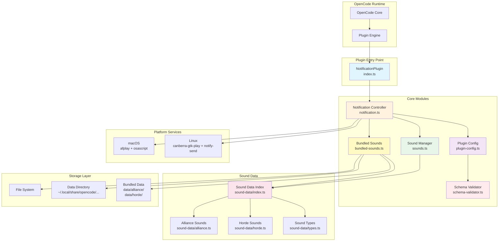

## Component Architecture

### 1. Plugin Entry Point (`index.ts`)

**Purpose**: Exports the main plugin interface to OpenCode.

**Responsibilities**:

- Export `NotificationPlugin` as the primary plugin interface
- Serve as the entry point for OpenCode plugin loading

**Dependencies**: `notification.ts`

### 2. Notification Controller (`notification.ts`)

**Purpose**: Core plugin logic that orchestrates event handling and notification delivery.

**Key Responsibilities**:

- Listen for OpenCode session idle events
- Load plugin configuration
- Install bundled sounds on first run
- Select random sounds based on faction preference
- Play sounds and display notifications using platform-specific commands
- Extract and format session summaries

**Event Flow**:

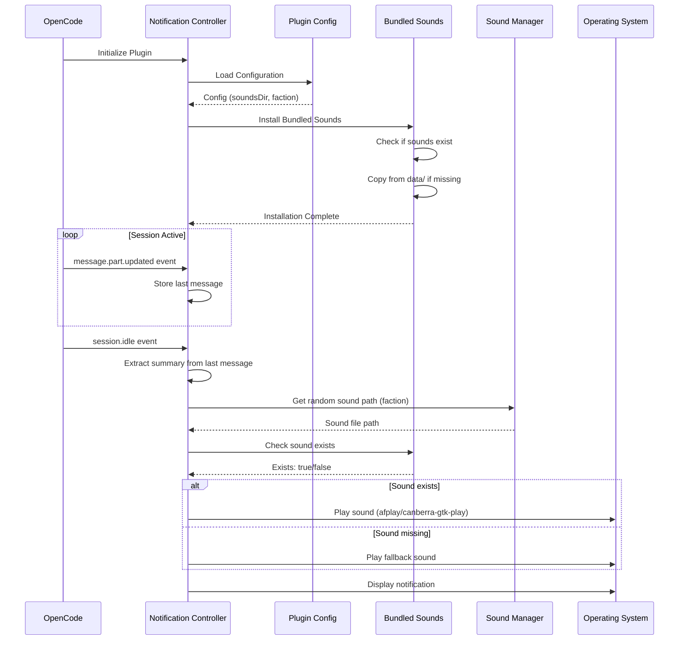

**Configuration Integration**:

- Reads `soundsDir` from plugin configuration
- Reads `faction` preference (alliance/horde/both)
- Falls back to platform-specific defaults

### 3. Schema Validator (`schema-validator.ts`)

**Purpose**: Validates plugin configuration against JSON schema at runtime using Zod.

**Key Responsibilities**:

- Validate configuration structure and values
- Provide detailed, actionable error messages
- Support both error-throwing and non-throwing validation modes
- Ensure type safety for configuration objects

**Validation Flow**:

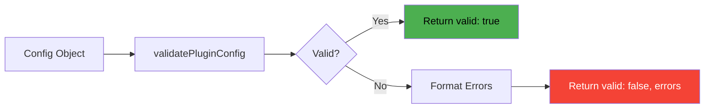

**Validation Rules**:

- `faction`: Must be `'alliance'`, `'horde'`, or `'both'` (optional)
- `soundsDir`: Must be a string (optional)
- No unrecognized keys allowed (strict mode)

**Error Message Format**:

```
[Warcraft Notifications] Configuration validation failed:
  - faction: Invalid enum value. Must be one of: 'alliance', 'horde', 'both'
  Configuration file: /path/to/.opencode/plugin.json
```

**Performance**: Validation completes in <0.1ms, meeting the <100ms requirement.

### 4. Plugin Configuration (`plugin-config.ts`)

**Purpose**: Manages plugin configuration loading, validation, and default directory resolution.

**Key Features**:

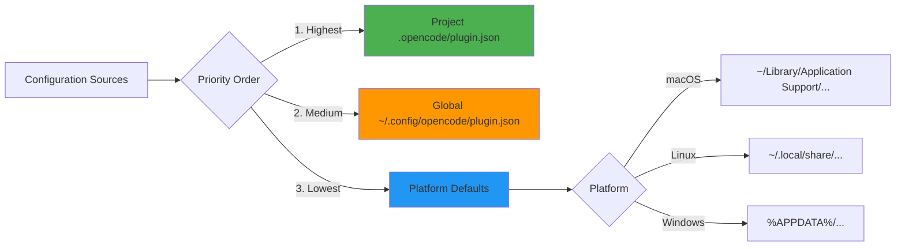

**Configuration Schema**:

```typescript
interface WarcraftNotificationConfig {
  soundsDir?: string; // Custom sound storage directory
  faction?: 'alliance' | 'horde' | 'both'; // Faction preference
}
```

**Platform-Specific Defaults**:

- **macOS**: `~/Library/Application Support/opencode/storage/plugin/<package-name>`
- **Linux**: `~/.local/share/opencode/storage/plugin/<package-name>`
- **Windows** (planned): `%APPDATA%\opencode\storage\plugin\<package-name>`

> **Note**: Windows support is planned for a future release. Currently supported: macOS and Linux.

**Environment Variable Overrides**:

- `SOUNDS_DATA_DIR`: Override default data directory
- `SOUNDS_BASE_URL`: Override download base URL (legacy)

### 5. Sound Manager (`sounds.ts`)

**Purpose**: Manages sound file selection, path resolution, and faction-based filtering.

**Sound Organization**:

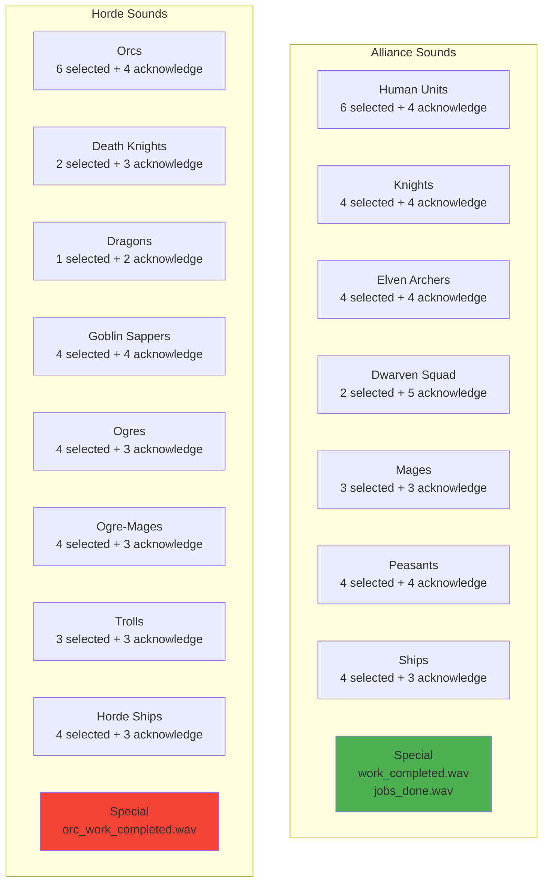

**Key Functions**:

- `getRandomSoundFromFaction(faction)`: Select random sound by faction
- `getRandomSoundPathFromFaction(faction, dataDir)`: Get full path to random sound
- `determineSoundFaction(filename)`: Determine faction from filename
- `soundExists(filename, faction, dataDir)`: Check if sound file exists
- `getSoundsByFaction(faction)`: Get all sounds for a faction

**Faction Detection Logic**:

```typescript
// Horde sounds start with specific prefixes
if (
  filename.startsWith('orc_') ||
  filename.startsWith('death_knight_') ||
  filename.startsWith('dragon_') ||
  filename.startsWith('goblin_sapper_') ||
  filename.startsWith('ogre_') ||
  filename.startsWith('troll_') ||
  filename.startsWith('horde_ship_')
) {
  return 'horde';
}
// Default to alliance
return 'alliance';
```

### 6. Bundled Sounds Manager (`bundled-sounds.ts`)

**Purpose**: Handles installation and verification of bundled sound files.

**Installation Flow**:

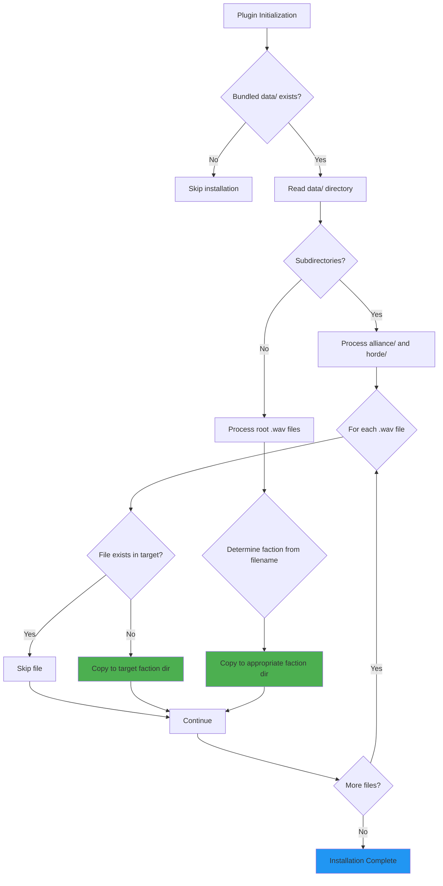

**Key Features**:

- **Non-destructive**: Never overwrites existing files
- **Faction-aware**: Organizes sounds into alliance/ and horde/ subdirectories
- **Idempotent**: Safe to run multiple times
- **Error-tolerant**: Continues on individual file failures

**Directory Structure**:

```
<dataDir>/
├── alliance/
│   ├── human_selected1.wav
│   ├── knight_acknowledge1.wav
│   ├── elf_selected1.wav
│   └── ... (50+ files)
└── horde/
    ├── orc_selected1.wav
    ├── death_knight_acknowledge1.wav
    ├── dragon_selected1.wav
    └── ... (50+ files)
```

### 7. Sound Data Module (`sound-data/`)

**Purpose**: Centralized sound metadata and file list management.

**Module Structure**:

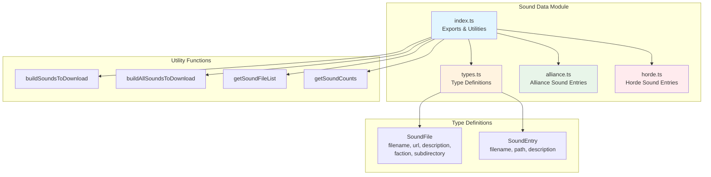

**Data Structure**:

```typescript
// Alliance sound entry example
{
  filename: 'human_selected1.wav',
  path: 'human_selected1.wav',
  description: 'Human unit selected - "Yes, my lord?"'
}

// Horde sound entry example
{
  filename: 'orc_selected1.wav',
  path: 'orc_selected1.wav',
  description: 'Orc unit selected - "Zug zug!"'
}
```

**Key Functions**:

- `buildSoundsToDownload(faction, baseUrl)`: Build download list for faction
- `buildAllSoundsToDownload(baseUrl)`: Build complete download list
- `getSoundFileList(faction?)`: Get list of expected filenames
- `getSoundCounts()`: Get sound counts by faction

## Data Flow

### Plugin Initialization Flow

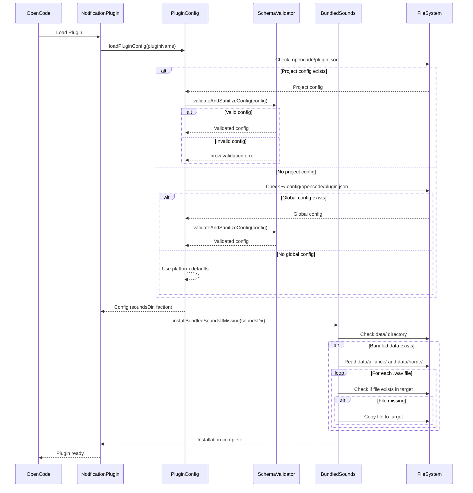

### Idle Notification Flow

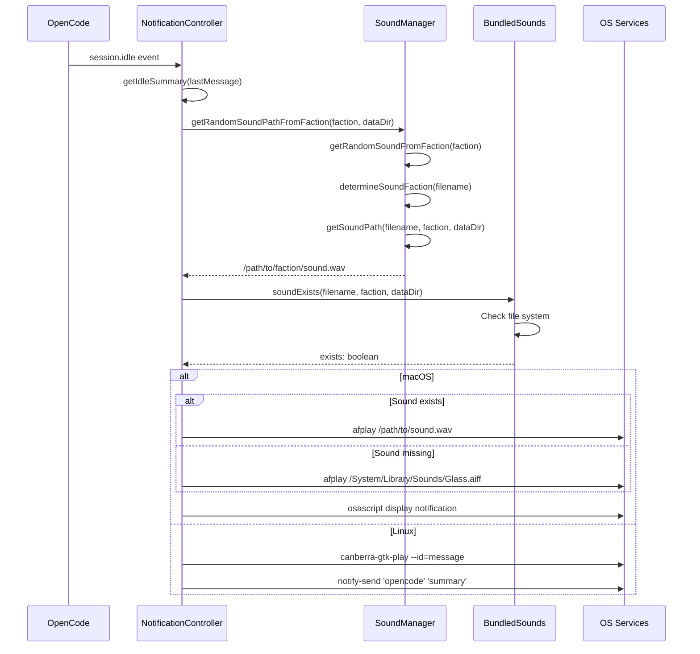

## Platform Integration

### macOS Integration

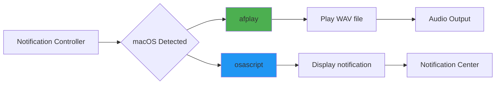

**Commands Used**:

```bash
# Play sound
afplay /path/to/sound.wav

# Display notification
osascript -e 'display notification "summary" with title "opencode"'
```

### Linux Integration

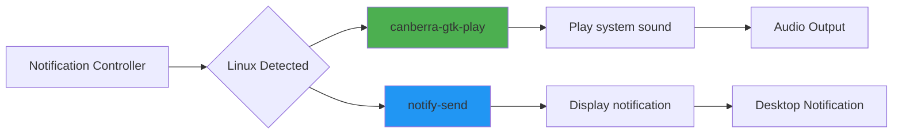

**Commands Used**:

```bash
# Play sound
canberra-gtk-play --id=message

# Display notification
notify-send 'opencode' 'summary'
```

## Configuration Precedence

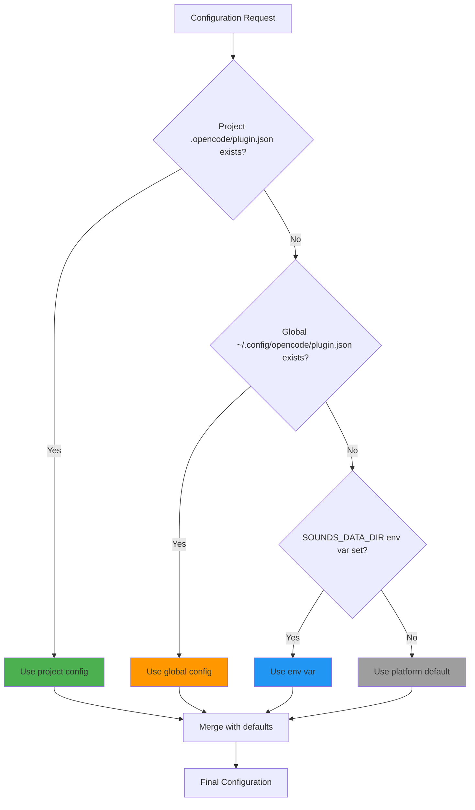

**Priority Order** (highest to lowest):

1. Project-specific `.opencode/plugin.json` `soundsDir` setting
2. Global `~/.config/opencode/plugin.json` `soundsDir` setting
3. `SOUNDS_DATA_DIR` environment variable
4. Platform-specific default directory

## Testing Architecture

### Test Structure

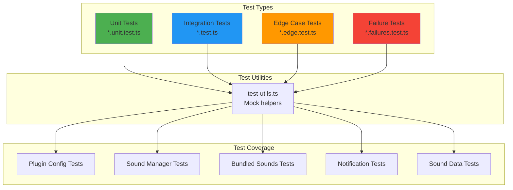

**Test Categories**:

- **Unit Tests**: Test individual functions in isolation
- **Integration Tests**: Test component interactions
- **Edge Case Tests**: Test boundary conditions and unusual inputs
- **Failure Tests**: Test error handling and recovery

**Test Utilities** (`test-utils.ts`):

- Mock file system operations
- Mock environment variables
- Mock platform detection
- Create temporary test directories

## Security Considerations

### File System Security

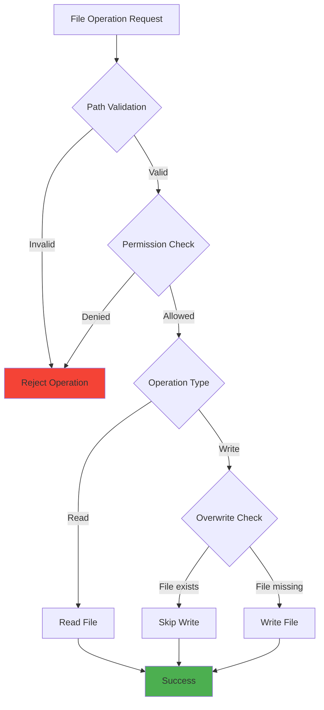

**Security Measures**:

- **No overwrites**: Existing files are never overwritten
- **Directory validation**: All paths are validated before use
- **Permission checks**: File operations respect system permissions
- **No network operations**: All sounds are bundled, no runtime downloads

### Configuration Security

- **No code execution**: Configuration is pure JSON data
- **Path sanitization**: All paths are sanitized before use
- **Environment isolation**: Environment variables are scoped appropriately

## Performance Considerations

### Lazy Loading

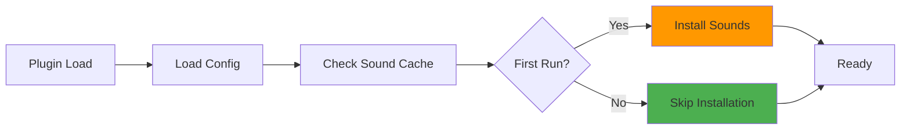

**Optimization Strategies**:

- **Sound cache**: Verified sounds are cached to avoid repeated checks
- **Lazy installation**: Sounds are only installed on first run
- **Minimal file I/O**: File operations are minimized and cached

### Memory Management

- **Small footprint**: Plugin maintains minimal state
- **No sound buffering**: Sounds are played directly from disk
- **Efficient data structures**: Sound lists use const arrays

## Extension Points

### Adding New Sounds

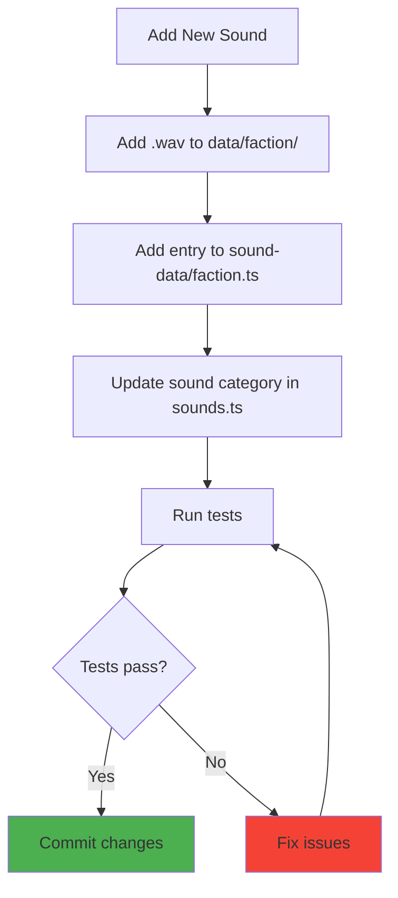

### Adding New Factions

To add a new faction (e.g., "neutral"):

1. **Update types** (`plugin-config.ts`):

   ```typescript
   export type Faction = 'alliance' | 'horde' | 'neutral' | 'both';
   ```

2. **Create sound data** (`sound-data/neutral.ts`):

   ```typescript
   export const neutralSoundEntries: SoundEntry[] = [
     { filename: 'neutral_sound1.wav', path: 'neutral_sound1.wav', description: '...' },
   ];
   ```

3. **Update sound manager** (`sounds.ts`):

   ```typescript
   export const neutralSounds = {
     /* ... */
   };
   export const getSoundsByFaction = (faction: Faction): string[] => {
     switch (faction) {
       case 'neutral':
         return Object.values(neutralSounds).flat();
       // ...
     }
   };
   ```

4. **Update bundled sounds** (`bundled-sounds.ts`):
   - Add neutral faction detection logic
   - Update installation to handle neutral/ subdirectory

## Deployment Architecture

### NPM Package Structure

```
@pantheon-ai/opencode-warcraft-notifications/
├── index.ts                 # Entry point
├── src/                     # Source code
│   ├── notification.ts
│   ├── plugin-config.ts
│   ├── sounds.ts
│   ├── bundled-sounds.ts
│   └── sound-data/
├── data/                    # Bundled sounds
│   ├── alliance/
│   └── horde/
├── docs/                    # Documentation
├── package.json
└── README.md
```

### Installation Flow

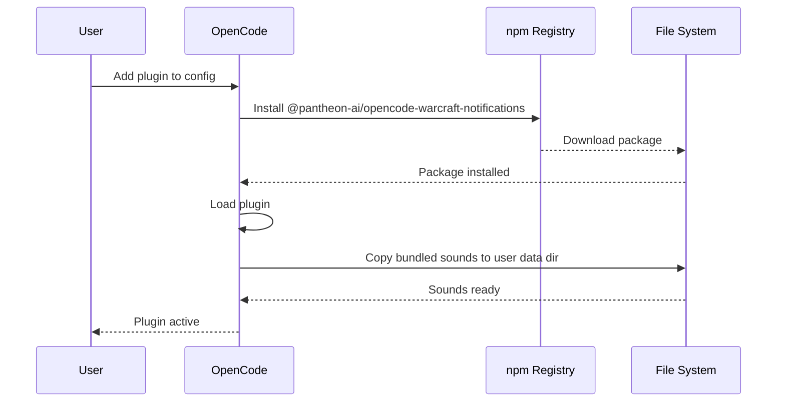

## Monitoring and Debugging

### Debug Mode

Enable debug logging with:

```bash
DEBUG_OPENCODE=1 opencode
```

**Debug Output**:

- Configuration loading attempts
- Sound installation progress
- File operation results
- Error details

### Common Issues

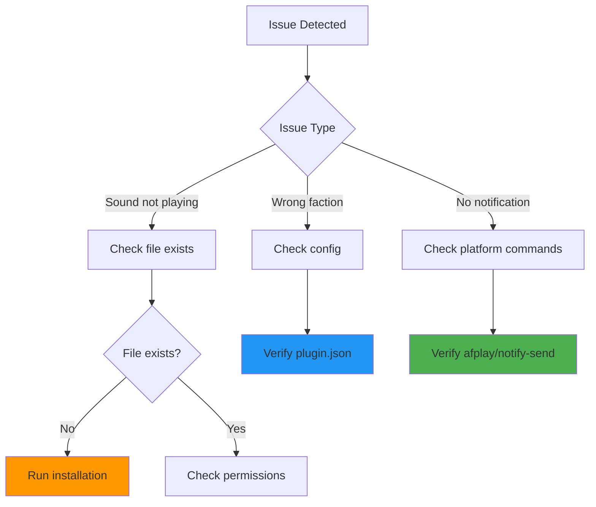

## Future Architecture Considerations

### Potential Enhancements

1. **Custom Sound Packs**
   - Support for user-provided sound packs
   - Sound pack marketplace integration

2. **Advanced Configuration**
   - Per-event sound mapping
   - Volume control
   - Sound categories (selected vs. acknowledge)

3. **Analytics**
   - Track most played sounds
   - Usage statistics
   - Performance metrics

4. **Multi-platform Expansion**
   - Windows support
   - Web-based OpenCode support
   - Mobile notifications

---

## Related Documentation

- [API Documentation](API.md) - Complete technical API reference
- [Development Guide](DEVELOPMENT.md) - Development setup and workflow
- [Deployment Guide](DEPLOYMENT.md) - Installation and operations
- [User Guide](USER_GUIDE.md) - End-user documentation

---

**Document Version**: 1.0  
**Last Updated**: 2025-11-10  
**Maintained By**: Pantheon AI Team
