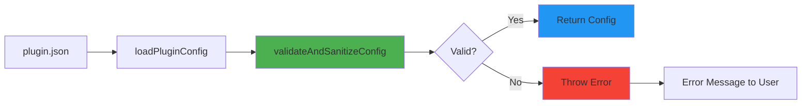
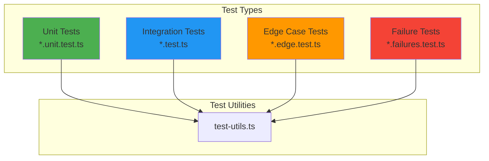
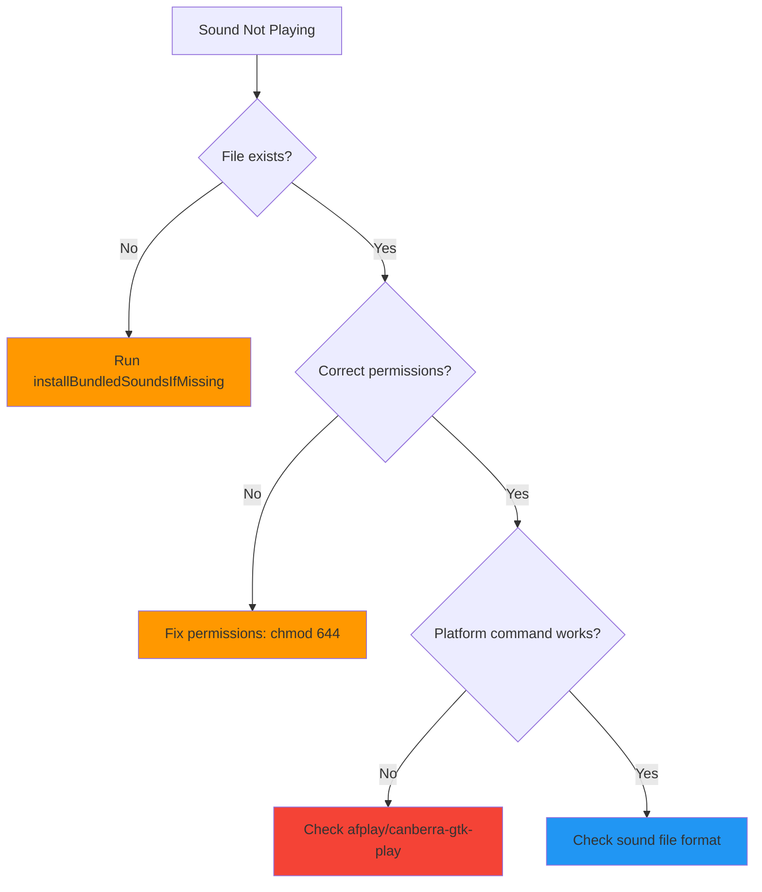
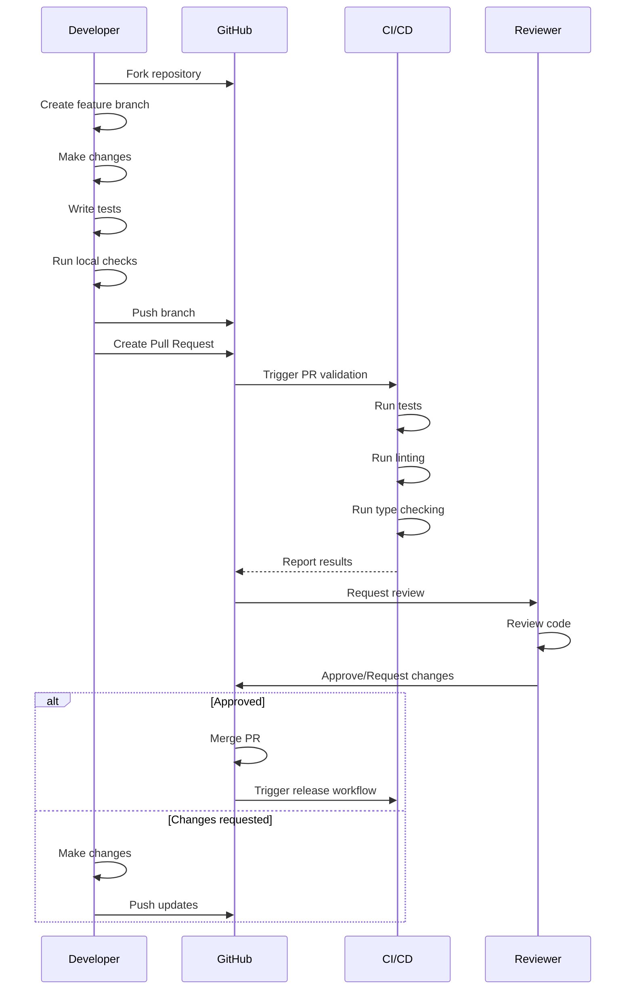
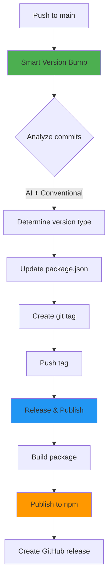

# Development Guide

## Overview

This guide provides comprehensive information for developers working on the Warcraft II Notifications Plugin. It covers setup, development workflows, testing strategies, and contribution guidelines.

## Table of Contents

- [Getting Started](#getting-started)
- [Development Environment](#development-environment)
- [Project Structure](#project-structure)
- [Development Workflow](#development-workflow)
- [Testing](#testing)
- [Code Quality](#code-quality)
- [Debugging](#debugging)
- [Contributing](#contributing)
- [Release Process](#release-process)

## Development Environment

### IDE Setup

#### Visual Studio Code

Recommended extensions:

- **ESLint**: For linting
- **Prettier**: For code formatting
- **TypeScript**: For type checking
- **Bun for Visual Studio Code**: For Bun support

**Settings** (`.vscode/settings.json`):

```json
{
  "editor.formatOnSave": true,
  "editor.defaultFormatter": "esbenp.prettier-vscode",
  "editor.codeActionsOnSave": {
    "source.fixAll.eslint": true
  },
  "typescript.tsdk": "node_modules/typescript/lib"
}
```

### Environment Variables

Create a `.env` file for local development:

```bash
# Debug mode
DEBUG_OPENCODE=1

# Custom data directory (optional)
SOUNDS_DATA_DIR=/path/to/custom/sounds

# Custom base URL (optional, legacy)
SOUNDS_BASE_URL=https://custom-cdn.com/sounds
```

---

## Project Structure

```
opencode-warcraft-notifications/
├── .github/                    # GitHub workflows and automation
│   ├── scripts/               # Workflow helper scripts
│   └── workflows/             # CI/CD workflows
├── data/                      # Bundled sound files
│   ├── alliance/             # Alliance faction sounds
│   └── horde/                # Horde faction sounds
├── docs/                      # Documentation
│   ├── github-workflows/     # Workflow documentation
│   └── schemas/              # JSON schemas
├── src/                       # Source code
│   ├── sound-data/           # Sound metadata
│   │   ├── alliance.ts       # Alliance sound entries
│   │   ├── horde.ts          # Horde sound entries
│   │   ├── index.ts          # Sound data exports
│   │   └── types.ts          # Type definitions
│   ├── bundled-sounds.ts     # Bundled sound management
│   ├── notification.ts       # Main plugin logic
│   ├── plugin-config.ts      # Configuration management
│   ├── sounds.ts             # Sound selection and paths
│   └── test-utils.ts         # Testing utilities
├── typings/                   # TypeScript type definitions
├── index.ts                   # Plugin entry point
├── package.json              # Package configuration
├── tsconfig.json             # TypeScript configuration
├── tsconfig.test.json        # Test TypeScript configuration
├── eslint.config.cjs         # ESLint configuration
└── .prettierrc               # Prettier configuration
```

### Key Directories

#### `src/`

Contains all source code:

- **Core modules**: `notification.ts`, `plugin-config.ts`, `sounds.ts`, `bundled-sounds.ts`, `schema-validator.ts`
- **Sound data**: `sound-data/` directory with faction-specific sound entries
- **Tests**: `*.test.ts` files for unit and integration tests
- **Utilities**: `test-utils.ts` for testing helpers

#### `data/`

Contains bundled WAV files:

- **alliance/**: 50+ Alliance unit sounds
- **horde/**: 50+ Horde unit sounds

#### `docs/`

Documentation files:

- **API documentation**: API reference
- **Architecture**: System design and component diagrams
- **Workflows**: CI/CD pipeline documentation
- **Schemas**: JSON schema definitions

---

## Configuration Validation

The plugin implements runtime validation of `plugin.json` configuration using Zod schemas. Configuration is validated automatically when the plugin loads, ensuring that any configuration errors are caught early with clear, actionable error messages.

### Validation Architecture



### Schema Definition

The validation schema is defined in `src/schema-validator.ts` and enforces:

- **faction**: Must be one of `'alliance'`, `'horde'`, or `'both'` (optional)
- **soundsDir**: Must be a string (optional)
- **No extra keys**: Unknown configuration keys are rejected

### Validation Behavior

#### Valid Configuration

```typescript
// Valid: Only alliance sounds
{ faction: 'alliance' }

// Valid: Custom sounds directory
{ soundsDir: '/custom/path/to/sounds' }

// Valid: Both settings
{ faction: 'horde', soundsDir: '~/.cache/sounds' }

// Valid: Empty (uses defaults)
{}
```

#### Invalid Configuration

```typescript
// Invalid: Unknown faction
{ faction: 'night-elf' }
// Error: faction: Invalid enum value. Must be one of: 'alliance', 'horde', 'both'

// Invalid: Wrong type for soundsDir
{ soundsDir: 123 }
// Error: soundsDir: Expected string, received undefined

// Invalid: Unrecognized keys
{ faction: 'alliance', unknownKey: 'value' }
// Error: Unrecognized configuration key(s): unknownKey. Only 'soundsDir' and 'faction' are allowed.
```

### Error Messages

Validation errors provide specific, actionable feedback:

```
[Warcraft Notifications] Configuration validation failed:
  - faction: Invalid enum value. Must be one of: 'alliance', 'horde', 'both'
  - soundsDir: Expected string, received undefined
  Configuration file: /path/to/.opencode/plugin.json
```

### Testing Validation

When writing tests that involve configuration:

```typescript
import { validatePluginConfig } from './schema-validator';

describe('My Feature', () => {
  it('should handle valid config', () => {
    const result = validatePluginConfig({ faction: 'alliance' });
    expect(result.valid).toBe(true);
  });

  it('should reject invalid config', () => {
    const result = validatePluginConfig({ faction: 'invalid' });
    expect(result.valid).toBe(false);
    expect(result.errors).toBeDefined();
  });
});
```

### Debugging Validation Issues

If you encounter validation errors during development:

1. **Check the error message**: It will specify exactly which field is invalid and why
2. **Verify the schema**: Look at `docs/schemas/plugin.json.schema` for the expected structure
3. **Enable debug mode**: Set `DEBUG_OPENCODE=1` to see validation warnings
4. **Test your config**: Use `validatePluginConfig()` in tests to verify expected behavior

---

## Development Workflow

### 1. Create a Feature Branch

```bash
git checkout -b feature/your-feature-name
```

### 2. Make Changes

Edit source files in `src/` directory:

```typescript
// Example: Adding a new sound category
export const newUnitSounds = {
  newUnitSelected: ['new_unit_selected1.wav', 'new_unit_selected2.wav'],
  newUnitAcknowledge: ['new_unit_acknowledge1.wav'],
};
```

### 3. Run Tests

```bash
# Run all tests
bun run test

# Run tests in watch mode
bun run test:watch

# Run tests with coverage
bun run test:coverage

# Run verbose tests
bun run test:verbose
```

### 4. Type Check

```bash
bun run type-check
```

### 5. Lint Code

```bash
# Check for linting errors
bun run lint

# Auto-fix linting errors
bun run lint --fix
```

### 6. Format Code

```bash
# Format all files
bun run format

# Check formatting without changes
bun run format:check
```

### 7. Commit Changes

Use conventional commit messages:

```bash
git add .
git commit -m "feat: add new unit sound category"
```

**Commit Message Format**:

- `feat:` - New feature
- `fix:` - Bug fix
- `docs:` - Documentation changes
- `style:` - Code style changes (formatting, etc.)
- `refactor:` - Code refactoring
- `test:` - Adding or updating tests
- `chore:` - Maintenance tasks

### 8. Push and Create PR

```bash
git push origin feature/your-feature-name
```

Then create a Pull Request on GitHub.

---

## Testing

### Test Structure



### Writing Tests

#### Unit Tests

Test individual functions in isolation:

```typescript
import { describe, test, expect } from 'bun:test';
import { determineSoundFaction } from './sounds';

describe('determineSoundFaction', () => {
  test('should identify Alliance sounds', () => {
    expect(determineSoundFaction('human_selected1.wav')).toBe('alliance');
    expect(determineSoundFaction('knight_acknowledge1.wav')).toBe('alliance');
  });

  test('should identify Horde sounds', () => {
    expect(determineSoundFaction('orc_selected1.wav')).toBe('horde');
    expect(determineSoundFaction('death_knight_acknowledge1.wav')).toBe('horde');
  });
});
```

#### Integration Tests

Test component interactions:

```typescript
import { describe, test, expect, beforeEach, afterEach } from 'bun:test';
import { loadPluginConfig } from './plugin-config';
import { createTempDir, cleanupTempDir } from './test-utils';

describe('Plugin Configuration Integration', () => {
  let tempDir: string;

  beforeEach(async () => {
    tempDir = await createTempDir();
  });

  afterEach(async () => {
    await cleanupTempDir(tempDir);
  });

  test('should load project-specific configuration', async () => {
    // Create test config
    const configPath = join(tempDir, '.opencode', 'plugin.json');
    await mkdir(dirname(configPath), { recursive: true });
    await writeFile(
      configPath,
      JSON.stringify({
        '@pantheon-ai/opencode-warcraft-notifications': {
          faction: 'horde',
        },
      }),
    );

    // Load config
    const config = await loadPluginConfig('@pantheon-ai/opencode-warcraft-notifications');
    expect(config.faction).toBe('horde');
  });
});
```

#### Edge Case Tests

Test boundary conditions:

```typescript
describe('Edge Cases', () => {
  test('should handle empty sound directory', async () => {
    const sounds = await getSoundsByFaction('alliance');
    expect(sounds).toBeArray();
    expect(sounds.length).toBeGreaterThan(0);
  });

  test('should handle missing configuration file', async () => {
    const config = await loadPluginConfig('nonexistent-plugin');
    expect(config).toEqual({});
  });
});
```

#### Failure Tests

Test error handling:

```typescript
describe('Error Handling', () => {
  test('should handle invalid faction', () => {
    expect(() => {
      // @ts-expect-error Testing invalid input
      getSoundsByFaction('invalid');
    }).toThrow();
  });

  test('should handle missing sound file gracefully', async () => {
    const exists = await soundExists('nonexistent.wav', 'alliance');
    expect(exists).toBe(false);
  });
});
```

### Test Utilities

Use `test-utils.ts` for common testing patterns:

```typescript
import { createMockContext, createTempDir, cleanupTempDir } from './test-utils';

// Create mock OpenCode context
const ctx = createMockContext();

// Create temporary directory for tests
const tempDir = await createTempDir();

// Cleanup after tests
await cleanupTempDir(tempDir);
```

### Running Tests

```bash
# Run all tests
bun test

# Run specific test file
bun test src/sounds.test.ts

# Run tests matching pattern
bun test --test-name-pattern "faction"

# Run tests with coverage
bun test --coverage

# Run tests in watch mode
bun test --watch
```

### Coverage Goals

- **Overall coverage**: > 80%
- **Critical paths**: > 95%
- **Edge cases**: > 70%

---

## Code Quality

### Linting

The project uses ESLint with TypeScript support:

```bash
# Check for linting errors
bun run lint

# Auto-fix linting errors
bun run lint --fix
```

**ESLint Configuration** (`eslint.config.cjs`):

- TypeScript rules
- Import/export rules
- JSDoc rules
- Code quality rules (SonarJS)
- Prettier integration

### Formatting

The project uses Prettier for code formatting:

```bash
# Format all files
bun run format

# Check formatting
bun run format:check
```

**Prettier Configuration** (`.prettierrc`):

```json
{
  "semi": true,
  "trailingComma": "all",
  "singleQuote": true,
  "printWidth": 100,
  "tabWidth": 2
}
```

### Type Checking

TypeScript is used for type safety:

```bash
# Type check without emitting files
bun run type-check

# Build TypeScript
bun run build

# Watch mode
bun run dev
```

**TypeScript Configuration** (`tsconfig.json`):

- Strict mode enabled
- ES2022 target
- Module resolution: bundler
- Path aliases supported

---

## Debugging

### Debug Mode

Enable debug logging:

```bash
DEBUG_OPENCODE=1 bun test
```

**Debug Output**:

- Configuration loading attempts
- Sound installation progress
- File operation results
- Error details

### Debugging Tests

Use Bun's built-in debugger:

```bash
# Run tests with debugger
bun --inspect test

# Run specific test with debugger
bun --inspect test src/sounds.test.ts
```

### Debugging Plugin in OpenCode

1. **Enable debug mode**:

   ```bash
   DEBUG_OPENCODE=1 opencode
   ```

2. **Check logs**:
   - Configuration loading
   - Sound installation
   - Event handling
   - Sound playback

3. **Verify sound files**:

   ```bash
   # Check default data directory
   ls -la ~/.local/share/opencode/storage/plugin/@pantheon-ai/opencode-warcraft-notifications/

   # Check alliance sounds
   ls -la ~/.local/share/opencode/storage/plugin/@pantheon-ai/opencode-warcraft-notifications/alliance/

   # Check horde sounds
   ls -la ~/.local/share/opencode/storage/plugin/@pantheon-ai/opencode-warcraft-notifications/horde/
   ```

### Common Issues

#### Sound Not Playing



#### Configuration Not Loading

```bash
# Check project config
cat .opencode/plugin.json

# Check global config
cat ~/.config/opencode/plugin.json

# Verify JSON syntax
bun run validate:schema
```

---

## Contributing

### Contribution Workflow



### Code Review Checklist

- [ ] Tests pass locally
- [ ] Code follows style guide
- [ ] Types are properly defined
- [ ] Documentation is updated
- [ ] Commit messages follow convention
- [ ] No console.log statements (use DEBUG_OPENCODE)
- [ ] Error handling is appropriate
- [ ] Performance impact is minimal

### Pull Request Template

```markdown
## Description

Brief description of changes

## Type of Change

- [ ] Bug fix
- [ ] New feature
- [ ] Breaking change
- [ ] Documentation update

## Testing

- [ ] Unit tests added/updated
- [ ] Integration tests added/updated
- [ ] Manual testing performed

## Checklist

- [ ] Code follows style guidelines
- [ ] Self-review completed
- [ ] Documentation updated
- [ ] Tests pass locally
- [ ] No new warnings
```

---

## Release Process

### Automated Release Workflow



### Version Bump Types

The workflow automatically determines version bumps:

- **MAJOR**: Breaking changes, API changes
- **MINOR**: New features, backwards-compatible additions
- **PATCH**: Bug fixes, documentation, small improvements

### Manual Release

If needed, trigger a manual release:

```bash
# Trigger workflow with specific version type
gh workflow run smart-version-bump.yml -f version_type=minor
```

### Release Checklist

- [ ] All tests pass
- [ ] Documentation is up-to-date
- [ ] CHANGELOG is updated (automated)
- [ ] Version bump is appropriate
- [ ] No breaking changes (unless MAJOR)

---

## Best Practices

### 1. Code Organization

- Keep functions small and focused
- Use descriptive variable names
- Group related functionality
- Avoid deep nesting

### 2. Error Handling

```typescript
// Good: Graceful error handling
try {
  await installBundledSoundsIfMissing(dataDir);
} catch (err) {
  if (process.env.DEBUG_OPENCODE) {
    console.warn('Installation failed:', err);
  }
  // Continue with existing sounds
}

// Bad: Unhandled errors
await installBundledSoundsIfMissing(dataDir); // May throw
```

### 3. Type Safety

```typescript
// Good: Explicit types
const getSoundPath = (
  filename: string,
  faction: 'alliance' | 'horde',
  dataDir?: string,
): string => {
  // ...
};

// Bad: Implicit any
const getSoundPath = (filename, faction, dataDir) => {
  // ...
};
```

### 4. Testing

```typescript
// Good: Descriptive test names
test('should return alliance for human unit sounds', () => {
  expect(determineSoundFaction('human_selected1.wav')).toBe('alliance');
});

// Bad: Vague test names
test('faction test', () => {
  expect(determineSoundFaction('human_selected1.wav')).toBe('alliance');
});
```

### 5. Documentation

````typescript
/**
 * Get the full path to a sound file in the faction-specific subdirectory.
 *
 * @param filename - Sound filename (e.g., 'human_selected1.wav')
 * @param faction - Faction the sound belongs to
 * @param dataDir - Optional override data directory
 * @returns Absolute path to the sound file
 *
 * @example
 * ```typescript
 * const path = getSoundPath('human_selected1.wav', 'alliance');
 * // Returns: '/home/user/.local/share/.../alliance/human_selected1.wav'
 * ```
 */
export const getSoundPath = (
  filename: string,
  faction: 'alliance' | 'horde',
  dataDir?: string,
): string => {
  // ...
};
````

---

## Resources

### Documentation

- [OpenCode Plugin Documentation](https://opencode.ai/docs/plugins/)
- [Bun Documentation](https://bun.sh/docs)
- [TypeScript Documentation](https://www.typescriptlang.org/docs/)

### Tools

- [Bun](https://bun.sh/) - JavaScript runtime and toolkit
- [ESLint](https://eslint.org/) - Linting
- [Prettier](https://prettier.io/) - Code formatting
- [TypeScript](https://www.typescriptlang.org/) - Type checking

### Community

- [GitHub Issues](https://github.com/pantheon-org/opencode-warcraft-notifications/issues)
- [GitHub Discussions](https://github.com/pantheon-org/opencode-warcraft-notifications/discussions)

---

## Related Documentation

- [API Documentation](/api/) - Complete technical API reference
- [Architecture Documentation](/architecture/) - System design and components
- [Deployment Guide](/deployment/) - Installation and operations
- [CI/CD Pipeline](/pipeline/) - Pipeline technical reference

---

**Document Version**: 1.0  
**Last Updated**: 2025-11-10  
**Maintained By**: Pantheon AI Team
