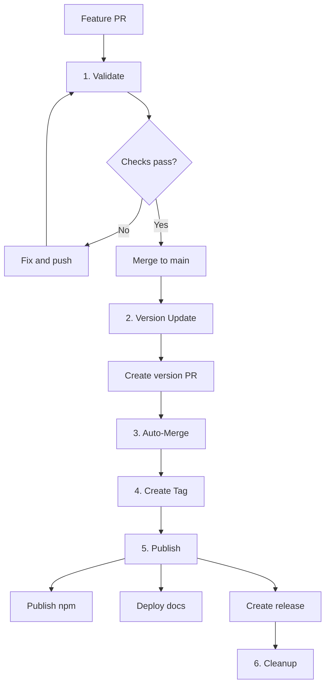
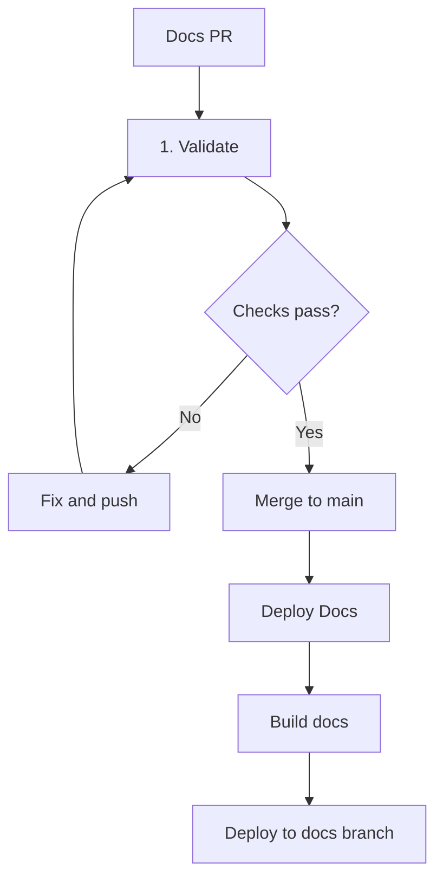

# GitHub Actions Workflows Documentation

This document provides comprehensive documentation for all GitHub Actions workflows in this repository.

> **📚 For detailed workflow information, see the [Workflow README](https://github.com/pantheon-org/opencode-warcraft-notifications/blob/main/.github/workflows/README.md) in the repository.**

## Workflow Overview

The repository uses **8 GitHub Actions workflows** organized into two categories:

### Automated Release Pipeline (6 workflows)

Sequential orchestrated workflows that handle code releases:

| #   | Workflow            | File                   | Triggers                    | Purpose                                     |
| --- | ------------------- | ---------------------- | --------------------------- | ------------------------------------------- |
| 1   | **Validate PR**     | `1-validate.yml`       | Pull Requests               | Quality assurance (lint, test, build)       |
| 2   | **Version Update**  | `2-version-update.yml` | Push to main (code changes) | Analyze commits & create version PR         |
| 3   | **Auto-Merge**      | `3-auto-merge.yml`     | Version PR creation         | Auto-approve and merge version PRs          |
| 4   | **Create Tag**      | `4-create-tag.yml`     | Version bump commit merged  | Create git tag from package.json            |
| 5   | **Publish Release** | `5-publish.yml`        | Tag push (`v*`)             | Publish to npm, deploy docs, create release |
| 6   | **Cleanup**         | `6-cleanup.yml`        | After publish               | Delete old branches and releases            |

### Independent Workflows (2 workflows)

Standalone workflows that operate independently:

| Workflow                    | File                    | Triggers                         | Purpose                                 |
| --------------------------- | ----------------------- | -------------------------------- | --------------------------------------- |
| **Deploy Documentation**    | `deploy-docs.yml`       | Push to main (`docs/**` changes) | Deploy docs immediately without version |
| **Repository Config Check** | `repo-config-check.yml` | Schedule (weekly) or manual      | Verify repository settings              |

## Workflow Flow

### Code Changes → Full Release Pipeline



### Documentation Changes → Immediate Deployment



## Detailed Workflow Documentation

### 1. Validate PR (`1-validate.yml`)

**Purpose:** Ensure code quality before merge

**Triggers:**

- Pull request opened, synchronized, or reopened

**Jobs:**

1. **Lint & Type Check** - ESLint and TypeScript validation
2. **Test** - Run full test suite with coverage
3. **Build** - Verify project builds successfully

**Environment:**

- Node.js 20
- Bun latest

**Outputs:**

- ✅ All checks must pass before PR can be merged

---

### 2. Version Update (`2-version-update.yml`)

**Purpose:** Automated semantic versioning based on conventional commits

**Triggers:**

- Push to main branch
- Excludes: `.github/**`, `docs/**`, `*.md` files

**Jobs:**

1. **Analyze Commits** - Extract commits since last tag
2. **Determine Version** - Use conventional commits to decide bump type
3. **Create Version PR** - Create PR with package.json update

**Conventional Commit Rules:**

- `BREAKING CHANGE` or `!:` → **MAJOR**
- `feat:` or `feature:` → **MINOR**
- `fix:`, `bugfix:`, `patch:` → **PATCH**
- `docs:`, `chore:`, `ci:` → **PATCH**

**Path Filters:**

- Ignores `docs/**` - Documentation changes don't trigger versions
- Ignores `.github/**` - Workflow changes don't trigger versions
- Ignores `*.md` - README changes don't trigger versions

**Environment:**

- Node.js 20
- Full git history

---

### 3. Auto-Merge (`3-auto-merge.yml`)

**Purpose:** Automatically approve and merge version bump PRs

**Triggers:**

- Workflow run completion (after Version Update)
- Check suite completion

**Jobs:**

1. **Find Version PR** - Locate the version bump PR
2. **Auto-Approve** - Approve the PR automatically
3. **Auto-Merge** - Merge the PR using squash strategy

**Conditions:**

- Only runs for PRs with title matching `chore: bump version to *`
- Requires all checks to pass

---

### 4. Create Tag (`4-create-tag.yml`)

**Purpose:** Create git tag from package.json version after version bump

**Triggers:**

- Push to main branch
- Only when `package.json` changes

**Jobs:**

1. **Check Commit** - Verify commit message matches `chore: bump version to X.Y.Z`
2. **Get Version** - Extract version from package.json
3. **Check Tag** - Verify tag doesn't already exist
4. **Create & Push Tag** - Create annotated tag and push

**Tag Format:**

- Pattern: `v{major}.{minor}.{patch}` (e.g., `v1.2.3`)
- Type: Annotated tag with release information

---

### 5. Publish Release (`5-publish.yml`)

**Purpose:** Complete release process (npm + docs + GitHub release)

**Triggers:**

- Tag push matching `v*` pattern
- Manual workflow dispatch

**Jobs:**

#### Job 1: Publish to npm

1. Checkout and setup
2. Run full validation (lint, test, build)
3. Check if version already published
4. Publish to npm with provenance
5. Verify publication

#### Job 2: Deploy Documentation

1. Checkout repository
2. Build documentation (Bun + Astro)
3. Deploy to `docs` branch using `peaceiris/actions-gh-pages@v4`

#### Job 3: Create GitHub Release

1. Get commit history since previous tag
2. Generate changelog from commits
3. Create GitHub release with:
   - npm package link
   - Installation instructions
   - Documentation link
   - Build information

**Secrets Required:**

- `NPM_TOKEN` - For npm publishing
- `GITHUB_TOKEN` - Automatic, for repository access

**Permissions:**

- `contents: write` - Create releases
- `id-token: write` - npm provenance
- `pages: write` - Deploy docs

---

### 6. Cleanup (`6-cleanup.yml`)

**Purpose:** Maintain repository by removing old artifacts

**Triggers:**

- After publish workflow completes
- Manual workflow dispatch

**Jobs:**

1. **Delete Version Branches** - Remove old `version-bump/*` branches
2. **Prune Old Releases** - Keep only recent releases

---

### Deploy Documentation (`deploy-docs.yml`)

**Purpose:** Deploy documentation immediately when docs change (no version required)

**Triggers:**

- Push to main branch with `docs/**` changes
- Manual workflow dispatch

**Jobs:**

1. **Build Documentation**
   - Checkout repository
   - Setup Bun
   - Install dependencies
   - Build documentation with Astro

2. **Deploy to docs branch**
   - Deploy `docs/dist` to `docs` branch
   - Uses `peaceiris/actions-gh-pages@v4`

**Key Features:**

- **Independent of releases** - Docs deploy without version bumps
- **Fast deployment** - ~30 seconds from merge to live
- **Caching** - Uses Bun cache for faster builds

**Comparison with Workflow 5:**

- **Workflow 5** (Publish Release): Deploys docs as part of release
- **deploy-docs.yml**: Deploys docs independently for quick updates

---

### Repository Config Check (`repo-config-check.yml`)

**Purpose:** Verify repository settings enforce squash merge strategy

**Triggers:**

- Schedule: Weekly on Mondays
- Manual workflow dispatch

**Jobs:**

1. **Check Settings**
   - Verify squash merge enabled
   - Verify merge commits disabled
   - Verify rebase merging disabled
   - Verify auto-delete branches enabled

**Requirements:**

- GitHub CLI (`gh`) authenticated
- Repository access permissions

---

## Configuration & Secrets

### Required Secrets

| Secret         | Used By       | Purpose                                               |
| -------------- | ------------- | ----------------------------------------------------- |
| `NPM_TOKEN`    | 5-publish.yml | Publishing to npm registry                            |
| `WORKFLOW_PAT` | Multiple      | Triggering workflows (optional, can use GITHUB_TOKEN) |
| `GITHUB_TOKEN` | All           | Automatic, provided by GitHub Actions                 |

### Environment Variables

| Variable       | Workflow       | Purpose              |
| -------------- | -------------- | -------------------- |
| `NODE_VERSION` | All            | Node.js version (20) |
| `BUN_VERSION`  | Docs workflows | Bun version (latest) |

---

## Path Filters & Triggers

### Version Update Workflow - Ignores:

```yaml
paths-ignore:
  - '.github/**' # Workflow changes
  - 'docs/**' # Documentation changes
  - '*.md' # Markdown files
```

**Why?** These changes don't affect the published package, so they shouldn't trigger a version bump.

### Deploy Docs Workflow - Triggers:

```yaml
paths:
  - 'docs/**' # Only documentation changes
```

**Why?** Documentation can be updated independently without a new package version.

---

## Workflow Design Principles

1. **Sequential Orchestration** - Workflows trigger in sequence (1→2→3→4→5→6)
2. **Separation of Concerns** - Each workflow has a single responsibility
3. **Idempotent Operations** - Workflows can be re-run safely
4. **Fail Fast** - Validation happens early (workflow 1)
5. **Automated Recovery** - Auto-retry mechanisms where appropriate
6. **Cycle Prevention** - `[skip ci]` and workflow checks prevent infinite loops
7. **Independent Docs** - Documentation deploys independently for agility

---

## Troubleshooting

### Documentation Not Deploying

**Symptom:** Merged docs changes but not visible

**Diagnosis:**

```bash
# Check if deploy-docs workflow triggered
gh run list --workflow=deploy-docs.yml --limit 5

# View specific run
gh run view <run-id>
```

**Solutions:**

- Verify changes are in `docs/**` directory
- Check workflow logs for build errors
- Manually trigger: `gh workflow run deploy-docs.yml`

### Version Not Bumping

**Symptom:** PR merged but no version PR created

**Diagnosis:**

```bash
# Check if version-update workflow triggered
gh run list --workflow=2-version-update.yml --limit 5
```

**Solutions:**

- Changes might be in ignored paths (`docs/**`, `.github/**`, `*.md`)
- Use conventional commit format
- Manually trigger: `gh workflow run 2-version-update.yml`

### Tag Not Created

**Symptom:** Version PR merged but no tag

**Diagnosis:**

```bash
# Check if tag workflow triggered
gh run list --workflow=4-create-tag.yml --limit 5
```

**Solution:**

- Commit message must match: `chore: bump version to X.Y.Z`
- This is automatically done by workflow 2

### Publish Not Triggered

**Symptom:** Tag exists but publish didn't run

**Diagnosis:**

```bash
# Check if publish workflow triggered
gh run list --workflow=5-publish.yml --limit 5

# Verify tag format
git tag -l "v*"
```

**Solution:**

- Tag must match `v*` pattern
- Manually trigger: `gh workflow run 5-publish.yml -f tag=v1.2.3`

---

## Manual Operations

### Force Version Bump

```bash
gh workflow run 2-version-update.yml -f version_type=minor
```

### Deploy Docs Manually

```bash
gh workflow run deploy-docs.yml
```

### Publish Release Manually

```bash
gh workflow run 5-publish.yml -f tag=v1.2.3
```

### Run Cleanup

```bash
gh workflow run 6-cleanup.yml
```

---

## Best Practices

1. ✅ **Use Conventional Commits** - Ensures correct version bumping
2. ✅ **Test Locally** - Run `bun test` before pushing
3. ✅ **Review Version PRs** - Even though auto-merged, review is good practice
4. ✅ **Monitor Actions** - Check Actions tab after merging
5. ✅ **Update Docs Freely** - Documentation can deploy independently
6. ❌ **Don't Skip CI** - Avoid `[skip ci]` unless necessary
7. ❌ **Don't Force Push** - Can break workflow orchestration

---

## Additional Resources

- **[Workflow README](https://github.com/pantheon-org/opencode-warcraft-notifications/blob/main/.github/workflows/README.md)** - Complete workflow documentation
- **[Sequential Orchestration](./sequential-orchestration.md)** - Workflow architecture
- **[Setup Guide](./setup-guide.md)** - Step-by-step setup
- **[Contributing Guide](https://github.com/pantheon-org/opencode-warcraft-notifications/blob/main/CONTRIBUTING.md)** - How to contribute

---

**Last Updated:** 2025-11-12  
**Version:** 2.0 (Updated with deploy-docs workflow)
