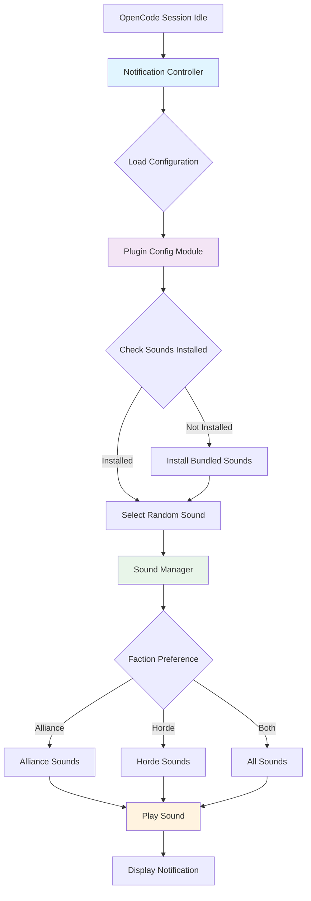
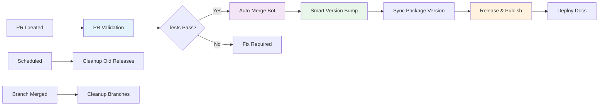

---
---


## First Day

### Hour 1: Environment Setup

#### 1. Clone and Install

```bash
# Clone the repository
git clone https://github.com/pantheon-org/opencode-warcraft-notifications.git
cd opencode-warcraft-notifications

# Install dependencies
bun install

# Verify installation
bun test
```

#### 2. Verify Your Environment

```bash
# Check Bun version (should be 1.0.0+)
bun --version

# Check Node version (should be 18.0.0+)
node --version

# Check Git configuration
git config --list | grep user
```

#### 3. IDE Setup

**Visual Studio Code** (Recommended):

```bash
# Install recommended extensions
code --install-extension dbaeumer.vscode-eslint
code --install-extension esbenp.prettier-vscode
code --install-extension oven.bun-vscode

# Open the project
code .
```

**Settings** (`.vscode/settings.json` - already configured):

- Auto-format on save
- ESLint auto-fix
- TypeScript support

### Hour 2: Explore the Codebase

#### Project Structure Overview

```
opencode-warcraft-notifications/
├── src/                    # Source code
│   ├── notification.ts     # Main plugin logic
│   ├── plugin-config.ts    # Configuration management
│   ├── sounds.ts           # Sound selection
│   ├── bundled-sounds.ts   # Sound installation
│   └── sound-data/         # Sound metadata
├── data/                   # Bundled WAV files
│   ├── alliance/          # Alliance sounds
│   └── horde/             # Horde sounds
├── docs/                   # Documentation
├── .github/workflows/      # CI/CD automation
└── index.ts               # Plugin entry point
```

#### Key Files to Read

1. **README.md** - Project overview and quick start
2. **docs/ARCHITECTURE.md** - System design and components
3. **docs/DEVELOPMENT.md** - Development workflow
4. **src/notification.ts** - Core plugin logic
5. **package.json** - Dependencies and scripts

#### Run Your First Tests

```bash
# Run all tests
bun test

# Run tests in watch mode
bun test --watch

# Run tests with coverage
bun test --coverage

# Run type checking
bun run type-check

# Run linting
bun run lint
```

### Hour 3: Make Your First Change

#### Exercise: Add a Debug Log

1. **Open** `src/notification.ts`
2. **Find** the `session.idle` event handler (around line 83)
3. **Add** a debug log:

```typescript
if (event.type === 'session.idle') {
  if (process.env.DEBUG_OPENCODE) {
    console.log('[Warcraft Plugin] Session idle detected');
  }
  const summary = getIdleSummary(lastMessage?.text) ?? 'Idle';
  // ... rest of the code
}
```

4. **Test** your change:

```bash
# Run tests
bun test src/notification.test.ts

# Test with debug mode
DEBUG_OPENCODE=1 bun test src/notification.test.ts
```

5. **Verify** code quality:

```bash
# Format code
bun run format

# Check linting
bun run lint

# Type check
bun run type-check
```

### Hour 4: Test the Plugin Locally

#### Install Plugin Locally

1. **Link the plugin** to OpenCode:

```bash
# Build the plugin
bun run build

# Create a test project
mkdir ~/test-warcraft-plugin
cd ~/test-warcraft-plugin

# Create OpenCode config
cat > .opencode/opencode.json << 'EOF'
{
  "$schema": "https://opencode.ai/config.json",
  "plugin": ["@pantheon-ai/opencode-warcraft-notifications"]
}
EOF

# Create plugin config
cat > .opencode/plugin.json << 'EOF'
{
  "@pantheon-ai/opencode-warcraft-notifications": {
    "faction": "alliance"
  }
}
EOF
```

2. **Test the plugin**:

```bash
# Start OpenCode
opencode

# Wait for idle event (or trigger manually)
# You should hear Warcraft II sounds!
```

#### Troubleshooting

**No sound playing?**

```bash
# Check if sounds are installed
ls ~/.local/share/opencode/storage/plugin/@pantheon-ai/opencode-warcraft-notifications/

# Enable debug mode
DEBUG_OPENCODE=1 opencode

# Check audio on macOS
afplay /System/Library/Sounds/Glass.aiff

# Check audio on Linux
canberra-gtk-play --id=message
```

**Plugin not loading?**

```bash
# Check OpenCode logs
tail -f ~/.cache/opencode/logs/opencode.log

# Verify plugin installation
ls ~/.cache/opencode/node_modules/@pantheon-ai/
```

---

## First Week

### Day 1-2: Deep Dive into Architecture

#### Study the Architecture

Read these documents in order:

1. **[Architecture Documentation](ARCHITECTURE.md)**
   - System architecture overview
   - Component architecture
   - Data flow diagrams
   - Platform integration

2. **[API Documentation](API.md)**
   - Plugin entry point
   - Notification module
   - Configuration module
   - Sound manager
   - Bundled sounds module

#### Understand the Data Flow



#### Key Concepts to Master

1. **Plugin Lifecycle**
   - Initialization
   - Event handling
   - Configuration loading
   - Sound installation

2. **Configuration Precedence**
   - Environment variables
   - Project-specific config
   - Global config
   - Default values

3. **Sound Management**
   - Bundled sounds
   - Faction-based selection
   - File system operations
   - Platform-specific playback

4. **Testing Strategy**
   - Unit tests
   - Integration tests
   - Edge case tests
   - Mock strategies

### Day 3-4: Explore CI/CD Pipeline

#### Study the Pipeline

Read these documents:

1. **[Pipeline Documentation](PIPELINE.md)** - Complete technical reference
2. **[GitHub Workflows](./github-workflows/README.md)** - Setup guides
3. **[Deployment Guide](DEPLOYMENT.md)** - Operations

#### Understand the Workflows

The project uses 8 automated workflows:



#### Key Workflows

1. **PR Validation** (`pr-validation.yml`)
   - Runs tests, linting, type checking
   - Validates documentation
   - Checks repository configuration

2. **Smart Version Bump** (`smart-version-bump.yml`)
   - AI-powered version determination
   - Analyzes commit messages
   - Creates version bump PRs

3. **Release & Publish** (`release-publish.yml`)
   - Creates GitHub releases
   - Publishes to npm
   - Generates release notes

4. **Auto-Merge Bot** (`auto-merge-bot.yml`)
   - Automatically merges approved PRs
   - Handles version bump PRs
   - Prevents merge conflicts

#### Try It Yourself

1. **Create a test PR**:

```bash
# Create a feature branch
git checkout -b test/onboarding-exercise

# Make a small change
echo "// Test comment" >> src/notification.ts

# Commit and push
git add src/notification.ts
git commit -m "test: Add onboarding exercise comment"
git push origin test/onboarding-exercise

# Create PR (use GitHub CLI or web interface)
gh pr create --title "test: Onboarding exercise" --body "Testing the CI/CD pipeline"
```

2. **Watch the workflows**:
   - Go to GitHub Actions tab
   - Watch PR Validation run
   - See test results
   - Observe auto-merge (if approved)

3. **Clean up**:

```bash
# Close the PR
gh pr close test/onboarding-exercise

# Delete the branch
git branch -D test/onboarding-exercise
git push origin --delete test/onboarding-exercise
```

### Day 5: Contribute Your First Feature

#### Choose a Starter Issue

Look for issues labeled:

- `good first issue`
- `help wanted`
- `documentation`
- `enhancement`

#### Example: Add a New Sound Category

Let's add a "rare" sound category that plays occasionally:

1. **Create a feature branch**:

```bash
git checkout -b feature/rare-sounds
```

2. **Add rare sounds to sound data**:

```typescript
// src/sound-data/alliance.ts
export const allianceSounds = [
  // ... existing sounds ...
  {
    filename: 'jobs_done.wav',
    category: 'rare', // Add this
    faction: 'alliance',
  },
];
```

3. **Update sound selection logic**:

```typescript
// src/sounds.ts
export const getRandomSoundFromFaction = (
  faction: Faction,
  includeRare: boolean = false,
): string => {
  const factionSounds = getSoundsByFaction(faction);

  // Filter out rare sounds unless explicitly requested
  const availableSounds = includeRare
    ? factionSounds
    : factionSounds.filter((s) => s.category !== 'rare');

  return availableSounds[Math.floor(Math.random() * availableSounds.length)];
};
```

4. **Add tests**:

```typescript
// src/sounds.test.ts
describe('getRandomSoundFromFaction', () => {
  it('should exclude rare sounds by default', () => {
    const sound = getRandomSoundFromFaction('alliance');
    expect(sound.category).not.toBe('rare');
  });

  it('should include rare sounds when requested', () => {
    const sounds = Array.from({ length: 100 }, () => getRandomSoundFromFaction('alliance', true));
    const hasRare = sounds.some((s) => s.category === 'rare');
    expect(hasRare).toBe(true);
  });
});
```

5. **Update documentation**:

```markdown
<!-- docs/USER_GUIDE.md -->

### Rare Sounds

The plugin includes special "rare" sounds that play occasionally:

- `jobs_done.wav` - Peasant work completion
- `orc_work_completed.wav` - Orc work completion

To enable rare sounds:

\`\`\`json
{
"@pantheon-ai/opencode-warcraft-notifications": {
"faction": "both",
"includeRare": true
}
}
\`\`\`
```

6. **Submit your PR**:

```bash
# Run tests
bun test

# Format and lint
bun run format
bun run lint

# Commit changes
git add .
git commit -m "feat: Add rare sound category with optional inclusion"

# Push and create PR
git push origin feature/rare-sounds
gh pr create --title "feat: Add rare sound category" \
  --body "Adds a rare sound category that can be optionally enabled"
```

---

## First Month

### Week 1-2: Master the Codebase

#### Complete Understanding

By the end of week 2, you should be able to:

- [ ] Explain the plugin lifecycle
- [ ] Describe the configuration precedence
- [ ] Implement a new sound category
- [ ] Add comprehensive tests
- [ ] Update documentation
- [ ] Navigate the CI/CD pipeline
- [ ] Review PRs effectively

#### Advanced Topics

1. **Testing Strategies**
   - Mock file system operations
   - Test platform-specific code
   - Edge case coverage
   - Performance testing

2. **Configuration Management**
   - Schema validation
   - Environment variable handling
   - Cross-platform paths
   - Default value resolution

3. **Sound Management**
   - Bundled sound installation
   - File system operations
   - Error handling
   - Fallback strategies

### Week 3-4: Contribute Meaningfully

#### Take Ownership

Choose an area to specialize in:

1. **Core Plugin Logic**
   - Event handling
   - Sound selection
   - Notification delivery
   - Error handling

2. **Configuration System**
   - Schema validation
   - Configuration loading
   - Default resolution
   - Documentation

3. **CI/CD Pipeline**
   - Workflow optimization
   - Version management
   - Release automation
   - Documentation deployment

4. **Documentation**
   - User guides
   - API documentation
   - Architecture diagrams
   - Troubleshooting guides

#### Mentor Others

- Review PRs from other contributors
- Answer questions in discussions
- Improve onboarding documentation
- Create tutorial content

---

## Key Resources

### Documentation

- **[README](../README.md)** - Project overview
- **[User Guide](USER_GUIDE.md)** - End-user documentation
- **[Development Guide](DEVELOPMENT.md)** - Development workflow
- **[API Documentation](API.md)** - Technical reference
- **[Architecture](ARCHITECTURE.md)** - System design
- **[Deployment Guide](DEPLOYMENT.md)** - Operations
- **[Pipeline Documentation](PIPELINE.md)** - CI/CD reference

### External Resources

- **[OpenCode Plugin Documentation](https://opencode.ai/docs/plugins/)** - Official plugin guide
- **[Bun Documentation](https://bun.sh/docs)** - Bun runtime
- **[TypeScript Handbook](https://www.typescriptlang.org/docs/)** - TypeScript guide
- **[GitHub Actions Documentation](https://docs.github.com/en/actions)** - CI/CD

### Tools

- **[Bun](https://bun.sh/)** - JavaScript runtime and toolkit
- **[TypeScript](https://www.typescriptlang.org/)** - Type-safe JavaScript
- **[ESLint](https://eslint.org/)** - Linting
- **[Prettier](https://prettier.io/)** - Code formatting
- **[GitHub CLI](https://cli.github.com/)** - GitHub command-line tool

---

## Team Structure

### Roles

#### Maintainers

- Review and merge PRs
- Manage releases
- Set project direction
- Mentor contributors

#### Contributors

- Submit PRs
- Fix bugs
- Add features
- Improve documentation

#### Community Members

- Report issues
- Suggest features
- Answer questions
- Share feedback

### Current Team

- **@thoroc** - Project Lead & Maintainer
- **Pantheon AI Team** - Core Contributors

---

## Communication

### Channels

#### GitHub Issues

**Use for**:

- Bug reports
- Feature requests
- Technical questions
- Documentation improvements

**Template**:

```markdown
**Description**: Clear description of the issue

**Steps to Reproduce**:

1. Step one
2. Step two
3. Step three

**Expected Behavior**: What should happen

**Actual Behavior**: What actually happens

**Environment**:

- OS: macOS/Linux
- OpenCode version: X.X.X
- Plugin version: X.X.X
```

#### GitHub Discussions

**Use for**:

- General questions
- Feature ideas
- Best practices
- Community chat

#### Pull Requests

**Use for**:

- Code changes
- Documentation updates
- Bug fixes
- New features

**PR Template**:

```markdown
## Description

Brief description of changes

## Type of Change

- [ ] Bug fix
- [ ] New feature
- [ ] Documentation update
- [ ] Refactoring

## Testing

- [ ] Tests added/updated
- [ ] All tests passing
- [ ] Manual testing completed

## Documentation

- [ ] Documentation updated
- [ ] CHANGELOG updated (if applicable)
```

### Response Times

- **Issues**: 24-48 hours for initial response
- **PRs**: 48-72 hours for initial review
- **Discussions**: Best effort, community-driven

---

## Getting Help

### Stuck on Something?

1. **Check Documentation**
   - Search the docs for your question
   - Check the FAQ in User Guide
   - Review troubleshooting sections

2. **Search Existing Issues**
   - Someone may have had the same problem
   - Check closed issues too
   - Look for similar PRs

3. **Ask in Discussions**
   - Describe your problem clearly
   - Include relevant code/logs
   - Mention what you've tried

4. **Create an Issue**
   - Use the issue template
   - Provide reproduction steps
   - Include environment details

### Common Questions

#### "How do I test my changes locally?"

```bash
# Run tests
bun test

# Test with debug mode
DEBUG_OPENCODE=1 bun test

# Test specific file
bun test src/notification.test.ts

# Test with coverage
bun test --coverage
```

#### "How do I add a new sound?"

1. Add WAV file to `data/alliance/` or `data/horde/`
2. Update sound metadata in `src/sound-data/`
3. Add tests in `src/sounds.test.ts`
4. Update documentation in `docs/USER_GUIDE.md`

#### "How do I update documentation?"

1. Edit markdown files in `docs/`
2. Use Mermaid for diagrams
3. Test locally with GitHub Pages preview
4. Submit PR with documentation changes

#### "How does the CI/CD pipeline work?"

See the [Pipeline Documentation](PIPELINE.md) for complete details.

---

## Next Steps

### After Onboarding

1. **Join the Community**
   - Star the repository
   - Watch for updates
   - Participate in discussions

2. **Make Regular Contributions**
   - Fix bugs
   - Add features
   - Improve documentation
   - Review PRs

3. **Share Your Experience**
   - Write blog posts
   - Create tutorials
   - Give talks
   - Mentor others

### Career Growth

Contributing to this project helps you:

- **Learn OpenCode Plugin Development**
- **Master TypeScript and Bun**
- **Understand CI/CD Automation**
- **Practice Code Review**
- **Build Your Portfolio**

---

## Feedback

### Improve This Guide

Found something unclear? Have suggestions?

- **Create an issue**: [GitHub Issues](https://github.com/pantheon-org/opencode-warcraft-notifications/issues)
- **Start a discussion**: [GitHub Discussions](https://github.com/pantheon-org/opencode-warcraft-notifications/discussions)
- **Submit a PR**: Improve this document directly

---

**Welcome to the team! We're excited to have you here.**

_"Work complete!"_ - Warcraft II Peasant  
_"Zug zug!"_ - Warcraft II Orc

---

**Document Version**: 1.0  
**Last Updated**: 2025-11-10  
**Maintained By**: Pantheon AI Team
