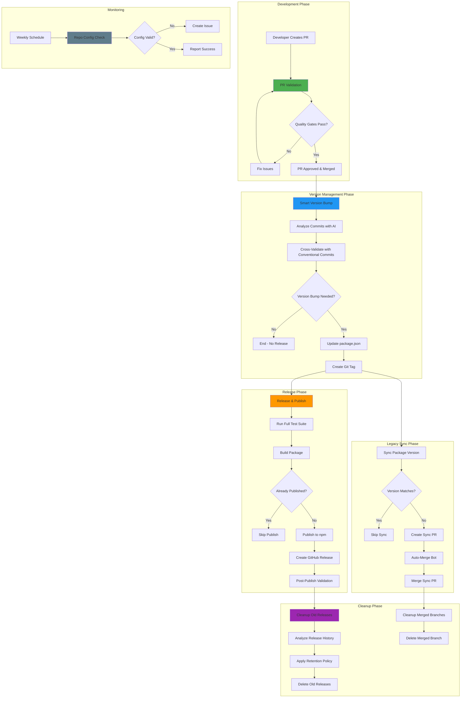
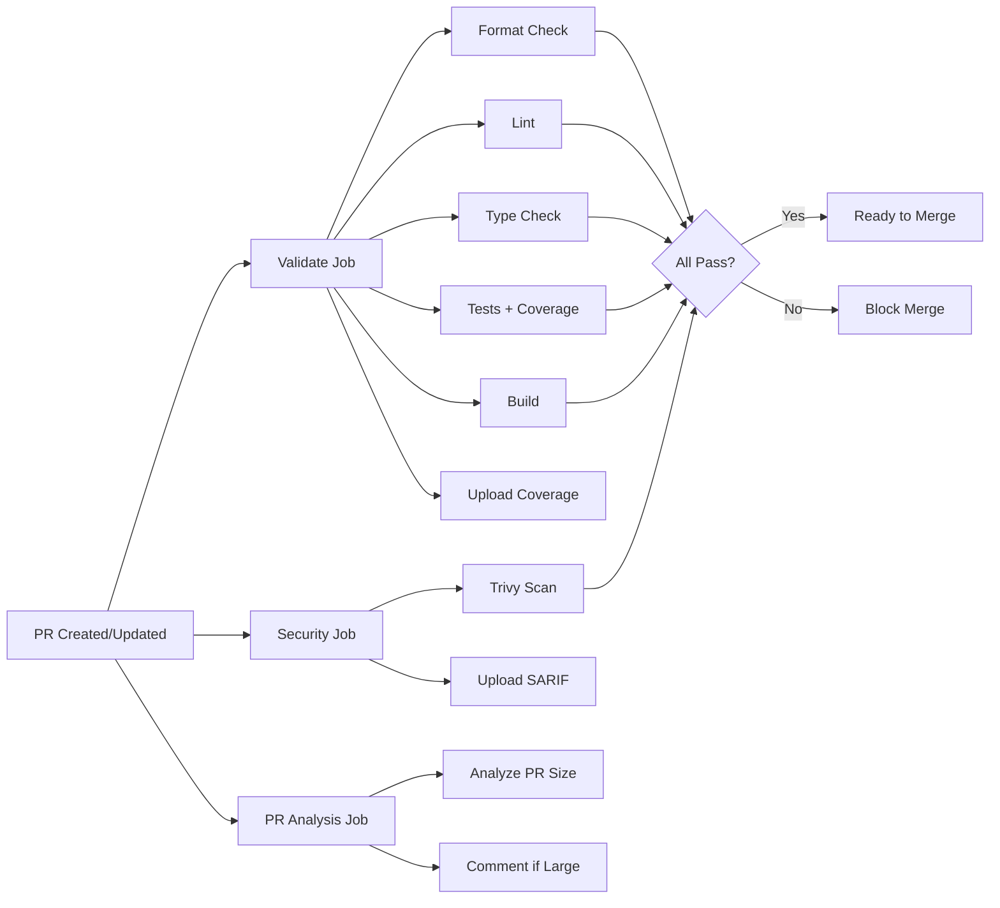
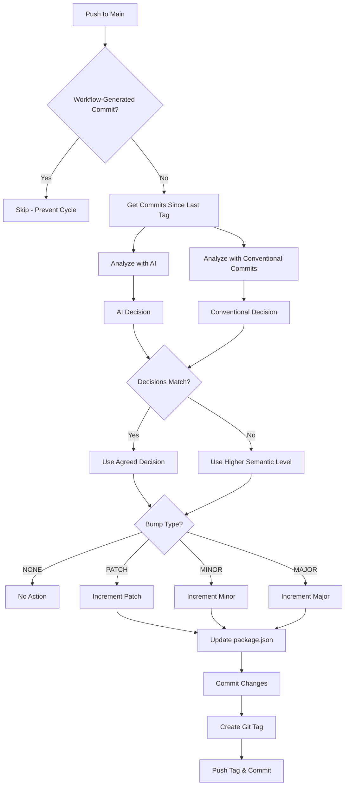
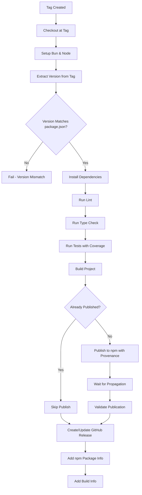
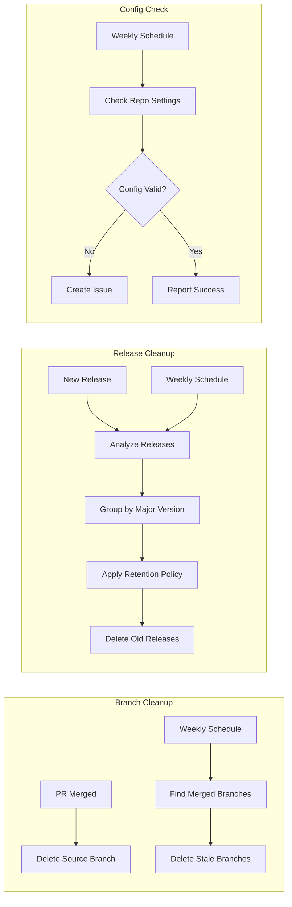

---
---


## Pipeline Architecture

### Complete Pipeline Flow



### Pipeline Stages

#### Stage 1: Quality Assurance (PR Validation)

**Purpose**: Ensure code quality before merge  
**Duration**: 2-3 minutes  
**Parallel Jobs**: 3 (validate, security, pr-analysis)



#### Stage 2: Semantic Versioning (Smart Version Bump)

**Purpose**: Determine and apply version bump  
**Duration**: 1-2 minutes  
**AI-Powered**: Yes (Google Gemini)



#### Stage 3: Release & Distribution (Release & Publish)

**Purpose**: Build, test, and publish to npm  
**Duration**: 3-4 minutes  
**Provenance**: Enabled



#### Stage 4: Maintenance (Cleanup Workflows)

**Purpose**: Maintain repository hygiene  
**Frequency**: Event-driven + Weekly



---

## Workflow Details

### PR Validation Workflow

**File**: `.github/workflows/pr-validation.yml`  
**Purpose**: Comprehensive quality assurance for all pull requests

#### Triggers

```yaml
on:
  pull_request:
    branches: [main, develop]
    types: [opened, synchronize, reopened]
```

#### Concurrency Control

```yaml
concurrency:
  group: ${{ github.workflow }}-${{ github.ref }}
  cancel-in-progress: true
```

**Behavior**: Cancels in-progress runs when new commits are pushed to the same PR.

#### Job 1: Validate

**Purpose**: Code quality validation  
**Runner**: `ubuntu-latest`  
**Timeout**: Default (360 minutes)

##### Steps Breakdown

1. **Checkout Repository**

   ```yaml
   - uses: actions/checkout@v4
     with:
       fetch-depth: 0 # Full history for accurate analysis
   ```

2. **Setup Bun Runtime**

   ```yaml
   - uses: oven-sh/setup-bun@v2
     with:
       bun-version: 'latest'
   ```

   - **Why Bun?**: Faster package installation and test execution
   - **Version Strategy**: Always use latest for development

3. **Cache Dependencies**

   ```yaml
   - uses: actions/cache@v4
     with:
       path: ~/.bun/install/cache
       key: ${{ runner.os }}-bun-${{ hashFiles('**/bun.lockb') }}
       restore-keys: |
         ${{ runner.os }}-bun-
   ```

   - **Cache Key**: Based on OS and lockfile hash
   - **Fallback**: Partial match on OS
   - **Performance Impact**: ~30-60 second improvement

4. **Install Dependencies**

   ```bash
   bun install --frozen-lockfile
   ```

   - **Frozen Lockfile**: Ensures reproducible builds
   - **Fails if**: lockfile is out of sync with package.json

5. **Format Check**

   ```bash
   bun run format:check
   ```

   - **Tool**: Prettier
   - **Config**: `.prettierrc`
   - **Scope**: All TypeScript, JavaScript, JSON, Markdown files

6. **Linting**

   ```bash
   bun run lint
   ```

   - **Tool**: ESLint
   - **Config**: `eslint.config.cjs`
   - **Rules**: TypeScript, Import, JSDoc, SonarJS, Prettier integration

7. **Type Checking**

   ```bash
   bun run type-check
   ```

   - **Tool**: TypeScript Compiler
   - **Config**: `tsconfig.test.json`
   - **Mode**: No emit, type checking only

8. **Test with Coverage**

   ```bash
   bun run test:coverage
   ```

   - **Framework**: Bun's built-in test runner
   - **Coverage**: Enabled
   - **Scope**: `src/` directory

9. **Build Project**

   ```bash
   bun run build
   ```

   - **Tool**: TypeScript Compiler
   - **Output**: Compiled JavaScript
   - **Validation**: Ensures production build succeeds

10. **Upload Coverage**
    ```yaml
    - uses: codecov/codecov-action@v4
      if: always()
      with:
        token: ${{ secrets.CODECOV_TOKEN }}
        fail_ci_if_error: false
    ```

    - **Service**: Codecov
    - **Behavior**: Always runs, even if tests fail
    - **Failure Mode**: Non-blocking

#### Job 2: Security

**Purpose**: Vulnerability scanning  
**Runner**: `ubuntu-latest`

##### Steps Breakdown

1. **Trivy Vulnerability Scanner**

   ```yaml
   - uses: aquasecurity/trivy-action@master
     with:
       scan-type: 'fs'
       scan-ref: '.'
       format: 'sarif'
       output: 'trivy-results.sarif'
   ```

   - **Scan Type**: Filesystem
   - **Target**: Entire repository
   - **Output Format**: SARIF (Static Analysis Results Interchange Format)

2. **Upload SARIF Results**
   ```yaml
   - uses: github/codeql-action/upload-sarif@v3
     if: always()
     with:
       sarif_file: 'trivy-results.sarif'
   ```

   - **Integration**: GitHub Security tab
   - **Visibility**: Security alerts visible in PR and repository

#### Job 3: PR Analysis

**Purpose**: Analyze PR size and complexity  
**Runner**: `ubuntu-latest`

##### Steps Breakdown

1. **Analyze PR Size**

   ```bash
   CHANGED_FILES=$(git diff --name-only origin/${{ github.base_ref }}...HEAD | wc -l)
   ADDED_LINES=$(git diff --numstat origin/${{ github.base_ref }}...HEAD | awk '{added+=$1} END {print added+0}')
   DELETED_LINES=$(git diff --numstat origin/${{ github.base_ref }}...HEAD | awk '{deleted+=$2} END {print deleted+0}')
   ```

2. **Large PR Detection**
   - **Threshold**: 20+ files OR 500+ added lines
   - **Action**: Post warning comment

3. **Comment on Large PRs**
   ```javascript
   github.rest.issues.createComment({
     issue_number: context.issue.number,
     owner: context.repo.owner,
     repo: context.repo.repo,
     body: `⚠️ **Large PR Warning**...`,
   });
   ```

#### Quality Gates

All jobs must pass for PR to be mergeable:

- ✅ Code formatting compliant
- ✅ No linting errors
- ✅ Type checking passes
- ✅ All tests pass with coverage
- ✅ Build succeeds
- ✅ No critical security vulnerabilities

---

### Smart Version Bump Workflow

**File**: `.github/workflows/smart-version-bump.yml`  
**Purpose**: AI-powered semantic versioning with cross-validation

#### Triggers

```yaml
on:
  push:
    branches: [main]
    paths-ignore:
      - '.github/**'
      - 'docs/**'
      - '*.md'
  workflow_dispatch:
    inputs:
      version_type:
        description: 'Force version bump type'
        required: false
        type: choice
        options: ['auto', 'major', 'minor', 'patch']
        default: 'auto'
```

#### Concurrency Control

```yaml
concurrency:
  group: version-bump-${{ github.ref }}
  cancel-in-progress: false # Never cancel version bumps
```

**Critical**: Version bumps must complete to prevent state inconsistencies.

#### Job 1: Analyze Changes

**Purpose**: Determine appropriate version bump  
**Runner**: `ubuntu-latest`

##### Cycle Prevention

```bash
LATEST_COMMIT_MSG=$(git log -1 --pretty=format:"%s")
if [[ "$LATEST_COMMIT_MSG" =~ ^chore:\ (bump\ version|sync\ package\.json\ version) ]] || [[ "$LATEST_COMMIT_MSG" =~ \[skip\ ci\] ]]; then
  echo "🛑 Skipping version bump to prevent cycle"
  exit 0
fi
```

**Prevents**: Infinite loop of version bump commits triggering more version bumps.

##### Commit Analysis

1. **Get Commits Since Last Tag**

   ```bash
   LATEST_TAG=$(git describe --tags --abbrev=0 2>/dev/null || echo "")
   if [ -z "$LATEST_TAG" ]; then
     COMMITS=$(git log --oneline --no-merges)
   else
     COMMITS=$(git log ${LATEST_TAG}..HEAD --oneline --no-merges)
   fi
   ```

2. **Squash Merge Detection**
   ```bash
   COMMIT_COUNT=$(echo "$COMMITS" | wc -l)
   if [ "$COMMIT_COUNT" -eq 1 ]; then
     echo "✅ Single commit detected (likely squash merge)"
   fi
   ```

##### AI Analysis with Google Gemini

1. **Install Gemini CLI**

   ```bash
   curl -o- https://generativelanguage.googleapis.com/install.sh | bash
   ```

2. **Create Analysis Prompt**

   ```text
   You are a semantic versioning expert. Analyze the following git commits and file changes to determine the appropriate version bump.

   Rules:
   - MAJOR: Breaking changes, API changes, major architecture changes
   - MINOR: New features, new functionality, backwards-compatible additions
   - PATCH: Bug fixes, documentation updates, small improvements, refactoring
   - NONE: Only CI/config changes, formatting, or no significant changes
   ```

3. **Execute AI Analysis**
   ```bash
   AI_DECISION=$(gemini generate "$(cat analysis_prompt.txt)" 2>/dev/null | tail -1 | tr -d '\n\r' | tr '[:lower:]' '[:upper:]')
   ```

##### Fallback: Conventional Commits Analysis

If AI fails or returns invalid response:

```bash
if grep -qi "BREAKING CHANGE\|!:" commits.txt; then
  AI_DECISION="MAJOR"
elif grep -qi "^feat\|^feature" commits.txt; then
  AI_DECISION="MINOR"
elif grep -qi "^fix\|^bugfix\|^patch" commits.txt; then
  AI_DECISION="PATCH"
else
  AI_DECISION="PATCH"
fi
```

##### Cross-Validation

```bash
# Independent conventional commit analysis
if grep -qi "BREAKING CHANGE\|!:" commits.txt; then
  CONVENTIONAL_DECISION="MAJOR"
elif grep -qi "^feat\|^feature" commits.txt; then
  CONVENTIONAL_DECISION="MINOR"
# ... etc
fi

# Compare decisions
if [ "$AI_DECISION" != "$CONVENTIONAL_DECISION" ]; then
  echo "⚠️ WARNING: Version analysis mismatch detected!"
  # Use higher semantic version level as safer default
  if [[ "$CONVENTIONAL_DECISION" == "MAJOR" ]] || [[ "$AI_DECISION" == "MAJOR" ]]; then
    FINAL_DECISION="MAJOR"
  elif [[ "$CONVENTIONAL_DECISION" == "MINOR" ]] || [[ "$AI_DECISION" == "MINOR" ]]; then
    FINAL_DECISION="MINOR"
  else
    FINAL_DECISION="PATCH"
  fi
fi
```

**Safety Mechanism**: Always chooses the higher semantic version level when there's disagreement.

##### Version Calculation

```bash
# Calculate new version based on latest tag
IFS='.' read -r -a version_parts <<< "$CURRENT_VERSION"
major=${version_parts[0]}
minor=${version_parts[1]}
patch=${version_parts[2]}

case $VERSION_TYPE in
  major)
    major=$((major + 1))
    minor=0
    patch=0
    ;;
  minor)
    minor=$((minor + 1))
    patch=0
    ;;
  patch)
    patch=$((patch + 1))
    ;;
esac

NEW_VERSION="${major}.${minor}.${patch}"
```

#### Job 2: Update Version & Create Tag

**Purpose**: Apply version bump and create release tag  
**Runner**: `ubuntu-latest`  
**Depends On**: analyze-changes

##### Tag Existence Check

```bash
if git tag -l "v$NEW_VERSION" | grep -q "v$NEW_VERSION"; then
  echo "⚠️ Tag v$NEW_VERSION already exists locally - skipping"
  exit 0
elif git ls-remote --tags origin | grep -q "refs/tags/v$NEW_VERSION$"; then
  echo "⚠️ Tag v$NEW_VERSION already exists on remote - skipping"
  exit 0
fi
```

**Prevents**: Duplicate tags from workflow re-runs.

##### Update package.json

```javascript
const fs = require('fs');
const pkg = JSON.parse(fs.readFileSync('package.json', 'utf8'));
pkg.version = '$NEW_VERSION';
fs.writeFileSync('package.json', JSON.stringify(pkg, null, 2) + '\n');
```

##### Commit and Tag

```bash
git add package.json
git commit -m "chore: bump version to $NEW_VERSION

Version Type: ${{ needs.analyze-changes.outputs.version_type }}
AI Analysis: ${{ needs.analyze-changes.outputs.ai_decision }}

This commit will be tagged as v$NEW_VERSION"

git tag -a "v$NEW_VERSION" -m "Release v$NEW_VERSION

Version Type: ${{ needs.analyze-changes.outputs.version_type }}
AI Analysis: ${{ needs.analyze-changes.outputs.ai_decision }}

This tag will trigger NPM publishing via release-publish.yml"

git push origin main && git push origin --tags
```

#### Outputs

```yaml
outputs:
  should_bump: ${{ steps.decision.outputs.should_bump }}
  version_type: ${{ steps.decision.outputs.version_type }}
  new_version: ${{ steps.decision.outputs.new_version }}
  ai_decision: ${{ steps.ai-analysis.outputs.ai_decision }}
  conventional_decision: ${{ steps.validation.outputs.conventional_decision }}
  mismatch_detected: ${{ steps.validation.outputs.mismatch_detected }}
```

---

### Sync Package Version Workflow

**File**: `.github/workflows/sync-package-version.yml`  
**Purpose**: Legacy workflow for version synchronization (mostly obsolete with Smart Version Bump)

#### Triggers

```yaml
on:
  push:
    tags:
      - 'v*'
  workflow_dispatch:
    inputs:
      tag:
        description: 'Tag to sync (e.g., v1.2.3)'
        required: true
        type: string
```

#### Job 1: Check Sync Needed

**Purpose**: Determine if package.json needs updating  
**Runner**: `ubuntu-latest`

```bash
VERSION=${TAG#v}
PACKAGE_VERSION=$(node -p "require('./package.json').version")

if [ "$PACKAGE_VERSION" = "$VERSION" ]; then
  echo "✅ Package.json version already matches tag - no sync needed"
  echo "sync_needed=false" >> $GITHUB_OUTPUT
else
  echo "📦 Package.json needs sync (legacy mode)"
  echo "sync_needed=true" >> $GITHUB_OUTPUT
fi
```

#### Job 2: Sync Package Version

**Purpose**: Create PR to sync package.json (legacy mode)  
**Runner**: `ubuntu-latest`  
**Condition**: Only runs if sync needed

**Note**: With Smart Version Bump, this workflow typically skips execution as package.json is already updated before tag creation.

---

### Release & Publish Workflow

**File**: `.github/workflows/release-publish.yml`  
**Purpose**: Build, test, and publish package to npm with provenance

#### Triggers

```yaml
on:
  push:
    tags:
      - 'v*'
  workflow_dispatch:
    inputs:
      tag:
        description: 'Tag to publish (e.g., v1.2.3)'
        required: true
        type: string
```

#### Permissions

```yaml
permissions:
  contents: write # Create releases
  id-token: write # npm provenance
```

**Provenance**: Enables npm package provenance for supply chain security.

#### Job: Publish

**Purpose**: Complete release pipeline  
**Runner**: `ubuntu-latest`

##### Version Verification

```bash
PACKAGE_VERSION=$(node -p "require('./package.json').version")
TAG_VERSION="${{ steps.version.outputs.version }}"

if [ "$PACKAGE_VERSION" != "$TAG_VERSION" ]; then
  echo "❌ Version mismatch: package.json ($PACKAGE_VERSION) != tag ($TAG_VERSION)"
  exit 1
fi
```

**Critical**: Ensures package.json and tag are in sync before publishing.

##### Full Test Suite

```bash
echo "🧪 Running linter..."
bun run lint

echo "🔍 Type checking..."
bun run type-check

echo "🧪 Running tests with coverage..."
bun run test:coverage

echo "🏗️ Building project..."
bun run build
```

**Quality Gate**: All must pass before publishing.

##### Publication Check

```bash
PACKAGE_NAME=$(node -p "require('./package.json').name")
VERSION="${{ steps.version.outputs.version }}"

if npm view "$PACKAGE_NAME@$VERSION" version 2>/dev/null; then
  echo "already_published=true" >> $GITHUB_OUTPUT
  echo "⚠️ Version $VERSION is already published to npm"
else
  echo "already_published=false" >> $GITHUB_OUTPUT
  echo "✅ Version $VERSION is not yet published"
fi
```

**Idempotency**: Prevents duplicate publications.

##### npm Publish

```bash
npm publish --access public --provenance
```

**Flags**:

- `--access public`: Package is publicly accessible
- `--provenance`: Generates provenance attestation linking package to source

##### GitHub Release Creation

```javascript
// Get or create release
let release;
try {
  const { data } = await github.rest.repos.getReleaseByTag({
    owner: context.repo.owner,
    repo: context.repo.repo,
    tag: tag,
  });
  release = data;
} catch (error) {
  if (error.status === 404) {
    const { data } = await github.rest.repos.createRelease({
      owner: context.repo.owner,
      repo: context.repo.repo,
      tag_name: tag,
      name: `Release ${tag}`,
      body: `Release ${version}`,
      draft: false,
      prerelease: false,
    });
    release = data;
  }
}

// Update with npm info
const npmUrl = `https://www.npmjs.com/package/${npmPackageName}/v/${version}`;
const updatedBody = `${release.body}

## 📦 Package Information

- **npm Package:** [\`${npmPackageName}@${version}\`](${npmUrl})
- **Status:** ${publishedStatus}
- **Installation:** \`npm install ${npmPackageName}@${version}\`

## Build Information

- **Node.js:** 20.x
- **Runtime:** Bun
- **Build Status:** ✅ Passed
- **Tests:** ✅ Passed with coverage
`;
```

##### Post-Publish Validation

```bash
# Wait for npm to propagate with retry logic
for i in {1..6}; do
  echo "Attempt $i/6: Checking if package is available..."
  if npm view "$PACKAGE_NAME@$VERSION" version >/dev/null 2>&1; then
    echo "✅ Successfully validated npm package: $PACKAGE_NAME@$VERSION"
    exit 0
  else
    if [ $i -lt 6 ]; then
      echo "Package not yet available, waiting 15 seconds..."
      sleep 15
    fi
  fi
done
```

**Retry Logic**: 6 attempts with 15-second delays (90 seconds total).

---

### Auto-Merge Bot Workflow

**File**: `.github/workflows/auto-merge-bot.yml`  
**Purpose**: Automatically merge version sync PRs after validation

#### Triggers

```yaml
on:
  pull_request:
    types: [opened, synchronize, reopened]
  check_suite:
    types: [completed]
  workflow_run:
    workflows: ['PR Validation']
    types: [completed]
```

#### Script: `.github/scripts/auto-merge.cjs`

##### PR Identification

```javascript
// Extract PR number based on event type
let prNumber = null;

if (GITHUB_EVENT_NAME === 'pull_request') {
  prNumber = eventPayload.pull_request?.number;
} else if (
  GITHUB_EVENT_NAME === 'workflow_run' &&
  eventPayload.workflow_run?.pull_requests?.length > 0
) {
  prNumber = eventPayload.workflow_run.pull_requests[0].number;
} else if (
  GITHUB_EVENT_NAME === 'check_suite' &&
  eventPayload.check_suite?.pull_requests?.length > 0
) {
  prNumber = eventPayload.check_suite.pull_requests[0].number;
}
```

##### Version Sync PR Detection

```javascript
const isVersionSyncPR =
  /^chore: sync package\.json version to \d+\.\d+\.\d+$/.test(prData.title) &&
  prData.headRefName.startsWith('sync-version/') &&
  prData.author.login === 'github-actions[bot]' &&
  prData.state === 'OPEN';
```

##### Check Status Validation

```javascript
const checksJson = exec(`gh pr checks ${prNumber} --json state,conclusion`);
const checks = JSON.parse(checksJson);

const hasFailedChecks = checks.some(
  (check) => check.state === 'COMPLETED' && check.conclusion !== 'SUCCESS',
);

const hasPendingChecks = checks.some(
  (check) => check.state === 'IN_PROGRESS' || check.state === 'QUEUED',
);
```

##### Auto-Merge Execution

```bash
gh pr merge ${prNumber} --squash --auto --delete-branch
```

**Flags**:

- `--squash`: Enforce single commit per merge
- `--auto`: Enable auto-merge when checks pass
- `--delete-branch`: Clean up after merge

---

### Cleanup Merged Branches Workflow

**File**: `.github/workflows/cleanup-merged-branches.yml`  
**Purpose**: Automatic branch cleanup after PR merge

#### Triggers

```yaml
on:
  pull_request:
    types: [closed]
  schedule:
    - cron: '0 2 * * 0' # Weekly on Sundays at 2 AM UTC
  workflow_dispatch:
```

#### Job: Cleanup Merged Branches

##### PR Trigger (Immediate Cleanup)

```bash
BRANCH_NAME="${{ github.event.pull_request.head.ref }}"
REPO_OWNER="${{ github.event.pull_request.head.repo.owner.login }}"
CURRENT_REPO_OWNER="${{ github.repository_owner }}"

# Only delete if it's from the same repository (not a fork)
if [ "$REPO_OWNER" = "$CURRENT_REPO_OWNER" ]; then
  echo "Deleting merged branch: $BRANCH_NAME"
  git push origin --delete "$BRANCH_NAME"
fi
```

##### Scheduled Cleanup (Batch Processing)

```bash
# Get all remote branches that have been merged into main
MERGED_BRANCHES=$(git branch -r --merged origin/main |
                  grep -v 'origin/main' |
                  grep -v 'origin/HEAD' |
                  sed 's/origin\///' |
                  xargs)

for branch in $MERGED_BRANCHES; do
  # Skip protected branches
  if [[ "$branch" =~ ^(main|master|develop|staging|production)$ ]]; then
    continue
  fi

  # Skip branches less than 1 day old
  BRANCH_AGE=$(git log -1 --format="%ct" "origin/$branch" 2>/dev/null || echo "0")
  CURRENT_TIME=$(date +%s)
  AGE_DAYS=$(( (CURRENT_TIME - BRANCH_AGE) / 86400 ))

  if [ $AGE_DAYS -lt 1 ]; then
    continue
  fi

  git push origin --delete "$branch"
done
```

**Safety Features**:

- Skips protected branches (main, master, develop, staging, production)
- Only deletes branches older than 1 day
- Only deletes branches merged into main

---

### Cleanup Old Releases Workflow

**File**: `.github/workflows/cleanup-old-releases.yml`  
**Purpose**: Maintain manageable release history

#### Triggers

```yaml
on:
  workflow_dispatch:
    inputs:
      dry_run:
        description: 'Dry run - only show what would be deleted'
        required: false
        default: true
        type: boolean
  schedule:
    - cron: '0 2 * * 0' # Weekly on Sundays at 2 AM UTC
  push:
    tags:
      - 'v*'
```

#### Retention Policy

```javascript
// Keep up to 5 major versions
const majorsToKeep = majorVersions.slice(0, 5);

// For current major: keep up to 10 minor/patch releases
if (isCurrentMajor) {
  const keepCount = Math.min(10, releases.length);
  const releasesToKeep = releases.slice(0, keepCount);
  const releasesToDelete = releases.slice(keepCount);
}

// For older majors: keep only the latest release
else {
  const latestRelease = releases[0];
  const olderReleases = releases.slice(1);
}
```

**Policy Summary**:

- Keep last 5 major versions
- For current major: keep last 10 releases
- For older majors: keep only latest release per major

#### Release Deletion

```javascript
for (const item of uniqueToDelete) {
  // Delete release
  await github.rest.repos.deleteRelease({
    owner: context.repo.owner,
    repo: context.repo.repo,
    release_id: item.release.id,
  });

  // Delete git tag
  await github.rest.git.deleteRef({
    owner: context.repo.owner,
    repo: context.repo.repo,
    ref: `tags/${item.tag.replace(/^v/, 'v')}`,
  });

  // Rate limiting protection
  await new Promise((resolve) => setTimeout(resolve, 500));
}
```

**Safety Features**:

- Dry run mode by default
- Semantic version parsing
- Rate limiting protection (500ms delay between deletions)

---

### Repository Configuration Check Workflow

**File**: `.github/workflows/repo-config-check.yml`  
**Purpose**: Validate repository settings for single-release-per-PR

#### Triggers

```yaml
on:
  workflow_dispatch:
  schedule:
    - cron: '0 9 * * 1' # Weekly on Mondays at 9 AM UTC
  push:
    paths:
      - '.github/scripts/check-repo-config.cjs'
      - '.github/workflows/repo-config-check.yml'
```

#### Script: `.github/scripts/check-repo-config.cjs`

##### Repository Settings Check

```javascript
const repoData = exec(
  'gh api repos/pantheon-org/opencode-warcraft-notifications --jq "{allow_squash_merge, allow_merge_commit, allow_rebase_merge, delete_branch_on_merge}"',
);

const settings = JSON.parse(repoData);

const isOptimal =
  settings.allow_squash_merge === true &&
  settings.allow_merge_commit === false &&
  settings.allow_rebase_merge === false &&
  settings.delete_branch_on_merge === true;
```

**Required Configuration**:

- ✅ Allow squash merging: `true`
- ❌ Allow merge commits: `false`
- ❌ Allow rebase merging: `false`
- ✅ Delete branch on merge: `true`

##### Issue Creation on Failure

```javascript
if (!isOptimal) {
  await github.rest.issues.create({
    owner: context.repo.owner,
    repo: context.repo.repo,
    title: '🔧 Repository Configuration Issue: Single Release per Merge Request',
    labels: ['configuration', 'automation', 'bug'],
    body: `## Issue
    
    The repository configuration check detected that the current settings may allow multiple releases per merge request.
    
    ## Solution
    
    Please review and apply the configuration changes detailed in:
    - 📚 **Documentation**: [docs/squash-merge-configuration.md](./docs/squash-merge-configuration.md)
    ...`,
  });
}
```

---

## Environment Configuration

### Runtime Requirements

#### Bun Runtime

**Version**: Latest  
**Purpose**: Fast package management and test execution

```yaml
- uses: oven-sh/setup-bun@v2
  with:
    bun-version: 'latest'
```

**Why Bun?**

- 10-20x faster package installation than npm
- Built-in test runner with coverage
- Native TypeScript support
- Compatible with Node.js ecosystem

#### Node.js Runtime

**Version**: 20.x  
**Purpose**: npm publishing compatibility

```yaml
- uses: actions/setup-node@v4
  with:
    node-version: '20'
    registry-url: 'https://registry.npmjs.org'
    always-auth: true
```

**Why Node 20?**

- LTS version with long-term support
- Required for npm provenance
- Stable npm CLI

### Dependency Caching

#### Bun Cache

```yaml
- uses: actions/cache@v4
  with:
    path: ~/.bun/install/cache
    key: ${{ runner.os }}-bun-${{ hashFiles('**/bun.lockb') }}
    restore-keys: |
      ${{ runner.os }}-bun-
```

**Cache Strategy**:

- **Primary Key**: OS + lockfile hash (exact match)
- **Fallback Key**: OS only (partial match)
- **Invalidation**: Automatic on lockfile change

**Performance Impact**:

- Cold cache: ~60-90 seconds
- Warm cache: ~10-20 seconds
- **Savings**: ~40-70 seconds per workflow run

---

## Secrets Management

### Required Secrets

#### `NPM_TOKEN`

**Purpose**: Authenticate npm publishing  
**Type**: npm Access Token  
**Scope**: Automation (publish-only)

**Setup**:

1. Go to npmjs.com → Account Settings → Access Tokens
2. Generate new token with "Automation" type
3. Add to GitHub: Settings → Secrets → Actions → New repository secret
4. Name: `NPM_TOKEN`

**Security**:

- ✅ Automation tokens cannot be used for login
- ✅ Can be revoked without affecting other tokens
- ✅ Scoped to specific packages

#### `WORKFLOW_PAT` (Optional but Recommended)

**Purpose**: Enable workflow-to-workflow triggering  
**Type**: Personal Access Token (Classic)  
**Scope**: `repo`, `workflow`

**Why Needed?**

- Default `GITHUB_TOKEN` cannot trigger other workflows (security feature)
- Smart Version Bump needs to trigger Release & Publish
- Without PAT: Manual intervention required

**Setup**:

1. Go to GitHub → Settings → Developer settings → Personal access tokens → Tokens (classic)
2. Generate new token with scopes: `repo`, `workflow`
3. Add to repository: Settings → Secrets → Actions → New repository secret
4. Name: `WORKFLOW_PAT`

**Security Considerations**:

- ⚠️ PAT has broader permissions than `GITHUB_TOKEN`
- ✅ Use fine-grained tokens when available
- ✅ Set expiration date
- ✅ Regularly rotate tokens

#### `CODECOV_TOKEN`

**Purpose**: Upload coverage reports to Codecov  
**Type**: Codecov Upload Token  
**Required**: No (workflow continues without it)

**Setup**:

1. Go to codecov.io → Repository Settings
2. Copy upload token
3. Add to GitHub secrets as `CODECOV_TOKEN`

#### `GOOGLE_AI_API_KEY`

**Purpose**: Enable AI-powered version analysis  
**Type**: Google AI (Gemini) API Key  
**Required**: No (falls back to conventional commits)

**Setup**:

1. Go to Google AI Studio
2. Generate API key
3. Add to GitHub secrets as `GOOGLE_AI_API_KEY`

**Fallback Behavior**:

- If missing or invalid: Uses conventional commit analysis only
- No workflow failure

### Secret Usage Patterns

#### Conditional Secret Usage

```yaml
- name: Upload coverage reports
  uses: codecov/codecov-action@v4
  if: always()
  with:
    token: ${{ secrets.CODECOV_TOKEN }}
    fail_ci_if_error: false # Don't fail if token missing
```

#### Secret Validation

```bash
if [ -z "${{ secrets.NPM_TOKEN }}" ]; then
  echo "❌ NPM_TOKEN secret is required for publishing"
  exit 1
fi
```

---

## Monitoring & Observability

### Workflow Status Monitoring

#### GitHub Actions Dashboard

**Location**: Repository → Actions tab

**Key Metrics**:

- Workflow run status (success/failure/cancelled)
- Run duration
- Job-level status
- Step-level logs

#### Status Badges

Add to README.md:

```markdown


```

### Coverage Monitoring

#### Codecov Integration

**Dashboard**: codecov.io/gh/pantheon-org/opencode-warcraft-notifications

**Metrics**:

- Overall coverage percentage
- Coverage trends over time
- File-level coverage
- PR coverage diff

**Badge**:

```markdown
[](https://codecov.io/gh/pantheon-org/opencode-warcraft-notifications)
```

### Security Monitoring

#### GitHub Security Tab

**Location**: Repository → Security → Code scanning alerts

**Sources**:

- Trivy vulnerability scanner (PR Validation)
- Dependabot alerts
- Secret scanning

**Alert Types**:

- High/Medium/Low severity vulnerabilities
- Dependency vulnerabilities
- Code quality issues

### npm Package Monitoring

#### npm Package Page

**URL**: https://www.npmjs.com/package/@pantheon-ai/opencode-warcraft-notifications

**Metrics**:

- Download statistics
- Version history
- Provenance information
- Package size

#### Provenance Verification

```bash
npm view @pantheon-ai/opencode-warcraft-notifications@latest --json | jq .dist.attestations
```

**Verifies**:

- Package built by GitHub Actions
- Source repository linkage
- Build environment integrity

### Release Monitoring

#### GitHub Releases

**Location**: Repository → Releases

**Information**:

- Release notes
- npm package links
- Build information
- Download statistics

### Notification Channels

#### GitHub Notifications

**Automatic Notifications For**:

- Workflow failures
- Security alerts
- PR comments (large PR warnings)
- Auto-merge status

**Configuration**: Settings → Notifications

#### Email Notifications

**Setup**: GitHub account settings → Notifications → Email preferences

**Recommended**:

- ✅ Workflow failures
- ✅ Security alerts
- ❌ Workflow successes (too noisy)

---

## Troubleshooting

### Common Issues

#### Issue 1: Version Bump Not Triggering

**Symptoms**:

- PR merged to main
- No version bump workflow run
- No new tag created

**Possible Causes**:

1. **Workflow-Generated Commit**

   ```bash
   # Check latest commit message
   git log -1 --pretty=format:"%s"
   ```

   - If contains "chore: bump version" or "[skip ci]": Cycle prevention activated
   - **Solution**: This is expected behavior, no action needed

2. **Path Filters Excluding Changes**

   ```yaml
   paths-ignore:
     - '.github/**'
     - 'docs/**'
     - '*.md'
   ```

   - If only these paths changed: Workflow skipped
   - **Solution**: Make substantive code changes

3. **Missing WORKFLOW_PAT**
   - Smart Version Bump runs but doesn't trigger Release & Publish
   - **Solution**: Add `WORKFLOW_PAT` secret (see [Secrets Management](#secrets-management))

**Debugging**:

```bash
# Check workflow runs
gh run list --workflow=smart-version-bump.yml --limit 5

# View specific run
gh run view <run-id> --log
```

#### Issue 2: npm Publish Fails

**Symptoms**:

- Release & Publish workflow fails at publish step
- Error: "You cannot publish over the previously published versions"

**Possible Causes**:

1. **Version Already Published**

   ```bash
   npm view @pantheon-ai/opencode-warcraft-notifications@<version>
   ```

   - **Solution**: This is expected if re-running workflow, no action needed

2. **Invalid NPM_TOKEN**
   - Error: "Unable to authenticate"
   - **Solution**: Regenerate npm token and update secret

3. **Package Name Conflict**
   - Error: "Package name too similar to existing package"
   - **Solution**: Change package name in package.json

**Debugging**:

```bash
# Test npm authentication locally
echo "//registry.npmjs.org/:_authToken=${NPM_TOKEN}" > .npmrc
npm whoami

# Test publish (dry run)
npm publish --dry-run
```

#### Issue 3: Auto-Merge Not Working

**Symptoms**:

- Version sync PR created
- All checks pass
- PR not auto-merged

**Possible Causes**:

1. **Auto-Merge Not Enabled in Repository**
   - Check: Settings → General → Pull Requests → Allow auto-merge
   - **Solution**: Enable auto-merge feature

2. **Branch Protection Rules**
   - Required reviews not met
   - Required status checks not configured
   - **Solution**: Adjust branch protection rules or add required approvals

3. **Auto-Merge Bot Not Running**
   - Check workflow runs for auto-merge-bot.yml
   - **Solution**: Manually trigger workflow or merge PR

**Debugging**:

```bash
# Check PR status
gh pr view <pr-number> --json autoMergeRequest,mergeable,mergeStateStatus

# Check required status checks
gh api repos/:owner/:repo/branches/main/protection/required_status_checks
```

#### Issue 4: Cycle of Version Bumps

**Symptoms**:

- Multiple version bump commits in quick succession
- Tags created for each commit
- Multiple releases published

**Root Cause**:

- Cycle prevention not working
- Commit message pattern not matching detection regex

**Solution**:

1. **Check Commit Message Pattern**

   ```bash
   git log --oneline -5
   ```

   - Should contain "chore: bump version" or "[skip ci]"

2. **Verify Cycle Prevention Logic**

   ```bash
   # In smart-version-bump.yml
   if [[ "$LATEST_COMMIT_MSG" =~ ^chore:\ (bump\ version|sync\ package\.json\ version) ]]
   ```

3. **Manual Intervention**

   ```bash
   # Delete extra tags
   git tag -d v1.0.1 v1.0.2
   git push origin :refs/tags/v1.0.1 :refs/tags/v1.0.2

   # Delete extra releases via GitHub UI or API
   gh release delete v1.0.1 --yes
   ```

#### Issue 5: Large PR Warning Not Appearing

**Symptoms**:

- PR has 20+ files or 500+ lines
- No warning comment posted

**Possible Causes**:

1. **PR Analysis Job Failed**
   - Check workflow logs for pr-analysis job
   - **Solution**: Fix any errors in the job

2. **Insufficient Permissions**
   - Bot cannot comment on PR
   - **Solution**: Check `GITHUB_TOKEN` permissions

3. **Comment Already Exists**
   - Bot doesn't post duplicate comments
   - **Solution**: This is expected behavior

**Debugging**:

```bash
# Check PR comments
gh pr view <pr-number> --json comments

# Manually trigger PR analysis
gh workflow run pr-validation.yml
```

#### Issue 6: Trivy Security Scan Failures

**Symptoms**:

- Security job fails in PR Validation
- SARIF upload errors

**Possible Causes**:

1. **Critical Vulnerabilities Found**
   - Check Security tab for details
   - **Solution**: Update vulnerable dependencies

2. **Trivy Scanner Issues**
   - Network timeouts
   - Scanner version incompatibility
   - **Solution**: Re-run workflow or update Trivy action version

3. **SARIF Upload Failures**
   - Invalid SARIF format
   - **Solution**: Check Trivy output format

**Debugging**:

```bash
# Run Trivy locally
docker run --rm -v $(pwd):/workspace aquasec/trivy:latest fs /workspace

# Validate SARIF file
cat trivy-results.sarif | jq .
```

### Debugging Workflows

#### View Workflow Logs

```bash
# List recent workflow runs
gh run list --limit 10

# View specific workflow runs
gh run list --workflow=pr-validation.yml --limit 5

# View detailed logs
gh run view <run-id> --log

# View logs for specific job
gh run view <run-id> --log --job=<job-id>
```

#### Re-run Failed Workflows

```bash
# Re-run failed jobs only
gh run rerun <run-id> --failed

# Re-run entire workflow
gh run rerun <run-id>
```

#### Download Workflow Artifacts

```bash
# List artifacts
gh run view <run-id> --json artifacts

# Download artifact
gh run download <run-id> --name <artifact-name>
```

#### Enable Debug Logging

Add secrets to repository:

- `ACTIONS_RUNNER_DEBUG`: `true` (verbose runner logging)
- `ACTIONS_STEP_DEBUG`: `true` (verbose step logging)

**Warning**: Generates very large logs, use sparingly.

### Emergency Procedures

#### Stop All Workflows

```bash
# Cancel all running workflows
gh run list --status in_progress --json databaseId --jq '.[].databaseId' | xargs -I {} gh run cancel {}
```

#### Rollback Release

```bash
# Delete tag locally and remotely
git tag -d v1.0.0
git push origin :refs/tags/v1.0.0

# Delete GitHub release
gh release delete v1.0.0 --yes

# Unpublish from npm (within 72 hours)
npm unpublish @pantheon-ai/opencode-warcraft-notifications@1.0.0
```

**Warning**: npm unpublish has strict time limits and usage restrictions.

#### Disable Workflow

```yaml
# Add to workflow file
on:
  workflow_dispatch: # Only manual triggers
  # Comment out automatic triggers
  # push:
  #   branches: [main]
```

---

## Best Practices

### Commit Message Conventions

#### Conventional Commits Format

```
<type>(<scope>): <subject>

<body>

<footer>
```

**Types**:

- `feat`: New feature (triggers MINOR bump)
- `fix`: Bug fix (triggers PATCH bump)
- `docs`: Documentation only (triggers PATCH bump)
- `style`: Formatting, missing semicolons, etc. (triggers PATCH bump)
- `refactor`: Code restructuring (triggers PATCH bump)
- `perf`: Performance improvement (triggers PATCH bump)
- `test`: Adding tests (triggers PATCH bump)
- `chore`: Maintenance tasks (triggers PATCH bump)
- `ci`: CI/CD changes (may skip version bump)
- `build`: Build system changes (may skip version bump)

**Breaking Changes**:

```
feat!: remove deprecated API

BREAKING CHANGE: The old API has been removed. Use new API instead.
```

- Triggers MAJOR bump
- Use `!` after type or `BREAKING CHANGE:` in footer

#### Examples

**Good Commit Messages**:

```
feat(notifications): add horde faction support

Implements complete horde sound set with 50+ audio files.
Adds faction selection in plugin configuration.

Closes #123
```

```
fix(sounds): resolve audio playback on macOS

The audio player was failing on macOS due to incorrect file paths.
Updated path resolution to use platform-specific separators.

Fixes #456
```

```
feat!: change plugin configuration schema

BREAKING CHANGE: The configuration format has changed from flat
structure to nested structure. Users must update their config files.

Migration guide: docs/MIGRATION.md
```

**Bad Commit Messages**:

```
update stuff
fix bug
WIP
asdf
```

### PR Best Practices

#### PR Size Guidelines

**Ideal PR Size**:

- Files changed: < 10
- Lines added: < 300
- Lines deleted: < 300

**Large PR Thresholds** (triggers warning):

- Files changed: > 20
- Lines added: > 500

**When Large PRs Are Acceptable**:

- Generated code (migrations, schemas)
- Bulk refactoring with automated tools
- Asset additions (sounds, images)
- Documentation updates

#### PR Description Template

```markdown
## Description

Brief description of changes

## Type of Change

- [ ] Bug fix (non-breaking change which fixes an issue)
- [ ] New feature (non-breaking change which adds functionality)
- [ ] Breaking change (fix or feature that would cause existing functionality to not work as expected)
- [ ] Documentation update

## Testing

- [ ] Unit tests added/updated
- [ ] Integration tests added/updated
- [ ] Manual testing performed

## Checklist

- [ ] Code follows project style guidelines
- [ ] Self-review completed
- [ ] Comments added for complex logic
- [ ] Documentation updated
- [ ] No new warnings generated
- [ ] Tests pass locally
```

### Version Bump Strategy

#### When to Use Each Version Type

**MAJOR (X.0.0)**:

- Breaking API changes
- Removing features
- Changing behavior that breaks existing usage
- Major architecture changes

**MINOR (x.Y.0)**:

- New features (backwards-compatible)
- New functionality
- Deprecating features (not removing)
- Significant improvements

**PATCH (x.y.Z)**:

- Bug fixes
- Documentation updates
- Performance improvements
- Refactoring (no behavior change)
- Dependency updates

**NONE**:

- CI/CD changes only
- Formatting/linting fixes
- Test-only changes
- Build configuration

#### Manual Version Override

When AI analysis is incorrect:

```bash
# Trigger workflow with manual version type
gh workflow run smart-version-bump.yml -f version_type=minor
```

**Use Cases**:

- AI misclassifies breaking change
- Multiple PRs merged, need specific version
- Emergency hotfix requiring specific version

### Security Best Practices

#### Dependency Management

**Regular Updates**:

```bash
# Check for outdated dependencies
bun outdated

# Update dependencies
bun update

# Update specific package
bun update <package-name>
```

**Security Audits**:

```bash
# Run security audit
bun audit

# Fix vulnerabilities automatically
bun audit --fix
```

**Dependabot Configuration**:

```yaml
# .github/dependabot.yml
version: 2
updates:
  - package-ecosystem: 'npm'
    directory: '/'
    schedule:
      interval: 'weekly'
    open-pull-requests-limit: 10
```

#### Secret Rotation

**Schedule**:

- `NPM_TOKEN`: Every 90 days
- `WORKFLOW_PAT`: Every 90 days
- `GOOGLE_AI_API_KEY`: Every 180 days

**Process**:

1. Generate new token/key
2. Update GitHub secret
3. Verify workflow runs successfully
4. Revoke old token/key

#### Code Scanning

**Enable GitHub Advanced Security**:

- CodeQL analysis
- Secret scanning
- Dependency review

**Configuration**:

```yaml
# .github/workflows/codeql-analysis.yml
name: 'CodeQL'
on:
  push:
    branches: [main]
  pull_request:
    branches: [main]
  schedule:
    - cron: '0 0 * * 1' # Weekly
```

### Performance Optimization

#### Workflow Optimization

**Parallel Jobs**:

```yaml
jobs:
  validate:
    # Runs in parallel with security
  security:
    # Runs in parallel with validate
```

**Conditional Steps**:

```yaml
- name: Upload coverage
  if: always() # Run even if tests fail

- name: Publish to npm
  if: steps.check-published.outputs.already_published == 'false'
```

**Caching Strategy**:

```yaml
- uses: actions/cache@v4
  with:
    path: ~/.bun/install/cache
    key: ${{ runner.os }}-bun-${{ hashFiles('**/bun.lockb') }}
    restore-keys: |
      ${{ runner.os }}-bun-
```

#### Build Optimization

**TypeScript Compilation**:

```json
{
  "compilerOptions": {
    "incremental": true,
    "tsBuildInfoFile": ".tsbuildinfo"
  }
}
```

**Test Optimization**:

```bash
# Run tests in parallel
bun test --parallel

# Run only changed tests
bun test --changed
```

---

## Maintenance

### Regular Maintenance Tasks

#### Weekly Tasks

- [ ] Review workflow run history for failures
- [ ] Check security alerts in Security tab
- [ ] Review Dependabot PRs
- [ ] Verify release cleanup ran successfully
- [ ] Check npm package download statistics

#### Monthly Tasks

- [ ] Review and update dependencies
- [ ] Audit workflow performance metrics
- [ ] Review and optimize caching strategies
- [ ] Update workflow action versions
- [ ] Review and update documentation

#### Quarterly Tasks

- [ ] Rotate secrets (NPM_TOKEN, WORKFLOW_PAT)
- [ ] Review and update branch protection rules
- [ ] Audit repository configuration
- [ ] Review and optimize retention policies
- [ ] Conduct security audit

### Workflow Updates

#### Updating GitHub Actions

**Check for Updates**:

```bash
# List all actions used
grep -r "uses:" .github/workflows/ | grep -v "#" | sort -u
```

**Update Process**:

1. Check action changelog for breaking changes
2. Update version in workflow file
3. Test in feature branch
4. Merge after validation

**Example**:

```yaml
# Before
- uses: actions/checkout@v3

# After
- uses: actions/checkout@v4
```

#### Updating Node/Bun Versions

**Node.js**:

```yaml
- uses: actions/setup-node@v4
  with:
    node-version: '20' # Update to '22' when LTS
```

**Bun**:

```yaml
- uses: oven-sh/setup-bun@v2
  with:
    bun-version: 'latest' # Always latest
```

### Monitoring Workflow Health

#### Key Metrics to Track

**Success Rate**:

```bash
# Get success rate for last 30 days
gh run list --workflow=pr-validation.yml --created ">$(date -d '30 days ago' +%Y-%m-%d)" --json conclusion | jq '[.[] | .conclusion] | group_by(.) | map({conclusion: .[0], count: length})'
```

**Average Duration**:

```bash
# Get average duration
gh run list --workflow=pr-validation.yml --limit 50 --json createdAt,updatedAt | jq '[.[] | ((.updatedAt | fromdateiso8601) - (.createdAt | fromdateiso8601))] | add / length'
```

**Failure Analysis**:

```bash
# List recent failures
gh run list --workflow=pr-validation.yml --status failure --limit 10
```

#### Performance Benchmarks

**Target Metrics**:

- PR Validation: < 3 minutes
- Smart Version Bump: < 2 minutes
- Release & Publish: < 5 minutes
- Cleanup workflows: < 30 seconds

**Alert Thresholds**:

- Duration > 2x target: Investigate
- Success rate < 95%: Investigate
- Consecutive failures > 3: Alert

### Disaster Recovery

#### Backup Procedures

**Workflow Files**:

```bash
# Backup all workflow files
tar -czf workflows-backup-$(date +%Y%m%d).tar.gz .github/workflows/
```

**Repository Settings**:

```bash
# Export repository settings
gh api repos/:owner/:repo > repo-settings-$(date +%Y%m%d).json
```

**Secrets Documentation**:

- Maintain encrypted list of all secrets
- Document secret purposes and scopes
- Keep backup of secret values in secure vault

#### Recovery Procedures

**Restore Workflow Files**:

```bash
# Extract backup
tar -xzf workflows-backup-20250110.tar.gz

# Commit and push
git add .github/workflows/
git commit -m "chore: restore workflow files from backup"
git push
```

**Recreate Secrets**:

```bash
# Add secret via CLI
gh secret set NPM_TOKEN < npm-token.txt

# Or via UI
# Settings → Secrets → Actions → New repository secret
```

**Rebuild Release History**:

```bash
# If releases were accidentally deleted
# Recreate from git tags
for tag in $(git tag); do
  gh release create $tag --title "Release $tag" --notes "Restored release"
done
```

---

## Appendix

### Workflow File Reference

#### Complete File Listing

```
.github/
├── workflows/
│   ├── pr-validation.yml              # PR quality gates
│   ├── smart-version-bump.yml         # AI-powered versioning
│   ├── sync-package-version.yml       # Legacy version sync
│   ├── release-publish.yml            # npm publishing
│   ├── auto-merge-bot.yml             # Automated PR merging
│   ├── cleanup-merged-branches.yml    # Branch cleanup
│   ├── cleanup-old-releases.yml       # Release cleanup
│   └── repo-config-check.yml          # Configuration validation
├── scripts/
│   ├── sync-version.cjs               # Version sync logic
│   ├── auto-merge.cjs                 # Auto-merge logic
│   └── check-repo-config.cjs          # Config check logic
└── ISSUE_TEMPLATE/
    └── config.yml                     # Issue template config
```

### Environment Variables Reference

| Variable               | Purpose                   | Required | Default                    |
| ---------------------- | ------------------------- | -------- | -------------------------- |
| `GITHUB_TOKEN`         | GitHub API authentication | Yes      | Auto-provided              |
| `NPM_TOKEN`            | npm publishing            | Yes      | None                       |
| `WORKFLOW_PAT`         | Workflow triggering       | No       | Falls back to GITHUB_TOKEN |
| `CODECOV_TOKEN`        | Coverage upload           | No       | None                       |
| `GOOGLE_AI_API_KEY`    | AI version analysis       | No       | None                       |
| `ACTIONS_RUNNER_DEBUG` | Verbose runner logs       | No       | false                      |
| `ACTIONS_STEP_DEBUG`   | Verbose step logs         | No       | false                      |

### npm Scripts Reference

| Script              | Command                                                   | Purpose                 |
| ------------------- | --------------------------------------------------------- | ----------------------- |
| `test`              | `bun test src`                                            | Run tests               |
| `test:coverage`     | `bun test --coverage src/`                                | Run tests with coverage |
| `test:watch`        | `bun test --watch src/`                                   | Watch mode testing      |
| `type-check`        | `bun tsc --noEmit --project tsconfig.test.json`           | Type checking           |
| `lint`              | `eslint src/`                                             | Linting                 |
| `format`            | `prettier --write "**/*.{ts,tsx,js,jsx,json,md,cjs,css}"` | Format code             |
| `format:check`      | `prettier --check "**/*.{ts,tsx,js,jsx,json,md,cjs,css}"` | Check formatting        |
| `build`             | `bun tsc`                                                 | Build project           |
| `clean`             | `rm -rf dist/ .bun-cache/ coverage/`                      | Clean build artifacts   |
| `check:repo-config` | `node .github/scripts/check-repo-config.cjs`              | Check repo config       |

### Useful Commands

#### GitHub CLI Commands

```bash
# Workflow management
gh workflow list
gh workflow view <workflow-name>
gh workflow run <workflow-name>
gh workflow enable <workflow-name>
gh workflow disable <workflow-name>

# Run management
gh run list --workflow=<workflow-name>
gh run view <run-id>
gh run rerun <run-id>
gh run cancel <run-id>
gh run watch <run-id>

# PR management
gh pr list
gh pr view <pr-number>
gh pr checks <pr-number>
gh pr merge <pr-number> --squash

# Release management
gh release list
gh release view <tag>
gh release create <tag>
gh release delete <tag>

# Secret management
gh secret list
gh secret set <name>
gh secret remove <name>
```

#### Git Commands

```bash
# Tag management
git tag -l
git tag -a v1.0.0 -m "Release v1.0.0"
git push origin v1.0.0
git tag -d v1.0.0
git push origin :refs/tags/v1.0.0

# Branch management
git branch -r --merged origin/main
git push origin --delete <branch-name>

# Commit analysis
git log --oneline --no-merges
git log --since="2 weeks ago" --oneline
git log --grep="feat:" --oneline
```

#### npm Commands

```bash
# Package information
npm view @pantheon-ai/opencode-warcraft-notifications
npm view @pantheon-ai/opencode-warcraft-notifications versions
npm view @pantheon-ai/opencode-warcraft-notifications@latest

# Publishing
npm publish --dry-run
npm publish --access public --provenance

# Authentication
npm whoami
npm login
```

### Related Documentation

- [GitHub Workflows Overview](./github-workflows/overview.md) - Detailed workflow documentation
- [Squash Merge Configuration](./github-workflows/squash-merge-configuration.md) - Repository setup guide
- [Cleanup Old Releases](./github-workflows/cleanup-old-releases.md) - Release retention policy
- [Cycle Prevention Fix](./github-workflows/cycle-prevention-fix.md) - Version bump cycle prevention
- [DEPLOYMENT.md](DEPLOYMENT.md) - Deployment and installation guide
- [DEVELOPMENT.md](DEVELOPMENT.md) - Development setup and guidelines

---

## Glossary

**CI/CD**: Continuous Integration / Continuous Deployment - Automated software delivery pipeline

**Conventional Commits**: Standardized commit message format for semantic versioning

**Provenance**: Cryptographic attestation linking npm package to source code and build process

**SARIF**: Static Analysis Results Interchange Format - Standard format for security scan results

**Semantic Versioning**: Version numbering scheme (MAJOR.MINOR.PATCH) based on change significance

**Squash Merge**: Combining all PR commits into single commit on merge

**Trivy**: Open-source vulnerability scanner for containers and filesystems

**Workflow**: Automated process defined in YAML file in `.github/workflows/`

---

**Document Version**: 1.0  
**Last Updated**: 2025-11-10  
**Maintained By**: DevOps Team

For questions or issues with the CI/CD pipeline, please:

1. Check this documentation
2. Review workflow logs in GitHub Actions
3. Search existing issues
4. Create new issue with `ci/cd` label
