# User Guide

## Overview

Welcome to the Warcraft II Notifications Plugin for OpenCode! This guide will help you get started, configure the plugin to your preferences, and troubleshoot common issues.

## Table of Contents

- [Quick Start](#quick-start)
- [Installation](#installation)
- [Configuration](#configuration)
- [Using the Plugin](#using-the-plugin)
- [Sound Factions](#sound-factions)
- [Customization](#customization)
- [Troubleshooting](#troubleshooting)
- [FAQ](#faq)

---

## Quick Start

### 1. Install the Plugin

Add the plugin to your OpenCode configuration:

```json
{
  "$schema": "https://opencode.ai/config.json",
  "plugin": ["@pantheon-ai/opencode-warcraft-notifications"]
}
```

### 2. Restart OpenCode

```bash
opencode
```

### 3. Enjoy!

When your OpenCode session goes idle, you'll hear authentic Warcraft II unit sounds and see a notification with your session summary.

---

## Installation

### Prerequisites

- **OpenCode**: Latest version
- **Operating System**: macOS or Linux
- **Audio**: Working audio output
- **Notifications**: System notifications enabled

### Installation Steps

#### Option 1: Global Installation (Recommended)

1. **Edit your OpenCode configuration**:

   ```bash
   # macOS/Linux
   nano ~/.config/opencode/opencode.json
   ```

2. **Add the plugin**:

   ```json
   {
     "$schema": "https://opencode.ai/config.json",
     "plugin": ["@pantheon-ai/opencode-warcraft-notifications"]
   }
   ```

3. **Save and restart OpenCode**:
   ```bash
   opencode
   ```

#### Option 2: Project-Specific Installation

1. **Create project configuration**:

   ```bash
   mkdir -p .opencode
   nano .opencode/opencode.json
   ```

2. **Add the plugin**:

   ```json
   {
     "$schema": "https://opencode.ai/config.json",
     "plugin": ["@pantheon-ai/opencode-warcraft-notifications"]
   }
   ```

3. **Restart OpenCode in your project**:
   ```bash
   cd /path/to/your/project
   opencode
   ```

### Verification

After installation, the plugin will:

1. Download from npm registry
2. Copy sound files to your system
3. Activate automatically

**Check installation**:

```bash
# macOS
ls -la ~/Library/Application\ Support/opencode/storage/plugin/@pantheon-ai/opencode-warcraft-notifications/

# Linux
ls -la ~/.local/share/opencode/storage/plugin/@pantheon-ai/opencode-warcraft-notifications/
```

You should see `alliance/` and `horde/` directories with WAV files.

---

## Configuration

### Configuration Files

The plugin supports two configuration files:

1. **Project-specific**: `.opencode/plugin.json` (in your project)
2. **Global**: `~/.config/opencode/plugin.json` (user-wide)

**Priority**: Project-specific > Global > Defaults

### Basic Configuration

Create a `plugin.json` file:

```json
{
  "@pantheon-ai/opencode-warcraft-notifications": {
    "faction": "both",
    "soundsDir": "/custom/path/to/sounds"
  }
}
```

### Configuration Options

#### `faction`

**Type**: `string`  
**Options**: `"alliance"`, `"horde"`, `"both"`  
**Default**: `"both"`

Choose which faction sounds to play:

```json
{
  "@pantheon-ai/opencode-warcraft-notifications": {
    "faction": "alliance"
  }
}
```

**Examples**:

- `"alliance"`: Only Alliance sounds (humans, elves, dwarves, knights, mages)
- `"horde"`: Only Horde sounds (orcs, trolls, ogres, death knights, dragons)
- `"both"`: Random mix of both factions (default)

#### `soundsDir`

**Type**: `string`  
**Default**: Platform-specific (see below)

Customize where sound files are stored:

```json
{
  "@pantheon-ai/opencode-warcraft-notifications": {
    "soundsDir": "/custom/sounds/path"
  }
}
```

**Default Locations**:

- **macOS**: `~/Library/Application Support/opencode/storage/plugin/@pantheon-ai/opencode-warcraft-notifications/`
- **Linux**: `~/.local/share/opencode/storage/plugin/@pantheon-ai/opencode-warcraft-notifications/`

### Configuration Examples

#### Example 1: Alliance Only (Global)

**File**: `~/.config/opencode/plugin.json`

```json
{
  "@pantheon-ai/opencode-warcraft-notifications": {
    "faction": "alliance"
  }
}
```

#### Example 2: Horde Only (Project)

**File**: `.opencode/plugin.json`

```json
{
  "@pantheon-ai/opencode-warcraft-notifications": {
    "faction": "horde"
  }
}
```

#### Example 3: Custom Sound Directory

**File**: `~/.config/opencode/plugin.json`

```json
{
  "@pantheon-ai/opencode-warcraft-notifications": {
    "soundsDir": "/home/user/my-warcraft-sounds",
    "faction": "both"
  }
}
```

### Environment Variables

You can also use environment variables:

```bash
# Custom sound directory
export SOUNDS_DATA_DIR=/custom/sounds/path

# Enable debug logging
export DEBUG_OPENCODE=1
```

### Configuration Validation

The plugin automatically validates your configuration when it loads. If your configuration has errors, you'll see a detailed error message explaining what needs to be fixed.

**Valid configuration values**:

- `faction`: Must be `"alliance"`, `"horde"`, or `"both"`
- `soundsDir`: Must be a string path (if provided)

If you encounter validation errors, see the [Troubleshooting Guide](TROUBLESHOOTING.md#configuration-validation-errors) for solutions.

For IDE autocomplete support and schema details, see the [Schema Validation Guide](VALIDATE_SCHEMA.md).

---

## Using the Plugin

### How It Works

```mermaid
sequenceDiagram
    participant You
    participant OpenCode
    participant Plugin
    participant System

    You->>OpenCode: Start coding session
    OpenCode->>Plugin: Session active
    Note over Plugin: Monitoring for idle

    You->>OpenCode: Stop typing (idle)
    OpenCode->>Plugin: session.idle event
    Plugin->>Plugin: Select random sound
    Plugin->>System: Play sound
    Plugin->>System: Show notification
    System-->>You: 🔊 "Zug zug!" + notification
```



### When Sounds Play

The plugin plays sounds when:

- Your OpenCode session goes **idle**
- You stop typing or interacting with OpenCode
- A task completes and OpenCode becomes idle

### What You'll Hear

Depending on your faction setting:

**Alliance Sounds**:

- "Yes, my lord?" (Human)
- "For the Alliance!" (Knight)
- "Your eminence?" (Elf)
- "Aye, laddie!" (Dwarf)
- "What is it?" (Mage)
- "Work complete!" (Peasant)

**Horde Sounds**:

- "Zug zug!" (Orc)
- "Lok tar!" (Orc)
- "Yes, master?" (Death Knight)
- Dragon roars (Dragon)
- "Huh, what?" (Ogre)
- "D'you call me?" (Troll)
- "Orc work completed!" (Special)

### Notifications

Along with the sound, you'll see a system notification showing:

- **Title**: "opencode"
- **Message**: Summary of your last session activity

---

## Sound Factions

### Alliance

The noble Alliance forces include:

#### Human Units

- **Peasants**: Workers and builders
- **Footmen**: Basic infantry
- **Knights**: Mounted warriors
- **Mages**: Spellcasters

**Sound Count**: 10 selected + 8 acknowledge = 18 sounds

#### Elven Archers

- Ranged attackers with elegant voices

**Sound Count**: 4 selected + 4 acknowledge = 8 sounds

#### Dwarven Demolition Squad

- Explosive experts with Scottish accents

**Sound Count**: 2 selected + 5 acknowledge = 7 sounds

#### Ships

- Naval units

**Sound Count**: 4 selected + 3 acknowledge = 7 sounds

#### Special

- Completion sounds: "Work complete!", "Jobs done!"

**Sound Count**: 2 sounds

**Total Alliance Sounds**: ~50 sounds

### Horde

The mighty Horde forces include:

#### Orcs

- Basic warriors with iconic "Zug zug!" and "Lok tar!"

**Sound Count**: 6 selected + 4 acknowledge = 10 sounds

#### Death Knights

- Dark spellcasters

**Sound Count**: 2 selected + 3 acknowledge = 5 sounds

#### Dragons

- Powerful flying units with roars

**Sound Count**: 1 selected + 2 acknowledge = 3 sounds

#### Goblin Sappers

- Explosive units

**Sound Count**: 4 selected + 4 acknowledge = 8 sounds

#### Ogres

- Large, powerful units

**Sound Count**: 4 selected + 3 acknowledge = 7 sounds

#### Ogre-Mages

- Spellcasting ogres

**Sound Count**: 4 selected + 3 acknowledge = 7 sounds

#### Trolls

- Axe-throwing units

**Sound Count**: 3 selected + 3 acknowledge = 6 sounds

#### Horde Ships

- Naval units

**Sound Count**: 4 selected + 3 acknowledge = 7 sounds

#### Special

- Completion sound: "Orc work completed!"

**Sound Count**: 1 sound

**Total Horde Sounds**: ~50 sounds

---

## Customization

### Changing Factions

You can change factions at any time:

1. **Edit your configuration**:

   ```bash
   nano ~/.config/opencode/plugin.json
   ```

2. **Update faction setting**:

   ```json
   {
     "@pantheon-ai/opencode-warcraft-notifications": {
       "faction": "horde"
     }
   }
   ```

3. **Restart OpenCode**:
   ```bash
   opencode
   ```

### Custom Sound Directory

If you want to use a custom location for sounds:

1. **Create your custom directory**:

   ```bash
   mkdir -p /custom/sounds/path
   ```

2. **Copy sounds to custom location**:

   ```bash
   # macOS
   cp -r ~/Library/Application\ Support/opencode/storage/plugin/@pantheon-ai/opencode-warcraft-notifications/* /custom/sounds/path/

   # Linux
   cp -r ~/.local/share/opencode/storage/plugin/@pantheon-ai/opencode-warcraft-notifications/* /custom/sounds/path/
   ```

3. **Update configuration**:
   ```json
   {
     "@pantheon-ai/opencode-warcraft-notifications": {
       "soundsDir": "/custom/sounds/path"
     }
   }
   ```

### Adding Custom Sounds

You can add your own WAV files:

1. **Navigate to sound directory**:

   ```bash
   # macOS
   cd ~/Library/Application\ Support/opencode/storage/plugin/@pantheon-ai/opencode-warcraft-notifications/alliance/

   # Linux
   cd ~/.local/share/opencode/storage/plugin/@pantheon-ai/opencode-warcraft-notifications/alliance/
   ```

2. **Add your WAV files**:

   ```bash
   cp /path/to/your/custom.wav .
   ```

3. **Ensure proper naming**:
   - Alliance sounds: Start with `human_`, `knight_`, `elf_`, `dwarf_`, `mage_`, `peasant_`, or `ship_`
   - Horde sounds: Start with `orc_`, `death_knight_`, `dragon_`, `goblin_sapper_`, `ogre_`, `troll_`, or `horde_ship_`

**Note**: Custom sounds must follow the naming convention to be recognized by the plugin.

---

## Troubleshooting

### Sound Not Playing

**Problem**: No sound when session goes idle

**Solutions**:

1. **Check if sound files exist**:

   ```bash
   # macOS
   ls -la ~/Library/Application\ Support/opencode/storage/plugin/@pantheon-ai/opencode-warcraft-notifications/alliance/

   # Linux
   ls -la ~/.local/share/opencode/storage/plugin/@pantheon-ai/opencode-warcraft-notifications/alliance/
   ```

2. **Test audio playback manually**:

   ```bash
   # macOS
   afplay ~/Library/Application\ Support/opencode/storage/plugin/@pantheon-ai/opencode-warcraft-notifications/alliance/human_selected1.wav

   # Linux
   canberra-gtk-play --file ~/.local/share/opencode/storage/plugin/@pantheon-ai/opencode-warcraft-notifications/alliance/human_selected1.wav
   ```

3. **Check audio output**:
   - Ensure volume is not muted
   - Test with system sounds
   - Check audio device settings

4. **Reinstall plugin**:

   ```bash
   # Remove plugin cache
   rm -rf ~/.cache/opencode/node_modules/@pantheon-ai/opencode-warcraft-notifications

   # Restart OpenCode
   opencode
   ```

### Wrong Faction Playing

**Problem**: Horde sounds play when Alliance is configured

**Solutions**:

1. **Check configuration**:

   ```bash
   cat ~/.config/opencode/plugin.json
   cat .opencode/plugin.json
   ```

2. **Verify faction setting**:

   ```json
   {
     "@pantheon-ai/opencode-warcraft-notifications": {
       "faction": "alliance" // Should match your preference
     }
   }
   ```

3. **Check configuration priority**:
   - Project config (`.opencode/plugin.json`) overrides global
   - Ensure you're editing the correct file

4. **Restart OpenCode**:
   ```bash
   opencode
   ```

### No Notification Showing

**Problem**: Sound plays but no notification appears

**Solutions**:

**macOS**:

1. **Check notification permissions**:
   - System Preferences > Notifications
   - Find "Script Editor" or "Terminal"
   - Enable notifications

2. **Test notifications**:
   ```bash
   osascript -e 'display notification "Test" with title "OpenCode"'
   ```

**Linux**:

1. **Install notification tools**:

   ```bash
   # Ubuntu/Debian
   sudo apt-get install libnotify-bin

   # Fedora
   sudo dnf install libnotify

   # Arch
   sudo pacman -S libnotify
   ```

2. **Test notifications**:
   ```bash
   notify-send 'OpenCode' 'Test notification'
   ```

### Plugin Not Loading

**Problem**: Plugin doesn't activate

**Solutions**:

1. **Check OpenCode configuration**:

   ```bash
   cat ~/.config/opencode/opencode.json
   ```

2. **Verify plugin entry**:

   ```json
   {
     "plugin": ["@pantheon-ai/opencode-warcraft-notifications"]
   }
   ```

3. **Check plugin installation**:

   ```bash
   ls -la ~/.cache/opencode/node_modules/@pantheon-ai/opencode-warcraft-notifications/
   ```

4. **Reinstall plugin**:
   ```bash
   rm -rf ~/.cache/opencode/node_modules/@pantheon-ai/opencode-warcraft-notifications
   opencode
   ```

### Configuration Not Loading

**Problem**: Custom configuration is ignored

**Solutions**:

1. **Validate JSON syntax**:

   ```bash
   cat ~/.config/opencode/plugin.json | jq .
   ```

2. **Check file permissions**:

   ```bash
   ls -la ~/.config/opencode/plugin.json
   chmod 644 ~/.config/opencode/plugin.json
   ```

3. **Verify plugin name**:
   - Must be exactly: `@pantheon-ai/opencode-warcraft-notifications`
   - Check for typos

4. **Enable debug logging**:
   ```bash
   DEBUG_OPENCODE=1 opencode
   ```

---

## FAQ

### General Questions

#### Q: Does this work on Windows?

**A**: Not yet.

> **Note**: Windows support is planned for a future release. Currently supported: macOS and Linux.

#### Q: Can I use my own sound files?

**A**: Yes! You can add custom WAV files to the sound directory. Make sure they follow the naming convention (see [Adding Custom Sounds](#adding-custom-sounds)).

#### Q: How much disk space do the sounds use?

**A**: Approximately 50-60 MB for all sounds (both factions).

#### Q: Does the plugin require internet access?

**A**: No. All sounds are bundled with the plugin. No network access is required after installation.

#### Q: Can I disable the plugin temporarily?

**A**: Yes. Remove the plugin from your `opencode.json` configuration and restart OpenCode.

### Configuration Questions

#### Q: Can I have different factions for different projects?

**A**: Yes! Use project-specific configuration (`.opencode/plugin.json`) to set different factions per project.

#### Q: What happens if I set both project and global configuration?

**A**: Project configuration takes priority over global configuration.

#### Q: Can I use environment variables instead of configuration files?

**A**: Yes. You can use `SOUNDS_DATA_DIR` to override the sound directory location.

### Technical Questions

#### Q: How does the plugin detect idle sessions?

**A**: The plugin listens for OpenCode's `session.idle` event, which is triggered when you stop interacting with the IDE.

#### Q: Can I see which sound is playing?

**A**: Enable debug mode with `DEBUG_OPENCODE=1` to see detailed logging including which sound file is selected.

#### Q: Does the plugin affect OpenCode performance?

**A**: No. The plugin has minimal performance impact (< 10MB memory, < 50ms response time).

#### Q: How do I update the plugin?

**A**: See the [Maintenance - Updates section in the Deployment Guide](DEPLOYMENT.md#maintenance) for update instructions.

### Troubleshooting Questions

#### Q: Why do I hear a system sound instead of Warcraft sounds?

**A**: This happens when the plugin can't find the sound files. The plugin falls back to system sounds. Check if sound files exist in the data directory.

#### Q: Can I test the plugin without waiting for idle?

**A**: Currently, the plugin only triggers on idle events. You can test sound playback manually using `afplay` (macOS) or `canberra-gtk-play` (Linux).

#### Q: Where can I report bugs?

**A**: Report bugs on [GitHub Issues](https://github.com/pantheon-org/opencode-warcraft-notifications/issues).

---

## Getting Help

### Documentation

- **[README](../README.md)**: Quick start and overview
- **[API Documentation](API.md)**: Technical API reference
- **[Architecture](ARCHITECTURE.md)**: System design and components
- **[Development Guide](DEVELOPMENT.md)**: For contributors
- **[Deployment Guide](DEPLOYMENT.md)**: Installation and operations

### Community

- **[GitHub Issues](https://github.com/pantheon-org/opencode-warcraft-notifications/issues)**: Bug reports and feature requests
- **[GitHub Discussions](https://github.com/pantheon-org/opencode-warcraft-notifications/discussions)**: Questions and community support

### Contact

- **Email**: support@pantheon-ai.com
- **GitHub**: [@pantheon-org](https://github.com/pantheon-org)

---

## Tips and Tricks

### Tip 1: Quick Faction Switch

Create shell aliases for quick faction switching:

```bash
# Add to ~/.bashrc or ~/.zshrc
alias wc-alliance='echo "{\"@pantheon-ai/opencode-warcraft-notifications\":{\"faction\":\"alliance\"}}" > ~/.config/opencode/plugin.json'
alias wc-horde='echo "{\"@pantheon-ai/opencode-warcraft-notifications\":{\"faction\":\"horde\"}}" > ~/.config/opencode/plugin.json'
alias wc-both='echo "{\"@pantheon-ai/opencode-warcraft-notifications\":{\"faction\":\"both\"}}" > ~/.config/opencode/plugin.json'
```

### Tip 2: Project-Specific Factions

Use different factions for different types of projects:

```bash
# Frontend projects: Alliance
cd ~/projects/frontend-app
echo '{"@pantheon-ai/opencode-warcraft-notifications":{"faction":"alliance"}}' > .opencode/plugin.json

# Backend projects: Horde
cd ~/projects/backend-api
echo '{"@pantheon-ai/opencode-warcraft-notifications":{"faction":"horde"}}' > .opencode/plugin.json
```

### Tip 3: Backup Your Configuration

Keep a backup of your configuration:

```bash
cp ~/.config/opencode/plugin.json ~/.config/opencode/plugin.json.backup
```

### Tip 4: Share Sounds Across Projects

Use a shared sound directory for multiple projects:

```bash
# Create shared directory
mkdir -p ~/shared-warcraft-sounds

# Copy sounds
cp -r ~/.local/share/opencode/storage/plugin/@pantheon-ai/opencode-warcraft-notifications/* ~/shared-warcraft-sounds/

# Configure all projects to use shared directory
echo '{"@pantheon-ai/opencode-warcraft-notifications":{"soundsDir":"~/shared-warcraft-sounds"}}' > ~/.config/opencode/plugin.json
```

---

**Document Version**: 1.0  
**Last Updated**: 2025-11-10  
**Maintained By**: Pantheon AI Team

---

_"Work complete!"_ - Warcraft II Peasant  
_"Zug zug!"_ - Warcraft II Orc
