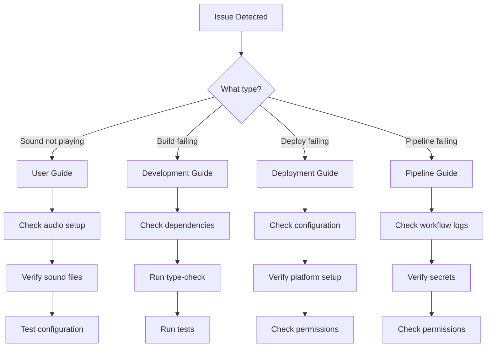
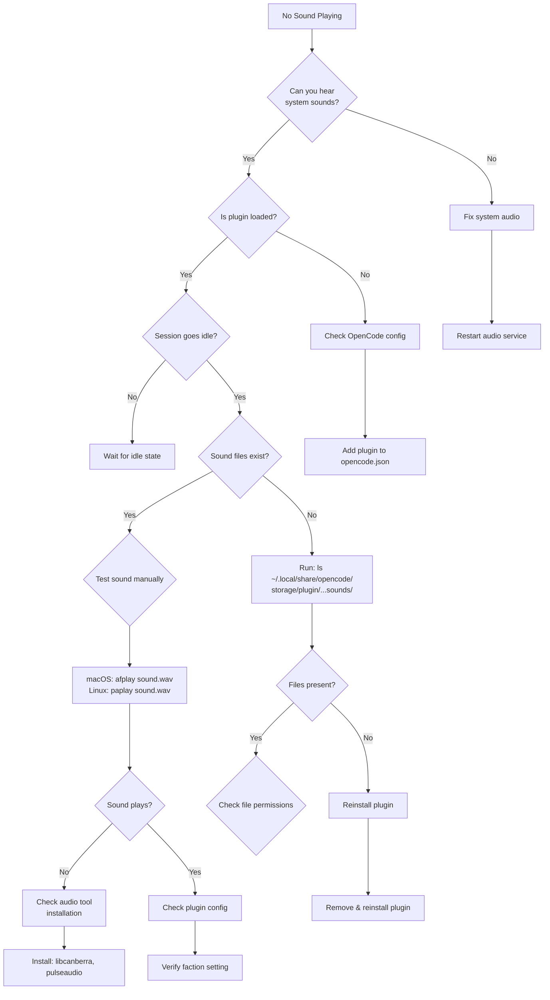
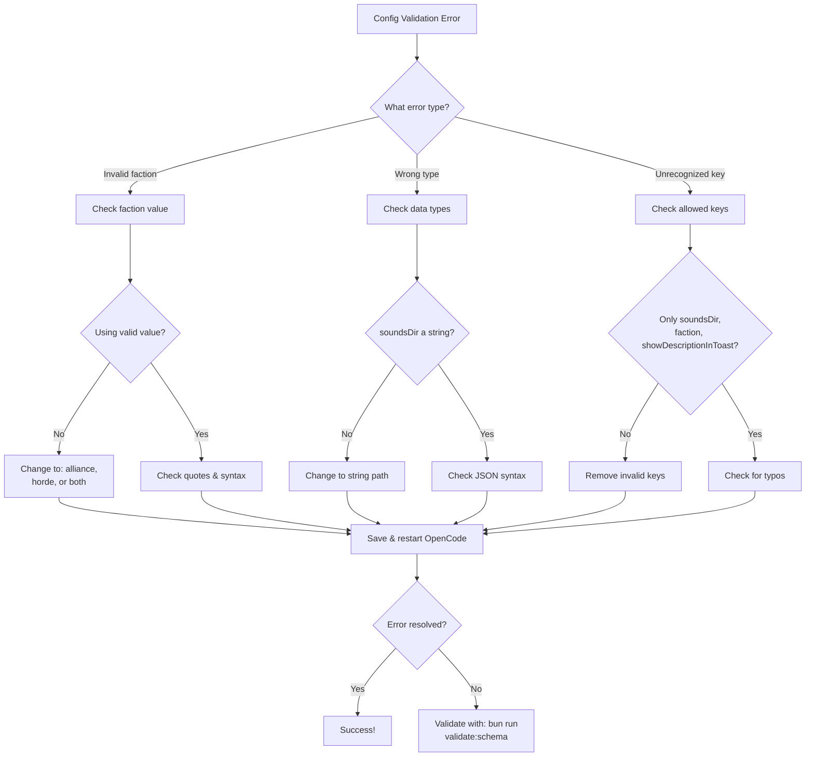
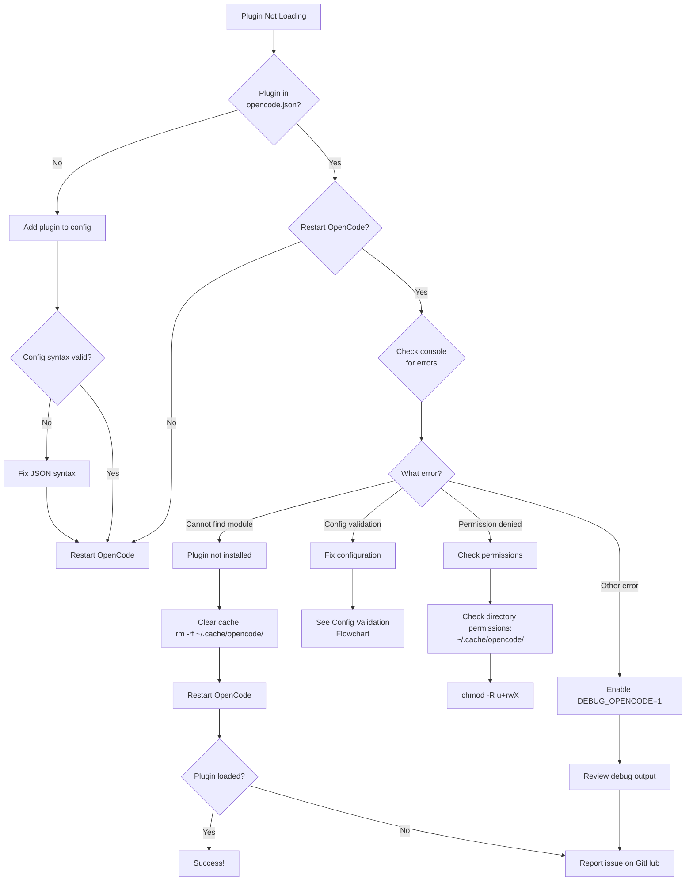
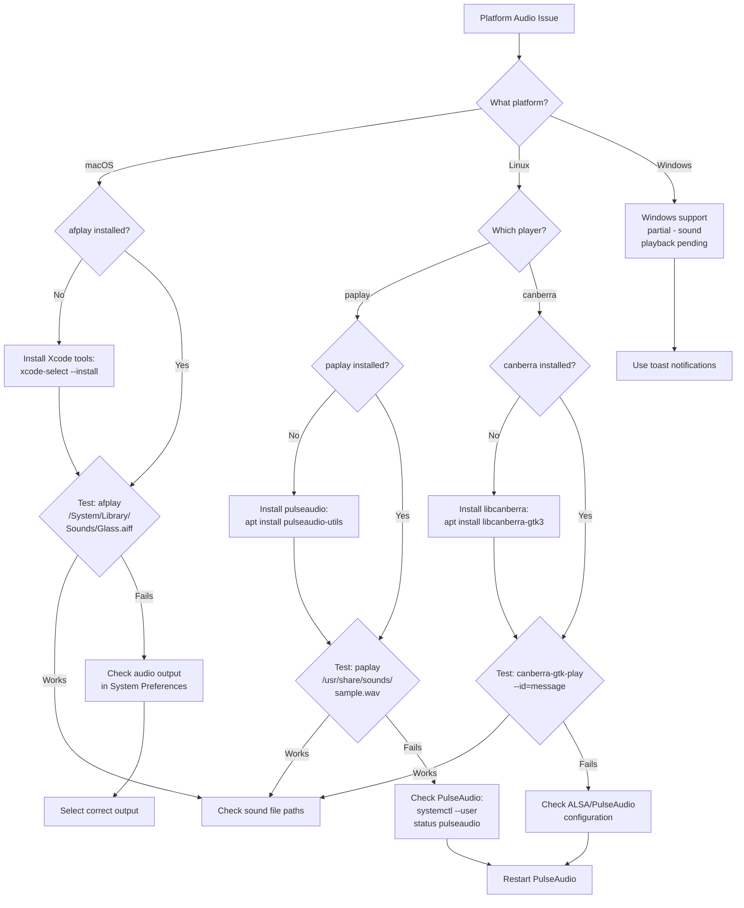
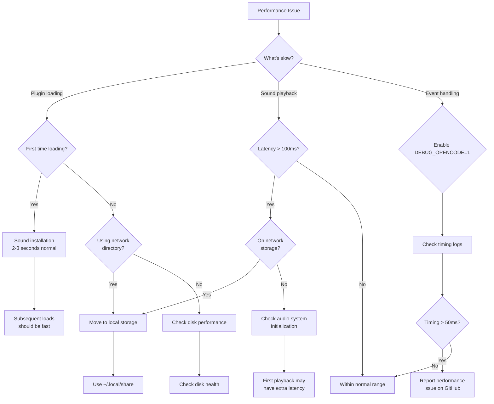

Comprehensive troubleshooting index for the Warcraft II Notifications Plugin.

## Quick Navigation

- [User Troubleshooting](#user-troubleshooting)
- [Development Troubleshooting](#development-troubleshooting)
- [Deployment Troubleshooting](#deployment-troubleshooting)
- [CI/CD Troubleshooting](#cicd-troubleshooting)

## User Troubleshooting

For common user issues, see [USER_GUIDE.md - Troubleshooting](/user-guide/#troubleshooting)

### Quick Links

- [No sound playing](/user-guide/#no-sound-playing)
- [Wrong faction sounds](/user-guide/#wrong-faction-sounds)
- [Plugin not loading](/user-guide/#plugin-not-loading)
- [Configuration not loading](/user-guide/#configuration-not-loading)
- [Sound files missing](/user-guide/#sound-files-missing)

### Common User Issues

#### Sound Issues

- **No sound playing**: Check audio output, verify sound files exist, test with sample file
- **Wrong faction sounds**: Verify configuration file, check faction setting, restart OpenCode
- **Sound quality issues**: Check audio format, verify WAV files are not corrupted

#### Configuration Issues

- **Configuration not loading**: Verify JSON syntax, check file permissions, verify file location
- **Plugin not loading**: Check OpenCode config, verify plugin installation, check console for errors

## Development Troubleshooting

For development issues, see [DEVELOPMENT.md - Debugging](/development/#debugging)

### Quick Links

- [Tests failing](/development/#tests-failing)
- [Type errors](/development/#type-checking)
- [Linting issues](/development/#linting)
- [Sound not playing during development](/development/#sound-not-playing)

### Common Development Issues

#### Build Issues

- **TypeScript compilation errors**: Check tsconfig.json, verify type definitions, run type-check
- **Dependency errors**: Run `bun install`, clear cache, check package.json
- **Build artifacts missing**: Run `bun run build`, check dist/ directory

#### Testing Issues

- **Tests failing**: Check test environment, verify mocks, run tests in isolation
- **Coverage too low**: Add missing test cases, check untested branches
- **Flaky tests**: Identify timing issues, add proper test isolation

#### Runtime Issues

- **Plugin not loading in dev**: Check link setup, verify build artifacts, check OpenCode config
- **Debug logging not working**: Set DEBUG_OPENCODE=1, check console output
- **Sound files not found**: Verify data directory, check bundled-sounds installation

## Deployment Troubleshooting

For deployment issues, see [DEPLOYMENT.md - Troubleshooting](/deployment/#troubleshooting)

### Quick Links

- [Installation fails](/deployment/#installation-fails)
- [Sound files missing](/deployment/#sound-files-missing)
- [Configuration issues](/deployment/#configuration-not-loading)
- [Platform-specific issues](/deployment/#platform-specific-troubleshooting)

### Common Deployment Issues

#### Installation Issues

- **npm install fails**: Check npm registry, verify package exists, check network
- **Plugin not recognized**: Verify package name, check OpenCode version, verify config syntax
- **Permission errors**: Check file permissions, verify user has write access to plugin directory

#### Platform Issues

- **macOS sound not working**: Check afplay command, verify audio output device
- **Linux sound not working**: Check canberra-gtk-play, install libcanberra, verify ALSA/PulseAudio
- **Path resolution issues**: Check platform-specific paths, verify directory structure

#### Configuration Issues

- **Config file not found**: Check file location, verify file name, check permissions
- **Invalid JSON**: Validate JSON syntax, check for trailing commas, verify quotes
- **Config precedence issues**: Check project vs global config, verify environment variables
- **Configuration validation errors**: See [Configuration Validation Errors](#configuration-validation-errors) below

### Configuration Validation Errors

Starting with version 1.0.156+, the plugin validates configuration against a JSON schema at runtime. Invalid configurations will cause the plugin to fail with detailed error messages.

#### Common Validation Errors

##### Invalid Faction Value

**Error**:

```
[Warcraft Notifications] Configuration validation failed:
  - faction: Invalid enum value. Must be one of: 'alliance', 'horde', 'both'
  Configuration file: /path/to/.opencode/plugin.json
```

**Solution**: Update your `plugin.json` to use a valid faction value:

```json
{
  "@pantheon-ai/opencode-warcraft-notifications": {
    "faction": "alliance"
  }
}
```

Valid faction values are: `"alliance"`, `"horde"`, or `"both"`.

##### Wrong Type for soundsDir

**Error**:

```
[Warcraft Notifications] Configuration validation failed:
  - soundsDir: Expected string, received undefined
  Configuration file: /path/to/.opencode/plugin.json
```

**Solution**: Ensure `soundsDir` is a string:

```json
{
  "@pantheon-ai/opencode-warcraft-notifications": {
    "soundsDir": "/path/to/sounds"
  }
}
```

##### Unrecognized Configuration Keys

**Error**:

```
[Warcraft Notifications] Configuration validation failed:
  - Unrecognized configuration key(s): dataDir. Only 'soundsDir' and 'faction' are allowed.
  Configuration file: /path/to/.opencode/plugin.json
```

**Solution**: Remove unrecognized keys. Only `faction` and `soundsDir` are allowed:

```json
{
  "@pantheon-ai/opencode-warcraft-notifications": {
    "faction": "horde",
    "soundsDir": "/custom/path"
  }
}
```

Common mistakes:

- Using `dataDir` instead of `soundsDir` (correct is `soundsDir`)
- Adding custom keys that aren't part of the schema
- Typos in configuration keys

#### Testing Your Configuration

You can verify your configuration by:

1. **Check the JSON syntax**:

   ```bash
   cat .opencode/plugin.json | jq .
   ```

2. **Validate against the schema**:

   ```bash
   bun run validate:schema docs/schemas/plugin.json.schema .opencode/plugin.json
   ```

3. **Enable debug mode** to see configuration loading:
   ```bash
   DEBUG_OPENCODE=1 opencode
   ```

#### Configuration Schema Reference

The complete schema is defined in `docs/schemas/plugin.json.schema`. Valid configuration:

```json
{
  "@pantheon-ai/opencode-warcraft-notifications": {
    "faction": "alliance" | "horde" | "both",  // optional, default: "both"
    "soundsDir": "string"                       // optional, platform-specific default
  }
}
```

Both fields are optional. If not specified, defaults will be used:

- `faction`: `"both"` (plays sounds from both factions)
- `soundsDir`: Platform-specific default location

## CI/CD Troubleshooting

For CI/CD pipeline issues, see [PIPELINE.md - Troubleshooting](/pipeline/#troubleshooting)

### Quick Links

- [Workflow failures](/pipeline/#workflow-failures)
- [Version bump issues](/pipeline/#version-bump-issues)
- [Deployment failures](/pipeline/#deployment-failures)
- [Auto-merge issues](/pipeline/#auto-merge-troubleshooting)

### Common CI/CD Issues

#### Workflow Issues

- **Workflow not triggering**: Check trigger conditions, verify branch names, check permissions
- **Workflow failing**: Check logs, verify secrets, check action versions
- **Timeout issues**: Increase timeout, optimize workflow, split into smaller jobs

#### Version Management

- **Version bump incorrect**: Check commit messages, verify AI analysis, review version bump logic
- **Version conflict**: Check existing tags, verify version in package.json
- **Version PR not created**: Check permissions, verify workflow execution, check branch protection

#### Deployment Issues

- **npm publish fails**: Check npm token, verify package access, check version doesn't exist
- **GitHub release fails**: Check GitHub token, verify tag creation, check release notes
- **Package validation fails**: Check package structure, verify required files, run validation locally

#### Auto-merge Issues

- **Auto-merge not triggering**: Check PR labels, verify checks passed, check branch protection
- **Merge conflicts**: Resolve conflicts manually, rebase branch, update base branch
- **Checks not passing**: Fix failing tests, resolve linting issues, update documentation

## Diagnostic Flowcharts

### Main Troubleshooting Decision Tree



### Sound Playback Troubleshooting



### Configuration Validation Troubleshooting



### Plugin Installation Troubleshooting



### Platform-Specific Audio Troubleshooting



### Performance Issue Troubleshooting



## Getting Help

If you can't find a solution to your issue:

1. **Check documentation**:
   - [User Guide](/user-guide/)
   - [Development Guide](/development/)
   - [Deployment Guide](/deployment/)
   - [CI/CD Pipeline](/pipeline/)

2. **Search existing issues**:
   - [GitHub Issues](https://github.com/pantheon-org/opencode-warcraft-notifications/issues)
   - Check closed issues for solutions

3. **Ask the community**:
   - [GitHub Discussions](https://github.com/pantheon-org/opencode-warcraft-notifications/discussions)
   - Provide detailed information about your issue

4. **Report a bug**:
   - Create a [new issue](https://github.com/pantheon-org/opencode-warcraft-notifications/issues/new)
   - Include reproduction steps
   - Provide system information
   - Attach relevant logs

## Debug Mode

Enable debug mode for detailed logging:

```bash
# Enable debug logging
export DEBUG_OPENCODE=1

# Run OpenCode
opencode
```

Debug output will show:

- Configuration loading
- Sound file installation
- Sound selection process
- Platform-specific operations
- Error details

## System Information

When reporting issues, include:

```bash
# Operating System
uname -a

# Node.js version
node --version

# Bun version
bun --version

# OpenCode version
opencode --version

# Plugin version
cat ~/.cache/opencode/node_modules/@pantheon-ai/opencode-warcraft-notifications/package.json | grep version

# Check sound files
ls -la ~/.local/share/opencode/storage/plugin/@pantheon-ai/opencode-warcraft-notifications/sounds/

# Check configuration
cat ~/.config/opencode/plugin.json
cat .opencode/plugin.json
```

## Related Documentation

- [User Guide](/user-guide/) - End-user documentation
- [Development Guide](/development/) - Development workflow
- [Deployment Guide](/deployment/) - Installation and operations
- [CI/CD Pipeline](/pipeline/) - Pipeline technical reference
- [FAQ](/user-guide/#faq) - Frequently asked questions

---

**Document Version**: 1.0  
**Last Updated**: 2025-11-10  
**Maintained By**: Pantheon AI Team
