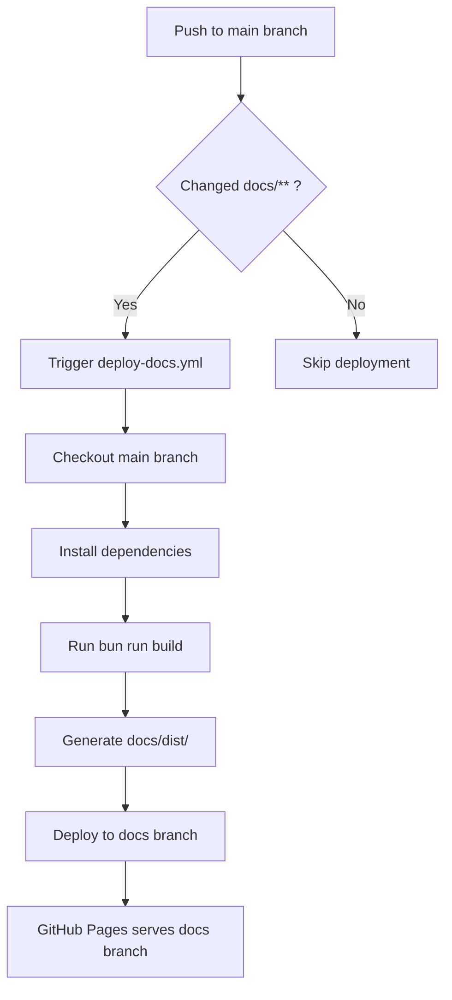

# Documentation Branch Structure

This document details the branch structure for documentation deployment in the Warcraft II Notifications Plugin repository.

## Overview

The project uses a **two-branch documentation workflow**:

- **`main` branch**: Contains source markdown files and build configuration
- **`docs` branch**: Contains generated static site artifacts for GitHub Pages deployment

This separation ensures that:

- Version control tracks only meaningful source changes
- Generated artifacts don't pollute the main branch history
- Documentation can be built and deployed automatically via CI/CD

## Branch Specifications

### Main Branch (`main`)

The main branch contains **source files only** for documentation.

#### Included Files/Directories

```
opencode-warcraft-notifications/
├── docs/
│   ├── src/
│   │   ├── content/
│   │   │   └── docs/          # Source markdown files
│   │   │       ├── index.md
│   │   │       ├── user-guide.md
│   │   │       ├── api.md
│   │   │       ├── architecture.md
│   │   │       ├── development.md
│   │   │       ├── deployment.md
│   │   │       ├── pipeline.md
│   │   │       ├── onboarding.md
│   │   │       ├── troubleshooting.md
│   │   │       ├── validate-schema.md
│   │   │       ├── github-workflows/
│   │   │       │   ├── overview.md
│   │   │       │   ├── setup-guide.md
│   │   │       │   └── ...
│   │   │       └── schemas/
│   │   │           ├── index.md
│   │   │           └── ...
│   │   ├── assets/             # Static assets (images, logos)
│   │   │   └── logo.svg
│   │   └── styles/             # Custom CSS
│   │       └── custom.css
│   ├── public/                 # Static public files
│   │   └── favicon.svg
│   ├── astro.config.mjs        # Astro build configuration
│   ├── package.json            # Dependencies for build
│   ├── transform-docs.js       # Pre-build transformation script
│   └── tsconfig.json           # TypeScript configuration
├── .github/
│   └── workflows/
│       └── deploy-docs.yml     # CI/CD workflow for deployment
└── .gitignore                  # Excludes generated files
```

#### Excluded Files/Directories (via `.gitignore`)

```gitignore
# Generated documentation artifacts (deployed to docs branch)
dist/
.astro/

# Documentation build artifacts
docs/node_modules/
docs/.astro/
docs/dist/
```

**Rationale**: These files are build outputs that change with every build and should not be tracked in source control on the main branch.

### Docs Branch (`docs`)

The docs branch contains **generated static site artifacts only**.

#### Included Files/Directories

```
opencode-warcraft-notifications/ (docs branch)
├── _astro/                     # Astro-generated JavaScript/CSS bundles
│   ├── ec.p1z7b.js
│   ├── ec.v4551.css
│   ├── index.BRy0Gjvj.css
│   ├── logo.C1AD156P.svg
│   └── ...
├── collections/                # Content collections schema
│   └── docs.schema.json
├── pagefind/                   # Search index
│   ├── fragment/
│   ├── index/
│   ├── pagefind.js
│   ├── pagefind-ui.js
│   ├── wasm.en.pagefind
│   └── ...
├── 404.html                    # Error page
├── content-assets.mjs          # Content asset mappings
├── content-modules.mjs         # Content module mappings
├── favicon.svg                 # Favicon
└── index.html                  # Site pages (generated from markdown)
```

#### Branch Characteristics

- **Orphan branch**: No common history with main branch
- **Auto-generated**: Created and updated by CI/CD workflow
- **Deployment target**: GitHub Pages serves from this branch
- **No manual commits**: All updates come from automated deployments

**Rationale**: This branch is purely for deployment and contains only what's necessary to serve the static site.

## Workflow Integration

### Automatic Deployment Process



### Workflow File: `.github/workflows/deploy-docs.yml`

Key configuration details:

- **Trigger**: Pushes to `main` branch with changes to `docs/**`
- **Build tool**: Bun (for speed and efficiency)
- **Static site generator**: Astro with Starlight theme
- **Deployment action**: `peaceiris/actions-gh-pages@v4`
- **Target branch**: `docs`
- **Source directory**: `./docs/dist`

### Build Process

1. **Transform**: `transform-docs.js` processes source markdown files
2. **Build**: Astro compiles markdown to HTML with Starlight theme
3. **Output**: Static site generated in `docs/dist/`
4. **Deploy**: Contents of `docs/dist/` pushed to `docs` branch

## GitHub Pages Configuration

### Repository Settings

To complete the setup, configure GitHub Pages in repository settings:

1. Navigate to: **Settings → Pages**
2. Set **Source** to: **Deploy from a branch**
3. Set **Branch** to: **docs** (root directory)
4. Click **Save**

### Expected Result

- **URL**: `https://pantheon-org.github.io/opencode-warcraft-notifications/`
- **Source**: `docs` branch
- **Updates**: Automatic on every push to `main` that affects `docs/**`

## File Ownership Rules

### ✅ Files that belong on `main` branch

- Source markdown files (`*.md`)
- Configuration files (`astro.config.mjs`, `package.json`, `tsconfig.json`)
- Build scripts (`transform-docs.js`)
- Static assets (images, CSS in `docs/src/`)
- CI/CD workflows (`.github/workflows/`)

### ❌ Files that should NEVER be on `main` branch

- Generated HTML files (`*.html`)
- Compiled JavaScript bundles (`_astro/*.js`)
- Compiled CSS bundles (`_astro/*.css`)
- Build directories (`dist/`, `.astro/`, `docs/dist/`, `docs/.astro/`)
- Search indexes (`pagefind/`)
- Generated asset mappings (`content-assets.mjs`, `content-modules.mjs`)

### ✅ Files that belong on `docs` branch

- All generated HTML, CSS, JavaScript
- Compiled assets and bundles
- Search indexes
- Content mappings
- 404 and other static pages

### ❌ Files that should NEVER be on `docs` branch

- Source markdown files
- Build configuration files
- Node modules
- Development dependencies

## Maintenance

### Keeping Branches Clean

**Main branch**:

```bash
# Verify no build artifacts are tracked
git status
git ls-files dist/ docs/dist/ docs/.astro/

# Should return nothing - if files appear, they need to be removed
```

**Docs branch**:

```bash
# Switch to docs branch
git checkout docs

# Should contain only generated files
ls -la

# Should see: _astro/, pagefind/, *.html, etc.
# Should NOT see: docs/, src/, *.md, package.json, etc.
```

### Troubleshooting

**Problem**: Build artifacts appear in `git status` on main branch

**Solution**:

1. Verify `.gitignore` includes the patterns listed above
2. Remove tracked files: `git rm -r --cached dist/ docs/dist/ docs/.astro/`
3. Commit: `git commit -m "chore: Remove build artifacts from version control"`

**Problem**: Docs branch is missing or empty

**Solution**:

1. Trigger workflow manually: **Actions → Deploy Documentation → Run workflow**
2. Check workflow logs for errors
3. Verify permissions: Workflow needs `contents: write` permission

**Problem**: GitHub Pages not updating

**Solution**:

1. Verify GitHub Pages is configured to use `docs` branch
2. Check **Actions** tab for deployment status
3. Verify `docs` branch has new commits after main branch changes

## Related Documentation

- [CI/CD Pipeline Documentation](./pipeline.md)
- [Deployment Guide](./deployment.md)
- [Development Guide](./development.md)

## Version History

- **v1.0.0** (2025-11-11): Initial branch structure specification
